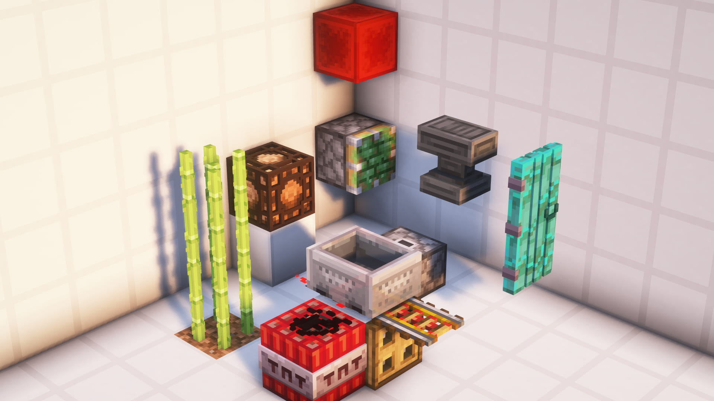
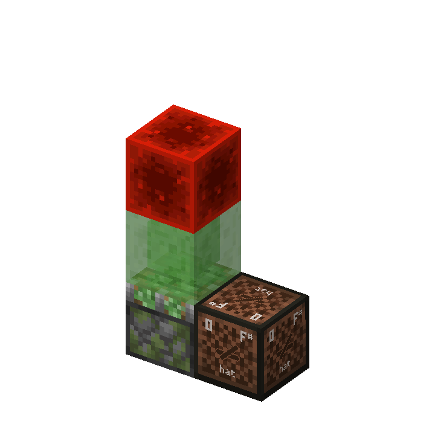
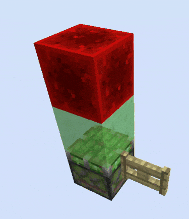
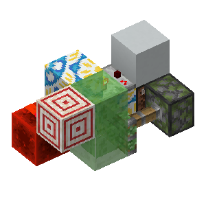
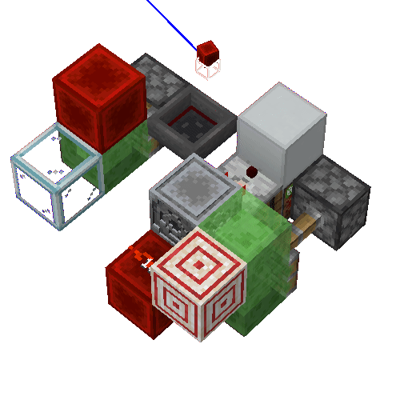

# #01 更新概念与不同类型的更新


本部分是更新理论的入门。

**基础部分**

- 更新理论的认识
- NC更新、PP更新、比较器更新等不同类型的更新
- 方块放置时的自检行为

**进阶部分**（源码分析）

- 简要的NC更新与PP更新的调用与响应
- 方块自检的调用

## 1.1 广义更新

在Minecraft中，方块与方块通过互相“通知”来建立相互的联系。

我们以**破坏某个石头按钮所附着的木板**为例：一个附着在木板上的石头按钮，该木板被破坏了，它会**通知**它周围与它相连的六个方块。木板可以被破坏，也可以被放置；延伸到其他各种方块，它们也都存在各种不同的变化。因此，木板并不会通知周围方块“木板被破坏了”的信息，而是简单地通知“这里发生了一些变化”。当石头按钮受到通知时，它知道“周围发生了变化”，于是检查自己是否还附着在木板上。此时它发现木板被破坏了，自己无法附着，于是变成了掉落物。

这种**通知**行为就称为广义上的**更新**。

## 1.2 更新的类型

在Minecraft中，更新是有多种类型的。

让我们继续上文中的例子：假设在石头按钮边上有一个紧邻着的栅栏门被打开了。石头按钮只会附着在木板这类完整方块上，而栅栏门的变化只是栅栏门开与关的简单状态的变化，相比于木板的放置于破坏显得就不那么明显了。栅栏门开关确实发生了变化，但如果栅栏门打开也要通知石头按钮的话就显得有些多余。因此，栅栏门被打开时，会发出另一种通知，这种通知并不会让石头按钮检查自己是否应该掉落。

这样的通知被称为**PP更新**，而在上文中木板破坏的通知则称为**NC更新**。

比较器是一种能够检测容器中物品数量的红石元件，根据容器中物品数量的多少输出0-15的不同强度高低的红石信号。当容器中物品数量发生变化时，容器并没有必要发出**NC更新**或**PP更新**，但比较器还是能够收到这种变化的“通知”。这是因为容器在容器中物品数量发生变化时，也会发出一种特殊的通知。

这样的通知被称为**比较器更新**。

## 1.3 NC更新

### 1.3.1 NC更新的概念与行为

方块在被放置、破坏、或发生能够显著影响周围方块的变化时，会发出**NC更新**。例如：

- 方块的放置与破坏
- 红石粉能量等级发生变化
- 活塞的推拉*
- ...

> 官方提供的反混淆中NC更新为`neighborChanged`，与mcp反混淆相同。yarn反混淆中则称为`updateNeighbors`

但一些变化不会发出**NC更新**，最为常见的有：

- 可连接方块的连接状态改变，例如玻璃板与其他方块连接、各种墙与其他方块连接
- 红石粉的连接状态发生变化，例如一个与它南北侧红石粉相连的红石粉又与东侧的一个红石粉相连接
- 活板门、栅栏门的开关
- 发射器、投掷器的激活状态改变（**！重要**）
- 漏斗的激活状态改变
- ...

> 活塞的具体行为不在本篇讨论范围内。

一个发出NC更新的“方块”称为**更新核**[^1]，大部分方块发出更新时，更新核是它本身。

[^1]: 有关**更新核**的理解在基础部分不作过多解释，且并非所有NC更新都存在更新核。参见[进阶部分](#172-nc更新的调用与响应)。

更新核发出NC更新时，按照**西东下上北南**的顺序，依次对更新核西侧紧邻、东侧紧邻……的方块发出NC更新。这样的更新就是通常意义上的更新。

部分方块在发出NC更新时不只有一个更新核，它们具有特殊的更新核与范围：

- 红石粉的能量等级变化为二阶毗邻更新[^2]。
- 带有指向的红石元件，例如红石中继器、比较器、侦测器，它们在激活状态发生变化时先单独更新它们输出端指向的方块，再以输出端指向的方块为更新核发出NC更新，并且在NC更新时不会更新它们自身方块。
- 平放的动力铁轨切换激活状态时，先以自身为更新核产生NC更新，再以下方方块为更新核产生NC更新。
- 斜放的动力铁轨切换激活状态时，先以自身为更新核产生NC更新，再以下方方块为更新核产生NC更新，最后以上方方块为更新核产生NC更新。

以上是常见且较为典型的例子。更多的特殊情况可以参见[Wiki-方块更新](https://zh.minecraft.wiki/w/%E6%96%B9%E5%9D%97%E6%9B%B4%E6%96%B0#NC%E6%9B%B4%E6%96%B0)

[^2]: 红石粉具有更加复杂的更新行为，本篇中不作展开。~~可能后续会追加红石粉专题DLC~~

### 1.3.2 NC更新的性质、QC激活、BUD装置

NC更新最典型的性质是能够使**BUD装置**响应。

一个方块当前的状态与它**本应该的状态**不同时，这个方块就可以称作是一个**BUD装置**，即**方块更新检测器（Block Update Detector）**。这种方块状态也可以称作是**BUD态**。

最典型的BUD装置是一个被充能（受到红石信号）但未被激活（未伸出）的活塞。活塞具有特殊的充能范围，当活塞本身和活塞上方的一个方块（可以为空气）被充能时，活塞就可以被认为被充能。通过充能活塞上方的空气充能活塞，这种充能方式就称为**QC充能**。这样被充能的活塞在受到NC更新后伸出，就称作**QC激活**。

**QC (quasi connectivity)** 称为**半连接性**，活塞、粘性活塞、投掷器、发射器都具有这种性质。

想象一个活塞的斜上方放置了一个红石块，此时这个活塞被QC充能。而红石块的放置只会更新它毗邻的六个方块，无法更新到活塞，所以没有任何方块通知活塞“这里有一个红石信号”。此时这个活塞本应伸出，但却因为没有受到NC更新而没有伸出。也就是*当前的状态与它本应该的状态不同*，即此时这个活塞处于**BUD态**，该活塞就构成了一个**BUD装置**。

此时，如果在活塞边上放置一个方块，方块放置就会发出NC更新。活塞受到NC更新，解除BUD态。

一个最简单常用的可以自行复位的BUD装置如下：



图中的红石块**QC充能**下方粘性活塞，当粘性活塞受到NC更新后伸出，红石块不再充能，而后粘性活塞收回，红石块再次QC充能粘性活塞。[^3]

[^3]: 此处对1.3.2中的BUD装置涉及活塞原理部分作简单展开，读者仅作了解即可。粘性活塞在伸出时没有受到任何NC更新，因此不会中途丢下方块。粘性活塞伸出到位后触发自检，发现没有被充能于是执行收回。收回时由于粘性活塞的方块到位顺序，粘性活塞先到位，此时触发自检但红石块还未到位（处于方块实体状态），红石块后到位。因此粘性活塞不会由于自检而再次伸出。

## 1.4 PP更新

### 1.4.1 PP更新的概念与行为

几乎所有的变化都会发出**PP更新**。除了：

- 使用命令放置方块
- 使用调试棒改变方块状态

等极其特殊的情况；但还是有一个特例：

- 粘性活塞推动正在激活的侦测器，到位时侦测器不发出PP更新。

> 官方提供的反混淆中PP更新为`updateShape`，即更新形状（例如，各种墙的形状、活板门的开关、红石元件的激活状体改变，都可以称作这里的“形状”），该反混淆名更有益于理解PP更新。PP更新的命名来源于mcp反混淆中是`postPlacement`方法。yarn反混淆中则称为`getStateForNeighborUpdate`

和NC更新不同，PP更新的顺序为**西东北南下上**。

在上文中提到的*不会发出**NC更新***的行为，都是较为典型的发出**PP更新**但不发出**NC更新**的行为。同样，上文中的**BUD装置**无法用来检测**PP更新**。

例如这里的栅栏门状态发生变化，发出pp更新，但并不会被活塞BUD装置检测到



需要注意的是，除了放置与破坏方块外，大部分红石元件的NC更新范围和PP更新范围是不一样的。例如中继器的NC更新范围是输出端及输出端的毗邻（除中继器自身），而其PP更新范围是自身的毗邻。

PP更新可以理解为**自身发生变化**的更新，而NC更新可以理解为**通知可能需要改变状态的方块**的更新。

同样以中继器为例，中继器的亮灭属于**自身发生了变化**，通过PP更新通知自身毗邻的方块。而中继器亮起会充能它输出端的方块，如果输出端的方块能够传递红石信号，这个方块还会再向它的毗邻传递红石信号；所以说中继器的亮起有可能会影响它输出端的方块以及输出端毗邻的方块，因此中继器通过NC更新**通知可能受到影响的方块检查是否要改变状态**。

又例如，当投掷器被激活，投掷物品时，投掷物品这一行为并不会对周围方块造成影响[^4]，因此投掷器激活并不发出NC更新。但是投掷器的确改变了激活状态，这种状态改变使得投掷器发出了PP更新。

[^4]: 不考虑投掷的物品被漏斗吸取。漏斗吸取属于漏斗自身的行为，不受更新控制。

这样，PP更新与NC更新的差异以及它们更新范围的不同就易于理解了。

### 1.4.2 PP更新的性质

既然上文中的BUD装置无法检测PP更新，那么什么装置能够检测（响应）PP更新呢？

答案是——侦测器。侦测器长得像脸的一面为检测PP更新的一面，有红色小点的一面为输出红石信号的一面。

侦测器响应、且仅响应PP更新。[^5]但由于大多数情况NC更新总是伴随PP更新的，所以这里的“仅”可能体现的并不明显。不过我们还是可以通过一些方法来体现：当侦测器直接面向中继器时，中继器亮灭会激活侦测器；但如果侦测器面向中继器输出端指向的方块（空气），中继器的亮灭则不会激活侦测器。这里也很好理解：当中继器指向一个空气时，空气不会有任何变化，因此侦测器自然也不会响应了。

通过BUD装置与侦测器的配合使用，我们可以很方便的在不翻阅源码的情况下测出各个红石元件的NC更新范围和PP更新范围。

[^5]: 消歧义：此处仅从更新类型的角度考虑，侦测器仅在受到PP更新时判断自身是否应当发生变化并执行特定的行为。若认为“响应”指广义的“侦测器发生变化”，那么除侦测器的计划刻行为外，当侦测器被活塞推到位时，它会调用自身的`onBlockAdded`方法，仅当到位位置无侦测器计划刻，并且侦测器原先的状态为亮起时，侦测器会继续在其中调用`setBlockstate`方法，最终状态变为熄灭（不存在计划刻），而原先状态为熄灭的侦测器则不产生任何变化。熄灭的侦测器被活塞到位时添加的计划刻来自于TE对侦测器的“更新”`postProcessState`，实际上最终仍旧调用的是侦测器响应PP的函数`getStateForNeighborUpdate`。

## 1.5 比较器更新

### 1.5.1 比较器更新的概念与行为

顾名思义，比较器更新是专用于更新比较器的更新。

以下行为会发出比较器更新：

- 一般的容器，如箱子、木桶、漏斗等中的物品数量发生变化。信号强度计算方式见下。
- 更广义上的容器，有“容量”概念的方块例如堆肥桶（信号强度与堆肥等级相等，范围为0~9）、炼药锅（信号强度与装液体的等级相等，范围为0~3）。
- 物品展示框，物品展示框输出的比较器信号强度取决于展示物品的旋转角度，仅输出强度为1~8的信号。不放置物品时信号强度为0。
- 讲台，信号强度计算方式见下。
- 探测铁轨上方有掉落物。
- 探测铁轨上有带有容器的矿车，如运输矿车（箱子矿车）、漏斗矿车时，矿车内物品数量发生变化时会在20gt后发出比较器更新。信号强度计算方式与一般容器相同。
- 雕纹书架（1.20+），信号强度与最后一次放置或取出的书的位置相等，第一排为1~3，第二排为2~6。

比较器既可以直接检测容器容量，也可以间隔一个可传递红石信号的方块检测容器容量。因此比较器更新的范围为容器水平方向的毗邻范围内的比较器，或二阶毗邻范围内间隔一个可传递红石信号的方块的比较器。比较器更新不会对比较器以外的方块造成更新。

### 1.5.2 比较器信号强度计算

对一般的容器：

- 输出信号强度=对`每个物品槽位填充比例的平均值*14`向下取整，如果容器不是空的，那么输出信号强度再`+1`。即：当容器为空，输出0。当容器不为空，输出容器的平均填充比例到1~15的映射并向下取整。

对讲台：

- 当讲台上不放置书时，输出信号强度为0。
- 当讲台上放置书且书只有一页时，输出信号强度为15。
- 当讲台上放置书且书不只有一页时，输出信号强度为`当前页码/总页码*14`向下取整再`+1`。
- 即：当讲台为空，输出0。当讲台不为空，输出当前页码占总页码的比例到1~15的映射并向下取整。

### 1.5.3 比较器更新检测器（CUD）

一个比较器当前的状态与它**本应该的状态**不同时，这个比较器就构成了一个比较器更新检测器（CUD，Comparator Update Detector）。一个最简单的例子是用比较器间隔一个方块检测一个有填充的堆肥桶，然后用活塞将堆肥桶推走。此时比较器依然有输出信号。

由于其他可复位的CUD结构与涉及原理较为复杂，在此处仅作展示，不作展开。




> *图为基于红石粉粉转向的CUD。*
> 
> 可以看到BUD并未启动，而CUD检测到了漏斗发出的比较器更新。

## 1.6 方块自检

红石元件在被放置时会进行**自检**，即检查自身是否应当改变状态。例如放置一个红石块，然后放置一个中继器，并且这个中继器的输入端紧邻着红石块。此时中继器没有受到更新，但还是亮起了，这就是因为中继器在被放置时进行了**自检**，发现自己应该亮起，于是亮起。

活塞自身到位也可以视作一种“被放置”，因此活塞自身在伸出后到位和拉回后到位也都会进行一次**自检**。

## 1.7【进阶】NC更新与PP更新的调用与响应

### 1.7.1 `setBlockState`函数

`setBlockState`通过一个`bitflags`即`FLAG`控制更新行为，在`World.java`的`World`类中：
```java
public boolean setBlockState(BlockPos pos, BlockState state, int flags, int maxUpdateDepth) {
        ...
        BlockState blockState = worldChunk.setBlockState(pos, state, (flags & Block.MOVED) != 0);
        if (blockState != null) {
            BlockState blockState2 = this.getBlockState(pos);
            if (blockState2 == state) {
                ...
                // 由FLAG控制的NC更新的调用
                if ((flags & Block.NOTIFY_NEIGHBORS) != 0) {
                    this.updateNeighbors(pos, blockState.getBlock());
                    if (!this.isClient && state.hasComparatorOutput()) {
                        this.updateComparators(pos, block);
                    }
                }
                // 由FLAG控制的PP更新的调用
                if ((flags & Block.FORCE_STATE) == 0 && maxUpdateDepth > 0) {
                    int i = flags & ~(Block.NOTIFY_NEIGHBORS | Block.SKIP_DROPS);
                    blockState.prepare(this, pos, i, maxUpdateDepth - 1);
                    state.updateNeighbors(this, pos, i, maxUpdateDepth - 1);
                    state.prepare(this, pos, i, maxUpdateDepth - 1);
                }
                ...
            }
            return true;
        }
        return false;
    }
```

### 1.7.2 NC更新的调用与响应

在源码中，NC更新主要通过两种方式调用：
- `updateNeighbor`及其衍生
- `flag`中`bit0 = 1`的`setBlockState`

`updateNeighbor`及其衍生，即`updateNeighbor` `updateNeighborsExcept` `updateNeighborsAlways`。

其中`updateNeighbor`是最根本的方法，传入`pos, sourceBlock, sourcePos`三个参数，分别为要更新的方块坐标`pos`，发出更新的方块类型`sourceBlock`和发出更新的方块坐标`sourcePos`。

`updateNeighborsAlways`和`updateNeighborsExcept`通过调用`NeighborUpdater.updateNeighbors`进行更新，在`NeighborUpdater.java`的`NeighborUpdater`实例中：
```java
public static final Direction[] UPDATE_ORDER = new Direction[]{Direction.WEST, Direction.EAST, Direction.DOWN, Direction.UP, Direction.NORTH, Direction.SOUTH};

default public void updateNeighbors(BlockPos pos, Block sourceBlock, @Nullable Direction except) {
    for (Direction direction : UPDATE_ORDER) {
        if (direction == except) continue;
        this.updateNeighbor(pos.offset(direction), sourceBlock, pos);
    }
}
```
因此NC更新顺序为西东下上北南。

其中在`Block.java`中定义：
```java
// Sends a neighbor update event to surrounding blocks.
public static final int NOTIFY_NEIGHBORS = 1;

// Notifies listeners and clients who need to react when the block changes.
public static final int NOTIFY_LISTENERS = 2;

// The default setBlockState behavior. Same as NOTIFY_NEIGHBORS | NOTIFY_LISTENERS.
public static final int NOTIFY_ALL = 3;

// Bypass virtual block state changes and forces the passed state to be stored as-is.
public static final int FORCE_STATE = 16;
```

对于以上的调用方法，只有调用`updateNeighborsAlways`和`updateNeighborsExcept`的`sourcePOS`和`setBlockState`的`pos`可以称作“更新核”，即以一个方块为中心对毗邻六个方块（或除去某个方向的方块）进行更新的“核”。而`updateNeighbor`是简单直接的“更新”。

仅PP更新时，`FLAG`通常为`NOTIFY_LISTENERS`；同时发出PP更新和NC更新时，`FLAG`通常为`NOTIFY_ALL`。部分覆写了`onBlockAdded`方法的方块具有不同的调用方式，见[下文](#174-红石元件的nc更新与pp更新的调用)

在各个方块中，NC更新由方块的`neighborUpdate`函数响应。

### 1.7.3 PP更新的调用

在源码中，PP更新通过`setBlockState`调用。当`FLAG`的`bit4 = 0`时会产生PP更新。

`state.updateNeighbors`定义在`AbstractBlock.java`的`AbstractBlockState`类中：
```java
public final void updateNeighbors(WorldAccess world, BlockPos pos, int flags, int maxUpdateDepth) {
    BlockPos.Mutable mutable = new BlockPos.Mutable();
    for (Direction direction : DIRECTIONS) {
        mutable.set((Vec3i)pos, direction);
        world.replaceWithStateForNeighborUpdate(direction.getOpposite(), this.asBlockState(), mutable, pos, flags, maxUpdateDepth);
    }
}
```
其中在`AbstractBlock`中有：
```java
protected static final Direction[] DIRECTIONS = new Direction[]{Direction.WEST, Direction.EAST, Direction.NORTH, Direction.SOUTH, Direction.DOWN, Direction.UP};
```
因此PP更新为西东北南下上。

其中`world.replaceWithStateForNeighborUpdate`：
```java
default public void replaceWithStateForNeighborUpdate(Direction direction, BlockState neighborState, BlockPos pos, BlockPos neighborPos, int flags, int maxUpdateDepth) {
    NeighborUpdater.replaceWithStateForNeighborUpdate(this, direction, neighborState, pos, neighborPos, flags, maxUpdateDepth - 1);
}
```
调用了`NeighborUpdater`中的`replaceWithStateForNeighborUpdate`方法：
```java
public static void replaceWithStateForNeighborUpdate(WorldAccess world, Direction direction, BlockState neighborState, BlockPos pos, BlockPos neighborPos, int flags, int maxUpdateDepth) {
    BlockState blockState = world.getBlockState(pos);
    BlockState blockState2 = blockState.getStateForNeighborUpdate(direction, neighborState, world, pos, neighborPos);
    Block.replace(blockState, blockState2, world, pos, flags, maxUpdateDepth);
}
```
最后调用了各个方块`blockState`的`getStateForNeighborUpdate`方法。也就是方块响应PP更新的方法。

### 1.7.4 红石元件的NC更新与PP更新的调用

而对于大多数的红石元件，它们在调用`setBlockState`时通常传入`FLAG=2`，NC更新实际是由`setBlockState`中的`worldChunk.setBlockState`方法调用覆写`@Override`后的`onBlockAdded`方法发出NC更新：

在`worldChunk.setBlockState`中：
```java
public BlockState setBlockState(BlockPos pos, BlockState state, boolean moved) {
    ...
    if (!this.world.isClient) {
        state.onBlockAdded(this.world, pos, blockState, moved);
    }
    ...
    return blockState;
}
```

而PP更新受`FLAG`控制正常由`setBlockState`调用。

以红石中继器为例，在红石中继器继承的`AbstractRedstoneGateBlock.java`的`AbstractRedstoneGateBlock`中：
```java
public void scheduledTick(BlockState state, ServerWorld world, BlockPos pos, Random random) {
    if (this.isLocked(world, pos, state)) {
        return;
    }
    boolean bl = state.get(POWERED);
    boolean bl2 = this.hasPower(world, pos, state);
    if (bl && !bl2) {
        world.setBlockState(pos, (BlockState)state.with(POWERED, false), Block.NOTIFY_LISTENERS);
    } else if (!bl) {
        world.setBlockState(pos, (BlockState)state.with(POWERED, true), Block.NOTIFY_LISTENERS);
        if (!bl2) {
            world.scheduleBlockTick(pos, this, this.getUpdateDelayInternal(state), TickPriority.VERY_HIGH);
        }
    }
}


@Override
public void onBlockAdded(BlockState state, World world, BlockPos pos, BlockState oldState, boolean notify) {
    this.updateTarget(world, pos, state);
}


    protected void updateTarget(World world, BlockPos pos, BlockState state) {
    Direction direction = state.get(FACING);
    BlockPos blockPos = pos.offset(direction.getOpposite());
    world.updateNeighbor(blockPos, this, pos);
    world.updateNeighborsExcept(blockPos, this, direction);
}
```

`scheduledTick`为中继器执行计划刻时调用的方法。在中继器执行计划刻时，它会调用`setBlockState`函数，而后由`setBlockState`调用`worldChunk.setBlockState`，在`worldChunk.setBlockState`调用了`@Override`的`onBlockAdded`，对中继器输出端指向的方块及指向方块的毗邻（除中继器自身）产生了NC更新。接着由`setBlockState`调用`state.updateNeighbors`产生了PP更新。

### 1.7.5 NC更新与PP更新的顺序

综上，对于大部分通过`setBlockState`发出更新的方块，都满足先NC更新、后PP更新的顺序。这一点极其重要，它影响了在后续更新中NC更新与PP更新的顺序问题。本篇不对“连续的方块更新”作展开。

### 1.7.6 侦测器的NC与PP更新

**侦测器是一个特例**。它并没有调用`onBlockAdded`方法中的NC更新，而是直接在`scheduledTick`中先调用`setBlockState`发出PP更新，再调用`updateNeighbors`发出NC更新。因此，侦测器在亮起和熄灭是遵循先PP后NC的顺序。

在侦测器的`onBlockAdded`中：
```java
@Override
public void onBlockAdded(BlockState state, World world, BlockPos pos, BlockState oldState, boolean notify) {
    if (state.isOf(oldState.getBlock())) {
        return;
    }
    if (!world.isClient() && state.get(POWERED).booleanValue() && !world.getBlockTickScheduler().isQueued(pos, this)) {
        BlockState blockState = (BlockState)state.with(POWERED, false);
        world.setBlockState(pos, blockState, Block.NOTIFY_LISTENERS | Block.FORCE_STATE);
        this.updateNeighbors(world, pos, blockState);
    }
}
```
其中第一个`if`中的`state.isOf(oldState.getBlock())`用于判断当前位置的方块在被改变状态之前是否还是当前的方块。例如，如果活塞推动了一个侦测器，那么侦测器到位的位置在改变前就是`air`，改变后就是`observer`，此时该函数返回`true`。而一个普通的侦测器在调用这一函数时总是返回`false`。

所以，侦测器的`onBlockAdded`方法在通常情况下都不会执行后续的内容，也就不会由`onBlockAdded`发出NC更新，而是如上文中所说，“直接在`scheduledTick`中先调用`setBlockState`发出PP更新，再调用`updateNeighbors`发出NC更新。”

## 1.8【进阶】方块自检的调用

方块在被放置时会被调用`onPlaced`函数，红石元件在该函数中完成自检。例如红石中继器：
```java
@Override
public void onPlaced(World world, BlockPos pos, BlockState state, LivingEntity placer, ItemStack itemStack) {
    if (this.hasPower(world, pos, state)) {
        world.scheduleBlockTick(pos, this, 1);
    }
}
```

活塞自检的源码不在本篇讨论范围内。
