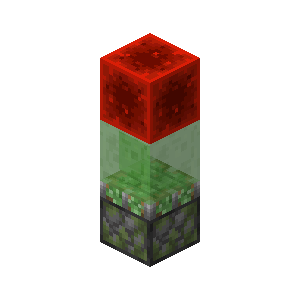

# #01 广义更新与不同类型的更新

本部分是更新理论的入门。

**基础部分**
- 更新理论的认识
- NC更新、PP更新、比较器更新等不同类型的更新
- 方块放置时的自检行为

**进阶部分**（源码分析）
- 简要的NC更新与PP更新的调用与响应
- 方块自检的调用

## 1.1 广义更新

在Minecraft中，方块与方块通过互相“通知”来建立相互的联系。

我们以**破坏某个石头按钮所附着的木板**为例：一个附着在木板上的石头按钮，该木板被破坏了，它会**通知**它周围与它相连的六个方块。木板可以被破坏，也可以被放置；延伸到其他各种方块，它们也都存在各种不同的变化。因此，木板并不会通知周围方块“木板被破坏了”的信息，而是简单地通知“这里发生了一些变化”。当石头按钮受到通知时，它知道“周围发生了变化”，于是检查自己是否还附着在木板上。此时它发现木板被破坏了，自己无法附着，于是变成了掉落物。

这种**通知**行为就称为广义上的**更新**。

## 1.2 更新的类型

在Minecraft中，更新是有多种类型的。

让我们继续上文中的例子：假设在石头按钮边上有一个紧邻着的栅栏门被打开了。石头按钮只会附着在木板这类完整方块上，而栅栏门的变化只是栅栏门开与关的简单状态的变化，相比于木板的放置于破坏显得就不那么明显了。栅栏门开关确实发生了变化，但如果栅栏门打开也要通知石头按钮的话就显得有些多余。因此，栅栏门被打开时，会发出另一种通知，这种通知并不会让石头按钮检查自己是否应该掉落。

这样的通知被称为**PP更新**，而在上文中木板破坏的通知则称为**NC更新**。

比较器是一种能够检测容器中物品数量的红石元件，根据容器中物品数量的多少输出0-15的不同强度高低的红石信号。当容器中物品数量发生变化时，容器并没有必要发出**NC更新**或**PP更新**，但比较器还是能够收到这种变化的“通知”。这是因为容器在容器中物品数量发生变化时，也会发出一种特殊的通知。

这样的通知被称为**比较器更新**。

## 1.3 NC更新

### 1.3.1 NC更新的概念与行为

方块在被放置、破坏、或发生能够显著影响周围方块的变化时，会发出**NC更新**。例如：
- 方块的放置与破坏
- 红石粉能量等级发生变化
- 活塞的推拉*
- ...

> 官方提供的反混淆中NC更新为`neighborChanged`，与mcp反混淆相同。yarn反混淆中则称为`updateNeighbors`

但一些变化不会发出**NC更新**，最为常见的有：
- 可连接方块的连接状态改变，例如玻璃板与其他方块连接、各种墙与其他方块连接
- 红石粉的连接状态发生变化，例如一个与它南北侧红石粉相连的红石粉又与东侧的一个红石粉相连接
- 活板门、栅栏门的开关
- 发射器、投掷器的激活状态改变（**！重要**）
- 漏斗的激活状态改变
- ...

> 活塞的具体行为不在本篇讨论范围内。

一个发出NC更新的“方块”称为**更新核**，大部分方块发出更新时，更新核是它本身。

更新核发出NC更新时，按照**西东下上北南**的顺序，依次对更新核西侧紧邻、东侧紧邻……的方块发出NC更新。这样的更新就是通常意义上的更新。

部分方块在发出NC更新时不只有一个更新核，它们具有特殊的更新核与范围：
- 红石粉的能力等级变化为二阶毗邻更新*。
- 带有指向的红石元件，例如红石中继器、比较器、侦测器，它们在激活状态发生变化时先单独更新它们输出端指向的方块，再以输出端指向的方块为更新核发出NC更新，并且在NC更新时不会更新它们自身方块。
- 平放的动力铁轨切换激活状态时，先以自身为更新核产生NC更新，再以下方方块为更新核产生NC更新。
- 斜放的动力铁轨切换激活状态时，先以自身为更新核产生NC更新，再以下方方块为更新核产生NC更新，最后以上方方块为更新核产生NC更新。

以上是常见且较为典型的例子。更多的特殊情况可以参见[Wiki-方块更新](https://zh.minecraft.wiki/w/%E6%96%B9%E5%9D%97%E6%9B%B4%E6%96%B0#NC%E6%9B%B4%E6%96%B0)

> 红石粉具有更加复杂的更新行为，本篇中不作展开。~~可能后续会追加红石粉专题DLC~~
> 
> 有关**更新核**的理解在基础部分不作过多解释，且并非所有NC更新都存在更新核。参见进阶部分。

### 1.3.2 NC更新的性质、QC激活、BUD装置

NC更新最典型的性质是能够使**BUD装置**响应。

一个方块当前的状态与它**本应该的状态**不同时，这个方块就可以称作是一个**BUD装置**，即**方块更新检测器（Block Update Detector）**。这种方块状态也可以称作是**BUD态**。例如一个浮空的沙子。

最典型的BUD装置是一个被充能（受到红石信号）但未被激活（未伸出）的活塞。活塞具有特殊的充能范围，当活塞本身和活塞上方的一个方块（可以为空气）被充能时，活塞就可以被认为被充能。通过充能活塞上方的空气充能活塞，这种充能方式就称为**QC充能**。这样被充能的活塞在受到NC更新后伸出，就称作**QC激活**。

> QC（quasi connectivity）半连接性，活塞、粘性活塞、投掷器、发射器都具有该性质。

想象一个活塞的斜上方放置了一个红石块，此时这个活塞被QC充能。而红石块的放置只会更新它毗邻的六个方块，无法更新到活塞，所以没有任何方块通知活塞“这里有一个红石信号”。此时这个活塞本应伸出，但却因为没有受到NC更新而没有伸出。也就是*当前的状态与它本应该的状态不同*，即此时这个活塞处于**BUD态**，该活塞就构成了一个**BUD装置**。

此时，如果在活塞边上放置一个方块，方块放置就会发出NC更新。活塞受到NC更新，解除BUD态。

一个最简单常用的可以自行复位的BUD装置如下：

图中的红石块**QC充能**下方粘性活塞，当粘性活塞受到NC更新后伸出，红石块不再充能，而后粘性活塞收回，红石块再次QC充能粘性活塞。

> 此处对该装置涉及活塞原理部分作简单展开，读者仅作了解即可。粘性活塞在伸出时没有受到任何NC更新，因此不会中途丢下方块。粘性活塞伸出到位后触发自检，发现没有被充能于是执行收回。收回时由于粘性活塞的方块到位顺序，粘性活塞先到位，此时触发自检但红石块还未到位（处于方块实体状态），红石块后到位。因此粘性活塞不会由于自检而再次伸出。

## 1.4 PP更新

### 1.4.1 PP更新的概念与行为

几乎所有的变化都会发出**PP更新**。除了：

- 使用命令放置方块
- 使用调试棒改变方块状态

等极其特殊的情况；但还是有一个特例：

- 粘性活塞推动正在激活的侦测器，到位时侦测器不发出PP更新。

> 官方提供的反混淆中PP更新为`updateShape`，即更新形状（例如，各种墙的形状、活板门的开关、红石元件的激活状体改变，都可以称作这里的“形状”），该反混淆名更有益于理解PP更新。PP更新的命名来源于mcp反混淆中是`postPlacement`方法。yarn反混淆中则称为`getStateForNeighborUpdate`

和NC更新不同，PP更新的顺序为**西东北南下上**。

在上文中提到的*不会发出**NC更新***的行为，都是较为典型的发出**PP更新**但不发出**NC更新**的行为。同样，上文中的**BUD装置**无法用来检测**PP更新**。

需要注意的是，除了放置与破坏方块外，大部分红石元件的NC更新范围和PP更新范围是不一样的。例如中继器的NC更新范围是输出端及输出端的毗邻（除中继器自身），而其PP更新范围是自身的毗邻。

PP更新可以理解为**自身发生变化**的更新，而NC更新可以理解为**我需要通知可能受到影响的方块检查是否要改变状态**的更新。

同样以中继器为例，中继器的亮灭属于**自身发生了变化**，通过PP更新通知自身毗邻的方块。而中继器亮起会充能它输出端的方块，如果输出端的方块能够传递红石信号，这个方块还会再向它的毗邻传递红石信号；所以说中继器的亮起有可能会影响它输出端的方块以及输出端毗邻的方块，因此中继器通过NC更新**通知可能受到影响的方块检查是否要改变状态**。

又例如，当投掷器被激活，投掷物品时，投掷物品这一行为并不会对周围方块造成影响*，因此投掷器激活并不发出NC更新。但是投掷器的确改变了激活状态，这种状态改变使得投掷器发出了PP更新。

> 不考虑投掷的物品被漏斗吸取。漏斗吸取属于漏斗自身的行为，不受更新控制。

这样，PP更新与NC更新的差异以及它们更新范围的不同就易于理解了。

### 1.4.2 PP更新的性质

既然上文中的BUD装置无法检测PP更新，那么什么装置能够检测（响应）PP更新呢？

答案是——侦测器。侦测器长得像脸的一面为检测PP更新的一面，有红色小点的一面为输出红石信号的一面。

侦测器响应、且仅响应PP更新。但由于大多数情况NC更新总是伴随PP更新的，所以这里的“仅”可能体现的并不明显。不过我们还是可以通过一些方法来体现：当侦测器直接面向中继器时，中继器亮灭会激活侦测器；但如果侦测器面向中继器输出端指向的方块（空气），中继器的亮灭则不会激活侦测器。这里也很好理解：当中继器指向一个空气时，空气不会有任何变化，因此侦测器自然也不会响应了。

通过BUD装置与侦测器的配合使用，我们可以很方便的在不翻阅源码的情况下测出各个红石元件的NC更新范围和PP更新范围。