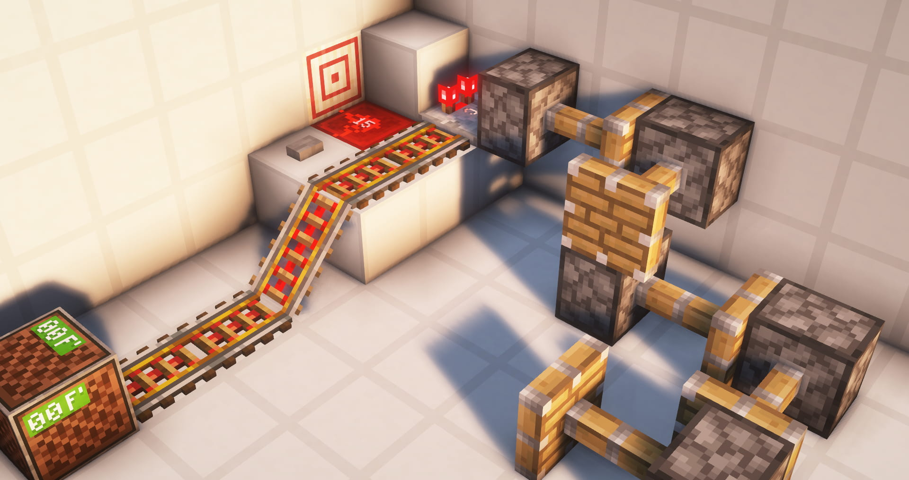
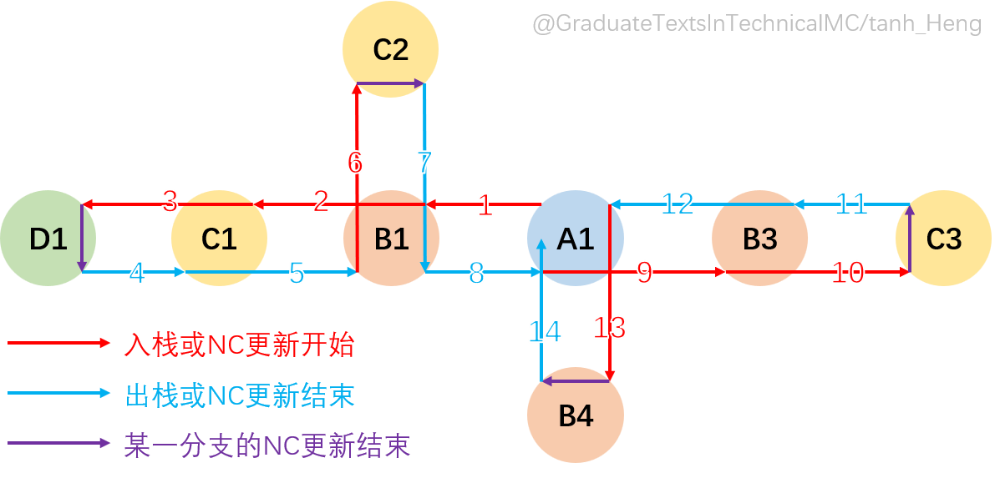
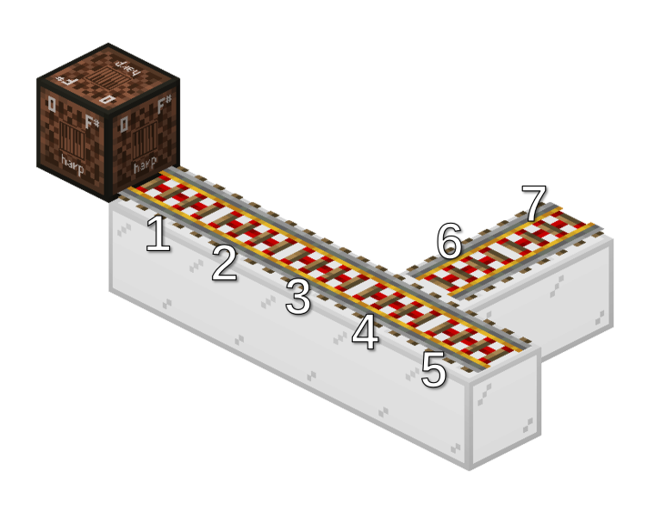
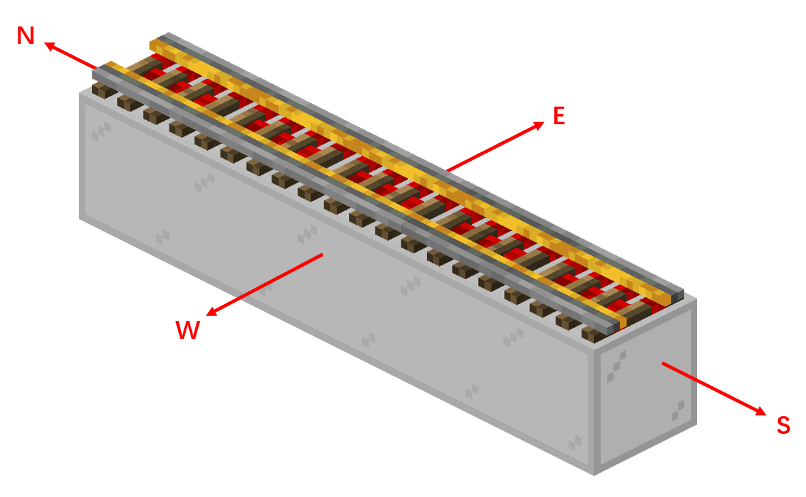

# #02 连续的方块更新及其分析方法

本部分将教学Minecraft中更深层次的更新机制，以及如何分析更新顺序

**基础部分**
- 方块的一般更新行为
- 理解栈、认识深度优先搜索
- 将三维空间的DFS抽象为树结构的DFS的分析方法
- 铁轨的更新顺序实例分析

**进阶部分**
- 一般栈（1.18及以前）和人工栈（1.19及以后）
- CCE更新抑制的原理
- 粉板更新抑制的原理
- OOM更新抑制的原理

## 2.1 方块的一般更新行为

一般情况下，方块总是以**先NC更新、后PP更新**的顺序发出更新。要深入理解更新理论，必须清楚一个概念：**更新不是一个单一的事件，而是一段“过程”**。

示意图如下：
```
方块A：
├── 发出NC更新
│   ├── NC更新触发了一些事件
│   │   └── 这些事件又触发了一些事件
│   └── 这些事件运行结束了
│   * NC更新完成 *
└── 发出PP更新
    ├── PP更新触发了一些事件
    └── 这些事件运行结束了
    * PP更新完成 *
```
例如，当方块A发出NC更新后，更新到方块B，此时B改变状态，又发出NC更新。更新过程如下：
```
├── 方块A 发出NC更新
│   ├── 方块B 受到NC更新
│   ├── 方块B 状态改变
│   ├── 方块B 发出NC更新
│   │   └── 什么都没有发生
│   │   * 方块B NC更新完成 *
│   └── 方块B 发出PP更新
│       └── 什么都没有发生
│       * 方块B PP更新完成 *
│   * 方块A NC更新完成 *
└── 方块A 发出PP更新
    └── 什么都没有发生
    * 方块A PP更新完成 *
```
一般讨论的**NC更新顺序**指的是**发出NC更新的先后次序**，**PP更新顺序**同理，也是**发出PP更新的顺序**。从上文中的示意和例子我们可以看出，在较为复杂的更新中，PP更新顺序也可以近似认为是**方块NC更新过程结束的先后次序**。

## 2.2 Minecraft中的更新方法：深度优先搜索

要深入理解Minecraft中，连续的、更加复杂的方块更新方法是如何进行的，就必须要了解它在计算时的本质。我们将尝试通过一些生动形象的简单例子，让读者循序渐进地理解这一复杂过程是如何发生的。

### 2.2.1 栈

~~那么，让我们先抛开Minecraft不谈。~~

想象一下你正在整理你桌面上的书。你打算把书按照一定顺序从下往上堆起来，而且在取书的时候只能从最顶部开始取。

你打算按照语数英的顺序从下往上堆。

你先把语文书放在了最底下。然后，你发现语文书还有配套的一本练习册，于是你把练习册放在了语文书的上面。接着，你又发现练习册还有配套的答案，于是你把练习册放在了语文书的上面。语文相关的书整理好了。

然后，你把数学书放在了语文练习册答案上面。把数学试卷放在了数学书的上面。最后你把英语书放在了数学试卷上面。

于是，你得到了这样一的一摞书：
```
英语书
数学试卷
数学书
语文答案
语文练习册
语文书
————————
桌面
```
而当你想要取出数学书的时候，你就必须先把英语书取出来，再把数学试卷取出来，最后才能取出数学书。

**这就是“栈（Stack）”**

你的语文书是最先放进去的，但是如果你要取出语文书，它就会是最后取出的。

你的英语书是最后放进去的，但是它可以被第一个取出。

这就是栈的基本原则：**后进先出（LIFO）**。即：后进入栈的元素总是可以被最先取出。

这一摞书就可以看作是栈。书的最顶部就是栈的最顶部，也就是**栈顶**，而桌面就是栈的最底部，也就是**栈底**。我们将放书的过程称为元素的**入栈**，即向栈中插入元素；取书的过程称为元素的**出栈**。

了解了栈，我们才能更好的理解深度优先搜索。

### 2.2.2 深度优先搜索

**2.2.2这一部分是希望读者能够对深度优先搜索有更全面、深入的了解。如果你只是想学习分析方法，可以略读此部分或在有一定基础的情况下直接跳至[2.2.3](#223-方块更新顺序的分析方法)**

> 如果你有计算机基础，这一部分可以略读或跳过。递归是一种最简单的深度优先的体现。

同样，让我们继续放书。

在上文我们放语文书的过程中：

首先，你放了一本语文书。按照原来的计划，你应该在语文书上紧接着放上数学书。但是你却没有这样做，因为语文书让你突然想到：还有一本语文练习本；而这一本语文练习本让你又想到：还有一本练习本答案。

于是，你在语文书后紧接着放了一本练习本，又紧接着放了一本练习本答案。

在放书的过程中，你选择了以深入某一学科为最优顺序，这就是深度优先搜索。

让我们类比到方块更新中来看一看：
```
放书
├── 放语文书
├── 放语文练习本
│   └── 放语文练习本答案
│   * 语文放完了 *
├── 放数学书
│   └── 放数学试卷
│   * 数学放完了 *
├── 放英语书
│   * 英语放完了 *
* 书放完了 *
```

让我们把“放书”换成方块A，语文、数学、英语书换成方块B1、B2、B3，语文练习本换成方块C1，数学试卷换成C2，语文练习本答案换成方块D1

假设有一个方块A状态改变，发出了NC更新，它的西侧有方块B1，东侧有方块B2，南侧有B3。如果A状态改变，B1、B2、B3都会改变状态。如果B1改变状态，与B1相连的C1也会改变状态。如果B2改变状态，与B2相连的C2也会改变状态。如果C1改变状态，与C1相连的D1也会改变状态。

那么，这样的方块更新顺序就是这样的：
```
方块A 状态改变
├── 方块A 发出NC更新
│   ├── 方块A 对西侧方块发出NC更新
│   │   ├── 方块B1 发出NC更新
│   │   │   ├── 方块C1 发出NC更新
│   │   │   │   ├── 方块D1 发出NC更新
│   │   │   │   └── 方块D1 发出PP更新
│   │   │   └── 方块C1 发出PP更新
│   │   └── 方块B1 发出PP更新
│   ├── 方块A 对东侧方块发出NC更新
│   │   ├── 方块B2 发出NC更新
│   │   │   ├── 方块C2 发出NC更新
│   │   │   └── 方块C2 发出PP更新
│   │   └── 方块B2 发出PP更新
│   ├── 方块A 对下侧、上侧、北侧方块发出NC更新
│   └── 方块A 对南侧方块发出NC更新
│       ├── 方块B3 发出NC更新
│       └── 方块B3 发出PP更新
* 方块A NC更新结束 *
```
完整示意图如下：
```
方块A 状态改变
├── 方块A 发出NC更新
│   │
│   ├── 方块A 对西侧方块发出NC更新
│   │   │
│   │   ├── 方块B1 受到NC更新
│   │   ├── 方块B1 状态改变
│   │   ├── 方块B1 发出NC更新
│   │   │   │
│   │   │   ├── 方块C1 受到NC更新
│   │   │   ├── 方块C1 状态改变
│   │   │   ├── 方块C1 发出NC更新
│   │   │   │   │
│   │   │   │   ├── 方块D1 受到NC更新
│   │   │   │   ├── 方块D1 状态改变
│   │   │   │   ├── 方块D1 发出NC更新
│   │   │   │   │   └── 什么都没有发生
│   │   │   │   │   * 方块D1 NC更新结束
│   │   │   │   └── 方块D1 发出PP更新
│   │   │   │       └── 什么都没有发生
│   │   │   │       * 方块D1 PP更新结束
│   │   │   │   * 方块C1 NC更新结束 *
│   │   │   │
│   │   │   └── 方块C1 发出PP更新
│   │   │       └── 什么都没有发生
│   │   │       * 方块C1 PP更新结束 *
│   │   │   * 方块B1 NC更新结束*
│   │   │
│   │   └── 方块B1 发出PP更新
│   │       └── 什么都没有发生
│   │   * 方块B1 PP更新结束 *
│   │
│   ├── 方块A 对东侧方块发出NC更新
│   │   ├── 方块B2 受到NC更新
│   │   ├── 方块B2 状态改变
│   │   ├── 方块B2 发出NC更新
│   │   │   │
│   │   │   ├── 方块C2 受到NC更新
│   │   │   ├── 方块C2 状态改变
│   │   │   ├── 方块C2 发出NC更新
│   │   │   │   └── 什么都没有发生
│   │   │   │   * 方块C2 NC更新结束 *
│   │   │   │
│   │   │   └── 方块C2 发出PP更新
│   │   │       └── 什么都没有发生
│   │   │       * 方块C2 PP更新结束 *
│   │   │   * 方块B2 NC更新结束 *
│   │   │
│   │   └── 方块B2 发出PP更新
│   │       └── 什么都没有发生
│   │       * 方块B2 PP更新结束 *
│   │
│   ├── 方块A 对下侧、上侧、北侧方块发出NC更新
│   │   └── 什么都没有发生
│   │   * 方块A 下侧、上侧、北侧NC更新结束 *
│   │
│   └── 方块A 对南侧方块发出NC更新
│       ├── 方块B3 受到NC更新
│       ├── 方块B3 状态改变
│       ├── 方块B3 发出NC更新
│       │   └── 什么都没有发生
│       │   * 方块B3 NC更新结束 *
│       │
│       └── 方块B3 发出PP更新
│           └── 什么都没有发生
│           * 方块B3 PP更新结束 *
│
* 方块A NC更新结束 *
```

我们总是优先考虑“更加深入”一层的行为。而只有当“更深一层”的行为结束后，较浅一层的行为才会继续进行。

从栈的角度来看，**发出NC更新**即为**入栈**，**NC更新结束**即为**出栈**。方块A发出NC更新入栈，方块B1受到NC更新，状态改变，发出NC更新，此时方块B1入栈；紧接着方块C1入栈，方块D1入栈。方块D1执行NC更新结束，方块D1出栈；方块D1出栈后，方块C1执行NC更新结束，方块C1出栈……方块B1出栈。而后方块B2入栈，C2入栈，C2出栈，B2出栈。B3入栈，B3出栈。最后方块A出栈，方块A的NC更新结束。

所以在Minecraft中，方块更新的深度优先搜索体现在只有当方块NC更新的某一分支结束后，才会继续下一分支。就像例子中的那样，B1、B2、B3都是A的分支，C1是B1的分支，D1是C1的分支。所以只有D1结束，C1才会结束；C1结束，B1才会结束；B1结束，B2才会开始。

因此，对于例子中的NC更新顺序，可以表示为：
```
A -> B1 -> C1 -> D1 -> B2 -> C2 -> B3
```
而对于例子中的PP更新顺序，则可看作是出栈顺序，也就是NC更新结束的顺序，表示为：
```
D1 -> C1 -> B1 -> C2 -> B2 -> B3 -> A
```
如果无法理解此处的PP更新顺序，读者可再次阅读到上文中的简图。

NC更新和PP更新的顺序是一难点。尤其要注意理清某一分支的NC更新是何时结束的。

这就是Minecraft中的深度优先搜索。

### 2.2.3 方块更新顺序的分析方法

让我们用一种更加形象的方式理解例子中的更新过程。我们可以将NC更新的入栈看作“逐步深入”，NC更新的出栈，也就是PP更新看作“逐步返回”。那么，让我们将上文中的图画得更加形象一些，并且再多加入一些节点：



*图中为A1发出更新后的更新链。上方为北侧。*

从图中就能够很好的看出：

NC更新顺序：`A1->B1->C1->D1->C2->B3->C3->B4`

PP更新顺序：`D1->C1->C2->B1->C3->B3->B4->A1`

将更新行为想象为一个点，这个点从A1出发，按照一定的更新顺序移动，并且“不撞南墙不回头”。那么，这个点的移动路径就构成了图示的箭头。逐步深入的过程就是入栈或NC更新，“回头”的过程就是出栈或PP更新。

需要注意的是，这里的分析将PP更新简化了。因为通常情况下，PP更新并不会导致**连续的方块更新**[^1]。要分析PP更新，方法和NC更新是类似的，从栈的角度分析即可。

[^1]: 墙、栅栏等元件在受到PP更新后改变状态，并发出PP更新，这类方块可能会触发由PP更新导致的连续的方块更新。但这不在通常需要分析的情况内。

## 2.3 常见的更新顺序分析

## 2.3.1 BUD铁轨链更新顺序分析

让我们以一个实例来尝试分析更新顺序



已知铁轨在状态改变时，先发出NC更新，后发出PP更新。图中是一串处于BUD状态的铁轨链，1-5铁轨位于东西走向。问：**音符盒按下后，铁轨熄灭的NC更新和PP更新顺序分别是？**

当音符盒按下后，发出NC更新。毗邻的1号铁轨受到NC更新，改变自身状态，发出NC更新，更新到2号、再到3和4。在4号铁轨处，4号铁轨先对东西侧的5号铁轨更新。5号铁轨受到更新后改变自身状态，发出NC更新，不再有后续NC更新，于是5号铁轨此时发出PP更新。退回到4号铁轨，4号铁轨再更新南北侧6、7号铁轨。深入到6号铁轨，6号铁轨发出NC更新；再深入到7号铁轨，7号铁轨发出NC更新。7号铁轨更新结束，发出PP更新。退回到6号铁轨，6号铁轨发出PP更新。退回到4号铁轨，4号铁轨发出PP更新。再退回到3、2、1号铁轨，3、2、1号铁轨发出PP更新。

所以，

NC更新顺序为：<hidden>1 -> 2 -> 3 -> 4 -> 5 -> 6 -> 7<hidden>

PP更新顺序为：<hidden>5 -> 7 -> 6 -> 4 -> 3 -> 2 -> 1<hidden>

## 2.3.2 考虑NC更新方向的分析*

此部分并不常用，读者可选择性跳过。



图中铁轨链方向如标注所示，铁轨链为南北向。我们以最北端的铁轨为例分析其不同方向的NC更新顺序。

NC更新按照西东下上北南的方向顺序发出。当最北侧铁轨熄灭时，它先发出西侧、东侧更新，无事发生；再发出下侧、上侧更新，无事发生；然后发出北侧更新，无事发生；最后发出南侧更新，更新到南侧铁轨，后续更新即可按上文中的方法分析。

假如我们在该铁轨北侧制作一个BUD装置，那么这个BUD装置会先被更新，然后南侧铁轨再进行连续的NC更新。

而如果我们考虑**上侧的NC更新顺序**，那么它就是**自北向南**，即**由近到远**。

让我们再考虑到2.3.1中的例子


音符盒为1-5铁轨链的最西侧，仅考虑1-5铁轨链的NC更新。

当音符盒按下后，1号铁轨受到更新而熄灭，先发出西侧更新，无事发生；再发出东侧更新，更新到2号铁轨，2号铁轨开始更新……等到2、3、4……铁轨更新结束后，1号铁轨的**东侧NC更新**完成，1号铁轨继续更新下侧、上侧、北侧、南侧。

此时如果我们考虑**上侧的NC更新顺序**，它就变成了5、4、3、2、1，也就是**由远到近**。

那么读者可能就会想问：既然NC更新的顺序还要考虑方向性，我们学习2.3.3的发出NC更新顺序又有什么用呢？

用处有二：

1. 用于分析PP更新。通常我们使用铁轨链时，多用侦测器来观测，因此这实际上是为了帮助我们分析PP更新的。
2. NC更新的方向性是在2.3.3的基础之上的，只有理解了2.3.3才能更好的理解方向性。

## 2.3.3 练习

上文中的第二个例子我们并没有考虑6、7号铁轨。读者可尝试分析考虑6、7号铁轨时，整个BUD铁轨链对**上侧的NC更新**的顺序。

答案：<hidden>5 -> 4 -> 6 -> 7 -> 3 -> 2 -> 1</hidden>