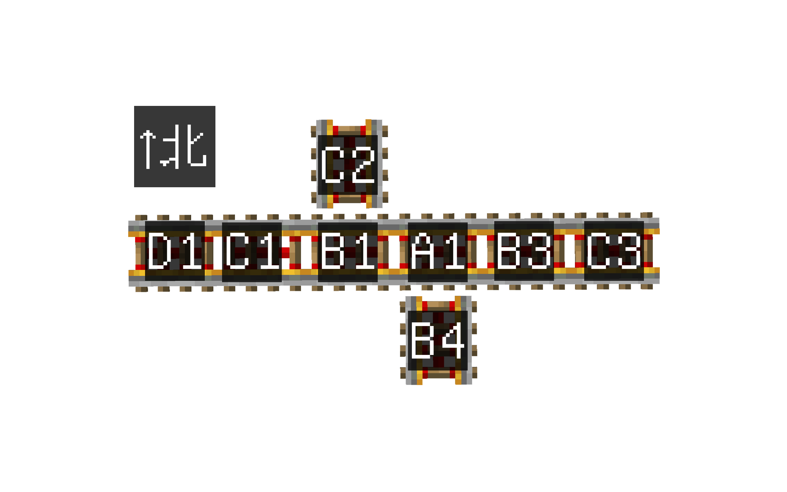
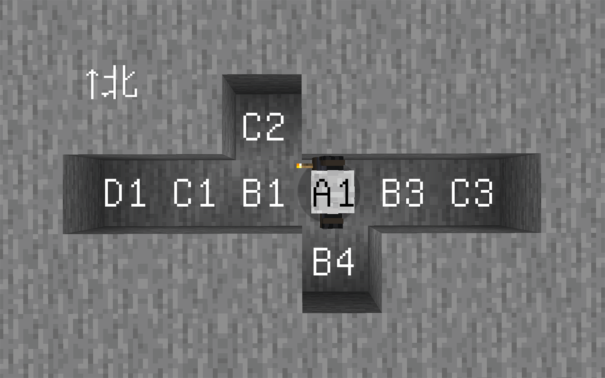

# #02 连续的方块更新及其分析方法

本部分将教学Minecraft中更深层次的更新机制，以及如何分析更新顺序

**基础部分**
- 方块的一般更新行为
- 理解栈、认识深度优先搜索
- 将三维空间的DFS抽象为树结构的DFS的分析方法
- 铁轨的更新顺序实例分析

**进阶部分**
- 一般栈（1.18及以前）和人工栈（1.19及以后）
- CCE更新抑制的原理
- 粉板更新抑制的原理
- OOM更新抑制的原理

## 2.1 方块的一般更新行为

一般情况下，方块总是以**先NC更新、后PP更新**的顺序发出更新。要深入理解更新理论，必须清楚一个概念：**更新不是一个单一的事件，而是一段“过程”**。

示意图如下：
```
方块A：
├── 发出NC更新
│   ├── NC更新触发了一些事件
│   │   └── 这些事件又触发了一些事件
│   └── 这些事件运行结束了
│   * NC更新完成 *
└── 发出PP更新
    ├── PP更新触发了一些事件
    └── 这些事件运行结束了
    * PP更新完成 *
```
例如，当方块A发出NC更新后，更新到方块B，此时B改变状态，又发出NC更新。更新过程如下：
```
├── 方块A 发出NC更新
│   ├── 方块B 受到NC更新
│   ├── 方块B 状态改变
│   ├── 方块B 发出NC更新
│   │   └── 什么都没有发生
│   │   * 方块B NC更新完成 *
│   └── 方块B 发出PP更新
│       └── 什么都没有发生
│       * 方块B PP更新完成 *
│   * 方块A NC更新完成 *
└── 方块A 发出PP更新
    └── 什么都没有发生
    * 方块A PP更新完成 *
```
一般讨论的**NC更新顺序**指的是**发出NC更新的先后次序**，**PP更新顺序**同理，也是**发出PP更新的顺序**。从上文中的示意和例子我们可以看出，在较为复杂的更新中，PP更新顺序也可以近似认为是**方块NC更新过程结束的先后次序**。

## 2.2 Minecraft中的更新方法

我们将通过一些生动形象的简单例子，让你循序渐进地理解更新这一复杂过程是如何发生的。

例如下面这串bud铁轨为例，更新其中的A1会怎样发生什么样的事情呢



### 2.2.1  更新顺序的分析方法

~~想要理解更新，我们就需要先抛开更新不谈~~

想象一下，你是一个强迫症，此时此刻你正拿着许多火把在一个矿洞。

由于你是强迫症，你将完全遵循以下规则：

1. 你走到每一格都会插一根火把
2. 每走一个格就按照**西东下上北南**的顺序寻找有没有格子
3. 如果有格子可走，就立刻进入
4. 无路可走的时候就往回走
5. 走回头路的时候会捡回放下火把
6. 走回岔路口的时候如果还有**其他方向**没检查完就继续检查

按照上面的规则，我们来看一下下面这个矿洞你会如何探索



<style>
NC{ color: Red }
PP{ color: Lightblue}
</style>

1. 最开始，你位于在A1，于是你在A1<NC>插下火把</NC>
2. 你开始按照**西东下上北南**的顺序寻找岔路，你发现西方有一格可走
3. 你进入这个格子（B1），<NC>插下火把</NC>，继续检查→发现西方有路，进入C1，<NC>插火把</NC>，检查→西方有路，进入D1，<NC>插火把</NC>
4. 哎，这个时候你按照西东下上北南的顺序检查完发现没路了，于是你收起火把往回走（进入C1）
5. 西你检查过了，于是检查东下上北南，发现没路，<PP>收火把</PP>，回到B1
6. 东下上都没路可走，但是当你检查到北的时候你发现有路，于是进入（C2），<NC>插火把</NC>
7. 检查完发现没路，<PP>收火把</PP>回到B1
8. B1检查完没路，<PP>收火把</PP>回到A1,你开始检查其他方向
9. ！东方有路，进入B3插火把→东方有路，进入C3插火把
10. 无路可走了，<PP>收火把</PP>回B3 →没路，<PP>收火把</PP>回A1
11. 检查剩余方向，南方有路，进入B4，插火把
12. 无路，<PP>收火把</PP>回A1
13. A1无剩余岔路，<PP>收起火把</PP>，探索完毕

这个探索矿洞的过程就是更新的过程，其中<NC>“插火把”</NC>是发出NC更新（入栈），<PP>收火把</PP>是发出PP更新（出栈）。至于这个“栈”是什么意思，你可以参阅[附录-专有名词解释→栈与调用栈](../Appendix/01-栈.md),而这种更新方法就是深度优先搜索（DFS）

**推荐搭配 [BiliBili-tanh_Heng：NC更新×深度优先搜索.exe](https://www.bilibili.com/video/BV1p481z4EBi) 食用**

让我们用一种更加形象的方式理解例子中的更新过程。我们可以将NC更新的入栈看作“逐步深入”，NC更新的出栈，也就是PP更新看作“逐步返回”。那么，让我们将上文中的图画得更加形象一些，并且再多加入一些节点：


*图中为A1发出更新后的更新链。上方为北侧。*

从图中就能够很好地看出：

NC更新顺序：`A1->B1->C1->D1->C2->B3->C3->B4`

PP更新顺序：`D1->C1->C2->B1->C3->B3->B4->A1`

将更新行为想象为一个点，这个点从A1出发，按照一定的更新顺序移动，并且“不撞南墙不回头”。那么，这个点的移动路径就构成了图示的箭头。逐步深入的过程就是入栈或NC更新，“回头”的过程就是出栈或PP更新。

需要注意的是，这里的分析将PP更新简化了。因为通常情况下，PP更新并不会导致**连续的方块更新**[^1]。要分析PP更新，方法和NC更新是类似的，从栈的角度分析即可。

[^1]: 墙、栅栏等元件在受到PP更新后改变状态，并发出PP更新，这类方块可能会触发由PP更新导致的连续的方块更新。但这不在通常需要分析的情况内。

## 2.3 常见的更新顺序分析

## 2.3.1 BUD铁轨链更新顺序分析

让我们以一个实例来尝试分析更新顺序


已知铁轨在状态改变时，先发出NC更新，后发出PP更新。图中是一串处于BUD状态的铁轨链，1-5铁轨位于东西走向。问：**音符盒按下后，铁轨熄灭的NC更新和PP更新顺序分别是？**

当音符盒按下后，发出NC更新。毗邻的1号铁轨受到NC更新，改变自身状态，发出NC更新，更新到2号、再到3和4。在4号铁轨处，4号铁轨先对东西侧的5号铁轨更新。5号铁轨受到更新后改变自身状态，发出NC更新，不再有后续NC更新，于是5号铁轨此时发出PP更新。退回到4号铁轨，4号铁轨再更新南北侧6、7号铁轨。深入到6号铁轨，6号铁轨发出NC更新；再深入到7号铁轨，7号铁轨发出NC更新。7号铁轨更新结束，发出PP更新。退回到6号铁轨，6号铁轨发出PP更新。退回到4号铁轨，4号铁轨发出PP更新。再退回到3、2、1号铁轨，3、2、1号铁轨发出PP更新。

所以，

NC更新顺序为：<hidden>1 -> 2 -> 3 -> 4 -> 5 -> 6 -> 7<hidden>

PP更新顺序为：<hidden>5 -> 7 -> 6 -> 4 -> 3 -> 2 -> 1<hidden>

## 2.3.2 考虑NC更新方向的分析*

此部分并不常用，读者可选择性跳过。


图中铁轨链方向如标注所示，铁轨链为南北向。我们以最北端的铁轨为例分析其不同方向的NC更新顺序。

NC更新按照西东下上北南的方向顺序发出。当最北侧铁轨熄灭时，它先发出西侧、东侧更新，无事发生；再发出下侧、上侧更新，无事发生；然后发出北侧更新，无事发生；最后发出南侧更新，更新到南侧铁轨，后续更新即可按上文中的方法分析。

假如我们在该铁轨北侧制作一个BUD装置，那么这个BUD装置会先被更新，然后南侧铁轨再进行连续的NC更新。

而如果我们考虑**对六个方向的NC更新中，对上侧方块的NC更新**的顺序，那么它就是**自北向南**，即**由近到远**。

让我们再考虑到2.3.1中的例子


音符盒为1-5铁轨链的最西侧，仅考虑1-5铁轨链的NC更新。

当音符盒按下后，1号铁轨受到更新而熄灭，先发出西侧更新，无事发生；再发出东侧更新，更新到2号铁轨，2号铁轨开始更新……等到2、3、4……铁轨更新结束后，1号铁轨的**东侧NC更新**完成，1号铁轨继续更新下侧、上侧、北侧、南侧。

此时如果我们考虑**对上侧方块的NC更新**的顺序，它就变成了5、4、3、2、1，也就是**由远到近**。

那么读者可能就会想问：既然NC更新的顺序还要考虑方向性，我们学习2.3.3的发出NC更新顺序又有什么用呢？

用处有二：

1. 用于分析PP更新。通常我们使用铁轨链时，多用侦测器来观测，因此这实际上是为了帮助我们分析PP更新的。
2. NC更新的方向性是在2.3.3的基础之上的，只有理解了2.3.3才能更好的理解方向性。

## 2.3.3 练习

上文中的第二个例子我们并没有考虑6、7号铁轨。读者可尝试分析考虑6、7号铁轨时，整个BUD铁轨链对**对上侧方块的NC更新**的顺序。

答案：<hidden>5 -> 4 -> 6 -> 7 -> 3 -> 2 -> 1</hidden>