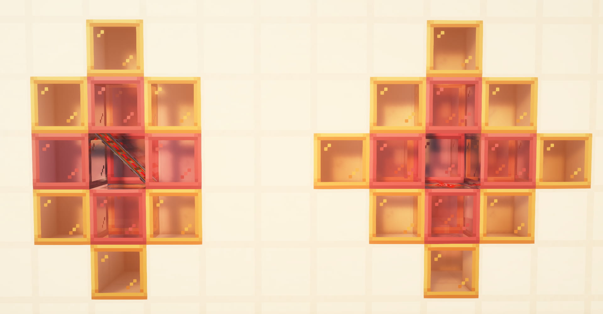

# #03 特殊的更新行为

本部分将介绍一些方块的特殊的更新行为

**基础部分**

- 红石粉的更新简述
- 斜侧铁轨的更新

**进阶部分**

- 详谈红石粉的更新及其代码解析
- 铁轨链的递归检查行为

## 3.1 红石粉的更新行为

### 3.1.1 二阶毗邻更新的概念

在[#01](./01-更新概念与不同类型的更新.md)中，我们引入了NC更新的“更新源”的概念，最普通常见的方块更新：例如放置、破坏方块产生的更新，都是以变化方块的位置为更新源，向六个方向发出NC更新的，这种就可以称作“一阶毗邻更新”。

而红石粉则不然。举例来说，在红石粉的能量等级发生变化时，会发出“二阶毗邻更新”，指的是：红石粉以自身位置和自身毗邻的六个方块分别为更新源，分别向六个方向发出NC更新。

“一阶”与“二阶”的命名，是由最远受到NC更新的方块距离发出更新方块的曼哈顿距离[^1]得来的。一阶毗邻更新即最远受到NC更新的方块距离发出更新方块的曼哈顿距离为1，二阶毗邻更新即该距离为2。

[^1]: 曼哈顿距离，即两坐标在各坐标轴上的距离的和，在Minecraft的三维空间中有`d=|x|+|y|+|z|`

### 3.1.2 红石粉二阶毗邻更新的更新源顺序（红石粉更新的位置性）

红石粉在发出二阶毗邻更新时，7个更新源的先后顺序是基于红石粉坐标的哈希信息随机排列的，其顺序见下表。这也就是红石粉更新具有位置性的由来。这些更新源有97%的概率被分为三组：

*注：表中O表示源红石粉，-X等表示更新源相对于源红石粉的方位*

| 组别1 | 组别2 | 组别3 | 概率 |
| :---: | :---: | :---: | :---: |
| -Y, +Z, +X | O | +Y, -Z, -X | 24.267% |
| +Y, -Z, -X | O | -Y, +Z, +X | 24.267% |
| O | -Y, +Z, +X | +Y, -Z, -X | 12.133% |
| O | +Y, -Z, -X | -Y, +Z, +X | 12.133% |
| -Y, +Z, +X | +Y, -Z, -X | O | 12.133% |
| +Y, -Z, -X | -Y, +Z, +X | O | 12.133% |
||其他各项||<0.2%|

各组别内的更新顺序是固定的，但组别排列顺序随机。除此之外，还有一些其他的概率极低的排列选项。

## 3.2 斜侧铁轨的更新行为

## 3.3【进阶】红石粉的更新及其代码解析

## 3.4【进阶】铁轨链的递归检查行为

铁轨在接受到NC更新时会检测自身充能状态。当满足以下两个条件之一时，它将会判断自己被充能`powered=True`：
1. 直接接收到红石信号，即被直接充能
2. 由相连的其他铁轨充能，即被间接充能

铁轨检查自身是否被间接充能并不是检测相连铁轨是否被充能，而是递归寻找整条铁轨链上距离自身8个铁轨及以内的 *(若认为直接相连的两个铁轨的距离为1个铁轨)*、被直接充能的铁轨，过程如下： 
1. 初始时距离变量为`0`。若`距离=8`，则终止检查并返回`False`，即不被间接充能。
2. 铁轨具有两个方向，当开始检查时，铁轨先检查哪一个方向由一个布尔值控制。当布尔值为`True`时，且当铁轨形状为南北/东西朝向时，它检查南/西侧铁轨；当铁轨形状是上下斜向`shape=ascending_*`时，它检查南侧上方/西侧上方的铁轨。当布尔值为`False`时反之。此布尔值在开始检查时先为`True`，后为`False`。且由于逻辑运算短路[^2]：若第一次布尔值为`True`时检查成功，则不会进行第二次布尔值为`False`的检查。在递归检查过程中 *(见步骤6)* 此布尔值不会改变。
3. 移动坐标`(i, j, k)`到接下来要检查的铁轨位置。
4. 判断当前铁轨能否可能在当前检查方向上与当前方向的下方的一个铁轨相连。若当前铁轨为向东/西/南/北侧向上，且检查方向为东/西/南/北，则认为不能。此步骤是为步骤8准备的。例如：当前铁轨为北侧向上，此时在向南侧检查，则此铁轨可能与南侧下方的铁轨相连；当前铁轨为北侧向上，此时在向北侧检查，则此铁轨不可能与南侧下方的铁轨相连。
5. 若当前铁轨形状为南侧向上/北侧向上或东侧向上/西侧向上，则认为当前铁轨形状为南北朝向或东西朝向——这一形状更改是为下一步骤 *(6.b.)* 准备的。
6. 检查坐标`(i, j, k)`：
    1. 检查当前位置是否是一个铁轨，如果不是，则返回`False`，结束当前步骤检查。
    2. 检查当前位置是否与原铁轨相连。此步骤并不检查“相连”，而是检查“不相连”：若原铁轨形状为东西朝向，则若当前铁轨形状为南北/北侧向上/南侧向上，则不相连，返回`False`，结束步骤6检查。若原铁轨为南北朝向，则若当前铁轨形状为东西/东侧向上/西侧向上，则不相连，返回`False`，结束当前步骤检查。
    3. 步骤i.ii.实际都是iii.iv.的前置条件。此步骤检查当前位置的铁轨是否被直接充能，如果是，则返回`True`，结束当前步骤检查。  
    4. 跳至步骤1，距离增加`1`，并按照开始检查的布尔值进行下一个铁轨的检查 *(递归)* 。
7. 若步骤6返回`True`，则终止检查并返回`True`。
8. *(见步骤4判断)* 若当前铁轨可能在当前检查方向上与当前方向的下方的一个铁轨相连，那么检查坐标`(i, j, k)`下方的方块，即跳至步骤6，但检查的坐标为`(i, j-1, k)`。在步骤4的例子中，若步骤3返回`False`，那么此时将检查原铁轨南侧下方的铁轨。

[^2]: 逻辑运算短路，计算机进行逻辑判断语句时的一种“熔断”机制。例如`A and B`中，若A不成立，则逻辑判断熔断，返回`False`，不再判断B是否成立；`A or B`中，若A成立，则逻辑判断熔断，返回`True`，不再判断B是否成立。