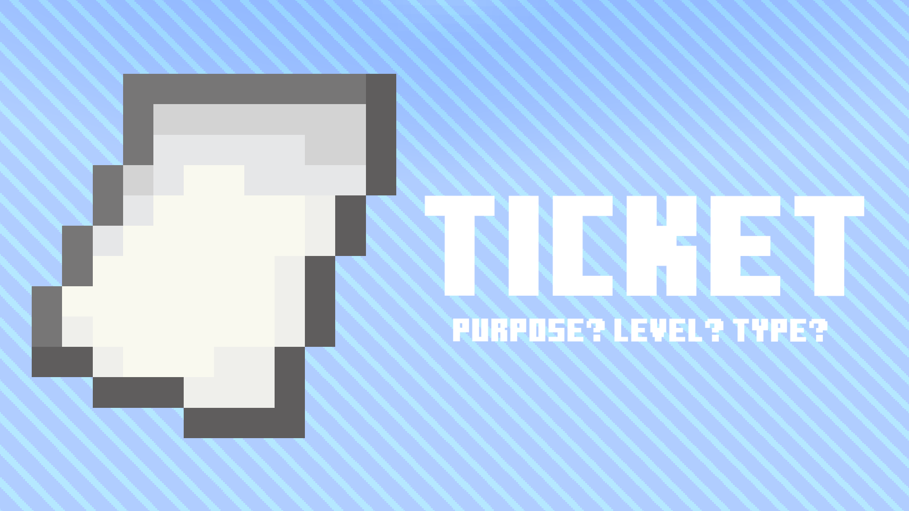

# 01加载票系统中的类型



本章将建立对加载票这一概念的基本认识。

## 1.1加载票 Ticket

一个加载票包含了 

`net.minecraft.server.world.ChunkTicket`

* `type` 加载票类型，记录加载的原因。
* `level` 加载等级，决定区块的运算。
* `tickCreated` 创建时间，用于判断加载票是否过期。

## 1.2加载票类型 TicketType

在Minecraft一共有8种加载票类型 

`net.minecraft.server.world.ChunkTicketType`

```java
    public static final ChunkTicketType<Unit> START = create("start", (a, b) -> 0);
    public static final ChunkTicketType<Unit> DRAGON = create("dragon", (a, b) -> 0);
    public static final ChunkTicketType<ChunkPos> PLAYER = create("player", Comparator.comparingLong(ChunkPos::toLong));
    public static final ChunkTicketType<ChunkPos> FORCED = create("forced", Comparator.comparingLong(ChunkPos::toLong));
    public static final ChunkTicketType<ChunkPos> LIGHT = create("light", Comparator.comparingLong(ChunkPos::toLong));
    public static final ChunkTicketType<BlockPos> PORTAL = create("portal", Vec3i::compareTo, 300);
    public static final ChunkTicketType<Integer> POST_TELEPORT = create("post_teleport", Integer::compareTo, 5);
    public static final ChunkTicketType<ChunkPos> UNKNOWN = create("unknown", Comparator.comparingLong(ChunkPos::toLong), 1);
```

* `start`：用于世界启动时加载出生点。加载距离是 11，即加载等级22 。`net.minecraft.server.MinecraftServer#prepareStartRegion`
* `dragon`：用于进行龙战时加载末地主岛。加载 9 距离，即加载等级24。 `net.minecraft.entity.boss.dragon.EnderDragonFight#tick`
* `player`：玩家加载。
* `forced`：用于实现 `/forceload`指令与强加载出生点。
* `light`：用于加载需要计算光照的区块。
* `portal`：用于生物或玩家穿过传送门时加载目标维度的区块，300gt（15s）内没有使用过之后，移除与之相关的加载票，加载距离是 3 。`net.minecraft.world.PortalForcer#getPortalRect`
* `post_teleport`：用于生物或者玩家传送时加载目标区块，比如 `/tp`，5gt后移除。
* `unknown`：用于游戏内代码上使用了 `getChunk`后加载区块，1gt后移除。

加载等级对应着加载距离，算法是：

加载等级 = 33 - 加载距离 

`net.minecraft.server.world.ChunkTicketManager#addTicket`

```java
  ChunkTicket<T> chunkTicket = new ChunkTicket<>(type, ChunkLevels.getLevelFromType(ChunkLevelType.FULL) - radius, argument); //ChunkLevelType.FULL = 33
```

需要注意的是，加载距离并不由 `ChunkTicketType`指定，比如 `post_teleport` 在 `/tp` 指令使用时加载距离为 1，而其他情况下为 0。

## 1.3加载等级 Level

加载等级被限制在[22-45]，至于为什么上限是这个数：

```java
public static final int INACCESSIBLE = 33 + ChunkStatus.getMaxDistanceFromFull();
```

在1.20.1中ChunkStatus.getMaxDistanceFromFull()会返回12，具体请看1.6小结。

## 1.4加载等级类型 LevelType

在加载等级决定了这个区块能运算什么,一共有四中类型 

`net.minecraft.server.world.ChunkLevelType`

```java
public enum ChunkLevelType {
    INACCESSIBLE,
    FULL,
    BLOCK_TICKING,
    ENTITY_TICKING;
}
```

加载等级与加载等级类型的关系:

`net.minecraft.server.world.ChunkLevels#getType`

```java
    public static ChunkLevelType getType(int level) {
        if (level <= 31) {
            return ChunkLevelType.ENTITY_TICKING;
        } else if (level <= 32) {
            return ChunkLevelType.BLOCK_TICKING;
        } else {
            return level <= 33 ? ChunkLevelType.FULL : ChunkLevelType.INACCESSIBLE;
        }
    }
```

加载等级类型决定了区块运算。

* 运算实体(强加载) `ENTITY_TICKING` ：当加载等级小于等于31时为运算实体，会计算全部的游戏流程，包括实体等等。
* 基础运算(弱加载) `BLOCK_TICKING` : 当加载等级小于等于32时为基础运算，不会运算实体，其他正常运算，如红石原件。
* 加载边界 `FULL` ：当加载等级为33时为加载边界，几乎不会有游戏流程运算，但是会记录实体，也就是说在加载边界的里的实体会被记录上刷怪上线。
* 不可访问 `INACCESSIBLE` ：当加载等级在大于33时为不可访问，这些区块并没有真正地加载，只是进行了部分的部分的世界生成。

## 1.5区块实例 ChunkHolder

不在本文的讨论范围，但会简略的介绍ChunkHolder的作用。

`ChunkHolder`是区块管理系统底层中区块的容器，存储了区块本身、区块加载等级、区块生成状态和区块的允许用途。大约可以看成区块在游戏内部的实例。

## 1.6区块状态 ChunkStatus

不在本文的讨论范围，但会简略的介绍ChunkStatus。

`ChunkStatus`对应了区块生成阶段，1.20.1中有：

* `empty`：空区块；
* `structure_starts`：获取区块中可能起始生成器结构；
* `structure_reference`：用于世界生成；
* `biomes`：确定生物群系；
* `noise`：生成地形的大致轮廓与基岩层；
* `surface`：替换地表附近的方块；
* `carvers`：生成洞穴和峡谷；
* `features`：生成海底洞穴和峡谷；
* `initialize_light`：计算区块的初始光照?；
* `light`：计算区块的光照；
* `full`：区块加载完成  `ProtoChunk`转换为 `WorldChunk`。

加载等级对应的区块状态：

* 34-：`full`；
* 35：`initialize_light`；
* 36：`carvers`；
* 37：`biomes`；
* 38~45：`structure_starts`。
