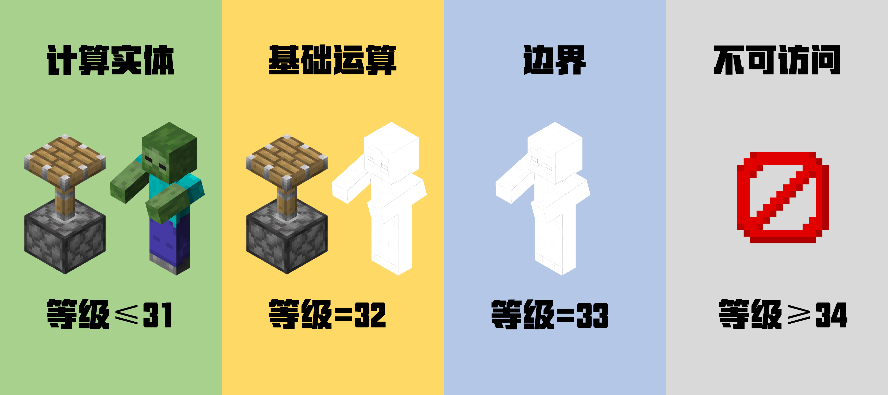

# 02加载等级

## 2.1加载等级

加载的范围是22-44，等级越低加载范围越大。

## 2.2等级类型

在minecraft加载等级决定了这个区块能运算什么,一共有四中类型 `net.minecraft.server.world.ChunkLevelType`

```java
public enum ChunkLevelType {
    INACCESSIBLE,
    FULL,
    BLOCK_TICKING,
    ENTITY_TICKING;
}
```

高等级的加载类型会覆盖低等级的加载类型 `net.minecraft.server.world.ChunkLevels#getType`

```java
    public static ChunkLevelType getType(int level) {
        if (level <= 31) {
            return ChunkLevelType.ENTITY_TICKING;
        } else if (level <= 32) {
            return ChunkLevelType.BLOCK_TICKING;
        } else {
            return level <= 33 ? ChunkLevelType.FULL : ChunkLevelType.INACCESSIBLE;
        }
    }
```

* 运算实体(强加载) `ENTITY_TICKING` ：当加载等级小于等于31时为运算实体，会计算全部的游戏流程，包括实体等等。
* 基础运算(弱加载) `BLOCK_TICKING` : 当加载等级小于等于32时为基础运算，不会运算实体，其他正常运算，如红石原件。
* 加载边界 `FULL` ：当加载等级为33时为加载边界，几乎不会有游戏流程运算，但是会记录实体，也就是说在加载边界的里的实体会被记录上刷怪上线。
* 不可访问 `INACCESSIBLE` ：当加载等级在大于33时为不可访问，这些区块并没有真正的加载，只是进行了部分的部分的世界生成。



(图片来自[bilibili](https://www.bilibili.com/opus/700887183340339268)）
