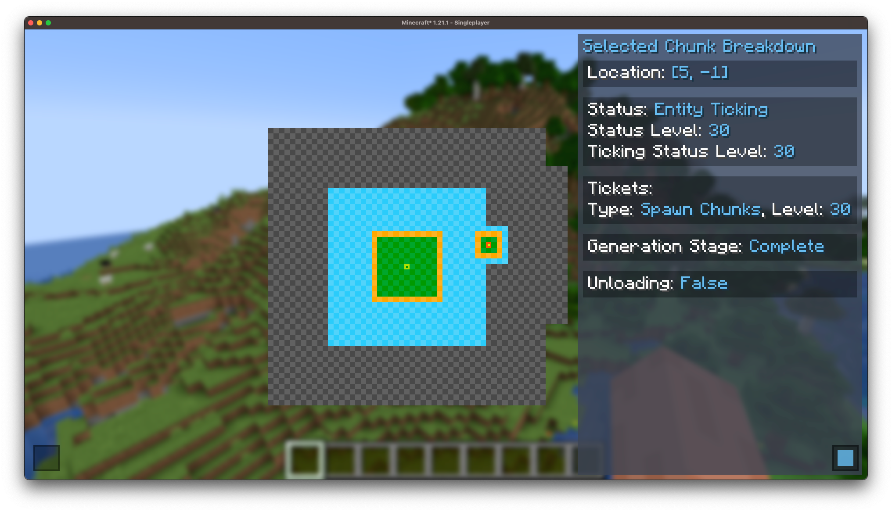

# a-附页-辅助mod

## Chunkdebug

链接:[Modrinth](https://modrinth.com/mod/chunk-debug)

一款可以查看服务器上个个地方区块加载情况。

## Intricarpet

链接:[Modrinth](https://modrinth.com/mod/intricarpet)

一个carpet扩展，可以关闭玩家区块加载，方便调试。

`/interaction chunkloading false`

## MessMod

链接:[Modrinth](https://modrinth.com/mod/messmod)

一个有多种功能的工具箱。
