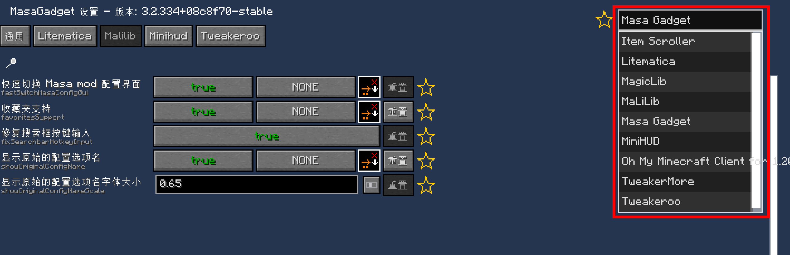
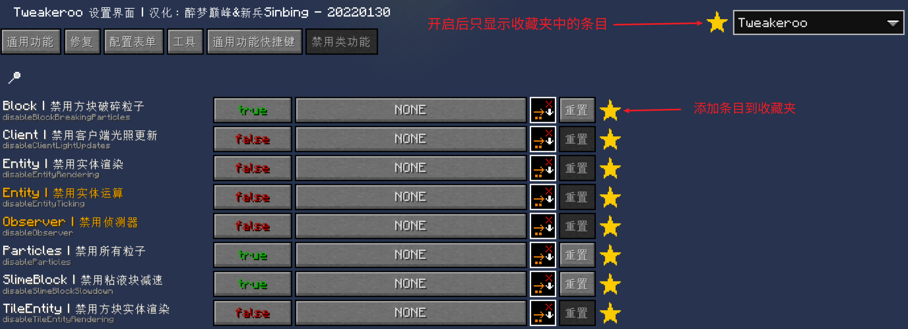
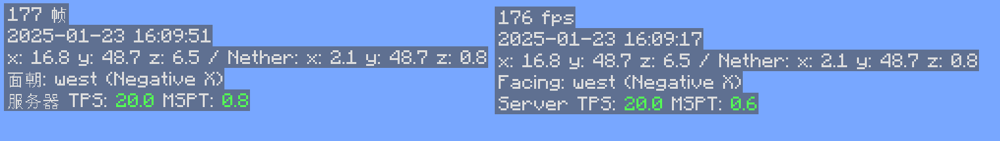

# #01 Masa Gadget 

Masa Gadget为各个masamod添加了一些额外的功能，同时本身也提供了村民信息渲染，搜寻可刷怪位置等额外功能

## 1.1 通用功能
### 1.1.1 快速切换masamod界面

安装Masa Gadget后默认开启，在任何一个masamod配置界面的右上角可以快速切换到其他的masamod配置界面中
再也不会为了忘记某个模组配置界面的快捷键而烦恼

### 1.1.2 收藏夹功能

默认关闭，开启后可以将masamod的条目添加到收藏夹中，方便下次更改,效果如下

## 1.2 Litematica
### 1.2.1 更好的轻松放置模式&修复轻松放置协议

默认开启，在开启轻松放置后仍然可以打开容器(不一定有效),修复了一些投影放置时方块方向错误的bug(还是有错)

### 1.2.2 在服务器中保存投影时保存容器数据

默认开启，需要[plusls-carpet-addition](https://github.com/plusls/plusls-carpet-addition)的支持

## 1.3 Minihud
### Minihud翻译

Minihud 显示的文本可以被翻译,效果如下

###  PCA同步协议同步蜂巢数据

按下 §6容器预览§r 的快捷键将会使用 PCA 同步协议来 同步蜂巢，蜂箱数据

