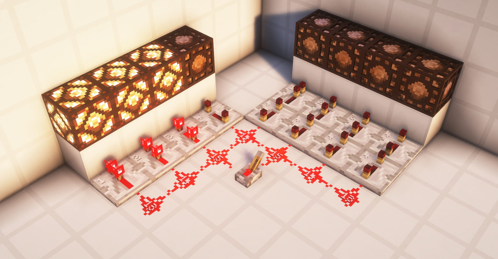
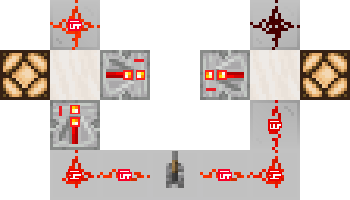
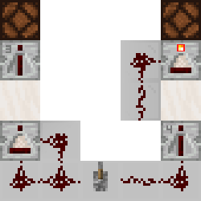

# #01 刻与刻间时序

> 我们在前文中已经学习了更新理论了，但是好奇的小B决定不止于此。他拿出了创造物品栏的~~雷石东直放站~~红石中继器，拉下了拉杆。
>
> 也许是小B太过敏感，当他拉下拉杆的时候，他发现红石中继器好像没有立刻亮起，他以为游戏出现了虫，便多尝试了几次。他很快意识到这是个稳定的，可复现的现象。很显然，与前文中我们探讨的大量瞬时现象不同，这里出现了所谓**异步**的现象，他称这种现象为**延迟**

## 1.1 游戏刻，红石刻与延迟

在Minecraft中有大量的事件需要处理，这些事件被按顺序放在一个大循环里，我们称这个循环为游戏主循环，在不使用 */tick* 命令，游戏正常运行的情况下，这个主循环总是以约 **每秒20次** 的间隔循环，我们称这个最短间隔为 **GameTick** ，简称 **gt**。由于历史遗留问题，当前部分情况下我们仍采用**红石刻RedstoneTick**的记号，简称**rt**。其与gt有如下换算关系：$1rt=2gt$。

这意味着：

1. 1gt = $\frac{1}{20}$秒 = $0.05$秒
2. 即使Minecraft算力充足，在不到0.05秒内计算完了游戏在本gt需要计算的全部内容，也会停止计算直到下一gt到来。

因此，玩家定义了两个指标以衡量游戏是否卡顿，分别是 **TPS** 和 **mspt**。TPS全称 Tick Per Second 指的是每秒钟游戏执行了多少游戏刻。通常而言，这个数值是20，但当游戏卡顿时，其将会低于20。而mspt，全称 Millisecond Per Tick，指的是当前游戏执行每一刻所需要花费的毫秒数，数值越低则游戏卡顿越低。

值得注意的是，mspt总是与TPS保持着如下关系：

- 当mspt低于50时，TPS为20
- 当mspt大于50时，TPS = $\frac{1000}{mspt}$

在游戏中，绝大部分红石元件的响应是有**延迟**的。元件的**宏观**延迟我们在此处将其单位定义为**gt**，部分元件的延迟如下：

- 中继器：2-8gt
- 比较器：2gt
- 侦测器：2gt
- ...

## 1.2 中继器，比较器初步

中继器和比较器具有宏观延迟。中继器的延迟和其设定档位有关，而比较器的延迟总是2gt。

中继器的基本作用是增强信号。即将任何强度不为0的红石信号在延迟指定游戏刻后变为强度为15的信号。

当中继器侧面被中继器或比较器直接贴脸输入时，则会进入“锁存”状态，此时，其输入端的任何改变均不影响其亮起或熄灭状态，直到其侧面输入结束，等待延迟对应gt后，若状态需要更改，则更改其状态。

比较器总共有3个输入端，分别为前面和两个侧面输入。当侧面无任何输入时，其总是会直接输出等同于前面输入的信号强度的信号。当其侧面存在输入时，比较器的行为取决于其模式。比较器有两种模式，分别为：

- 比较模式
- 减法模式

---

其默认为**比较模式**。当比较器处于**比较模式**时，其总是遵循如下逻辑进行输出：

> 取左侧输入和右侧输入的最大值，若其最大值大于其前端输入，则不进行任何输出，否则输出其前端输入。

---

当比较器处于**减法模式**时，其总是遵循如下逻辑进行输出：

> 取左侧输入和右侧输入的最大值，若其最大值大于其前端输入，则不进行任何输出，否则输出其(前端输入-侧面输入的最大值)。

---

比较器与容器的互动在此处不做讨论。

## 1.3 充能理论

我们建立充能理论以解释一种发生在中继器与比较器等元件的现象，其重要特征为隔着方块充能红石粉或其它中继器/比较器。

我们定义对于任意**可充能**方块，其有两种充能状态：**强充能** 和 **弱充能**。

当可充能方块被强充能时，其标志性特征为可以激活其周围6个方向的红石粉，无论其指向。而弱充能时仅能激活输入端对着可充能方块的中继器，比较器和部分其他红石元件。这也被作为辨别两种充能的重要办法。

以下方法可以使得方块被强充能：

- 中继器，比较器，红石火把，侦测器直接对着可充能方块发出信号。

以下方法可以使得方块被弱充能：

- 可充能方块被信号强度不为0的红石粉指向。

在MC中，可充能方块是大多数，因此我们在此以不可充能方块的显著特征——不压线，来区分两种方块。压线指的是一种现象，绝大多数方块在会切断上下连接的红石粉，我们称这种现象为压线。但部分方块，如玻璃，台阶，半砖，箱子等并不具备此现象，这也意味着他们是不可充能方块。我们在这里定义活塞/粘性活塞也为不可充能方块。

## 1.4 刻间时序

> 此部分重点用于讲解基础时序分析。

在这里我们给出一个例子来使用gt的概念来分析最简单的时序。

如图所示，当拉下拉杆时，右侧中继器会在延迟8gt后被激活，接下来强充能方块，此时处于减法模式的比较器侧面的红石信号强度为14，而正面输入的信号强度为15，15-14=1>0，在延迟2gt后激活红石灯，共延迟10gt。

左侧的比较器处于比较模式，其正面和侧面的信号强度都是14，两侧强度相等，延迟2gt后输出信号强度为14的红石信号，强充能了面前的方块，随后中继器在延迟6gt后激活红石灯，共计延迟8gt。
