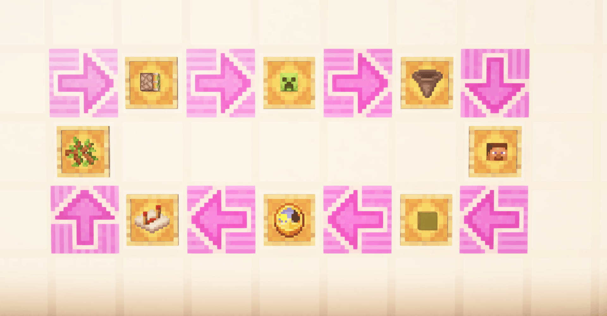
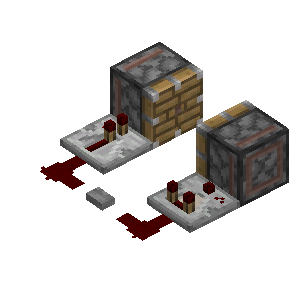
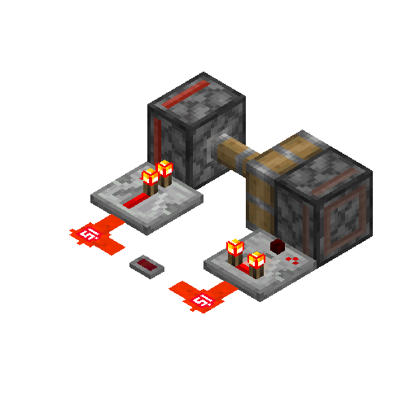
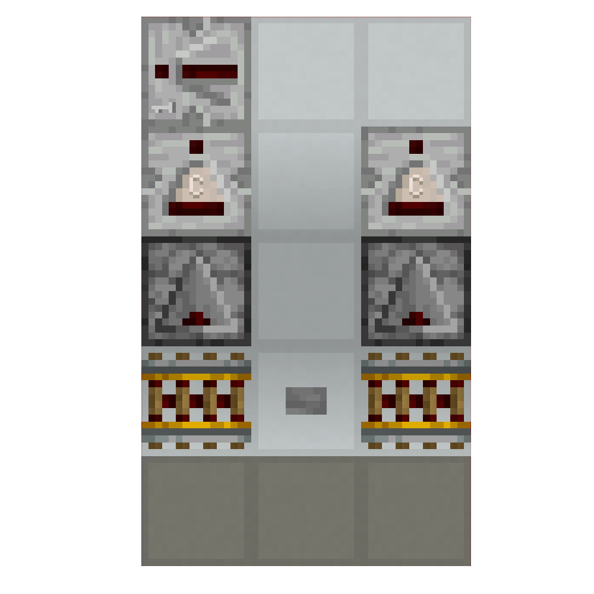
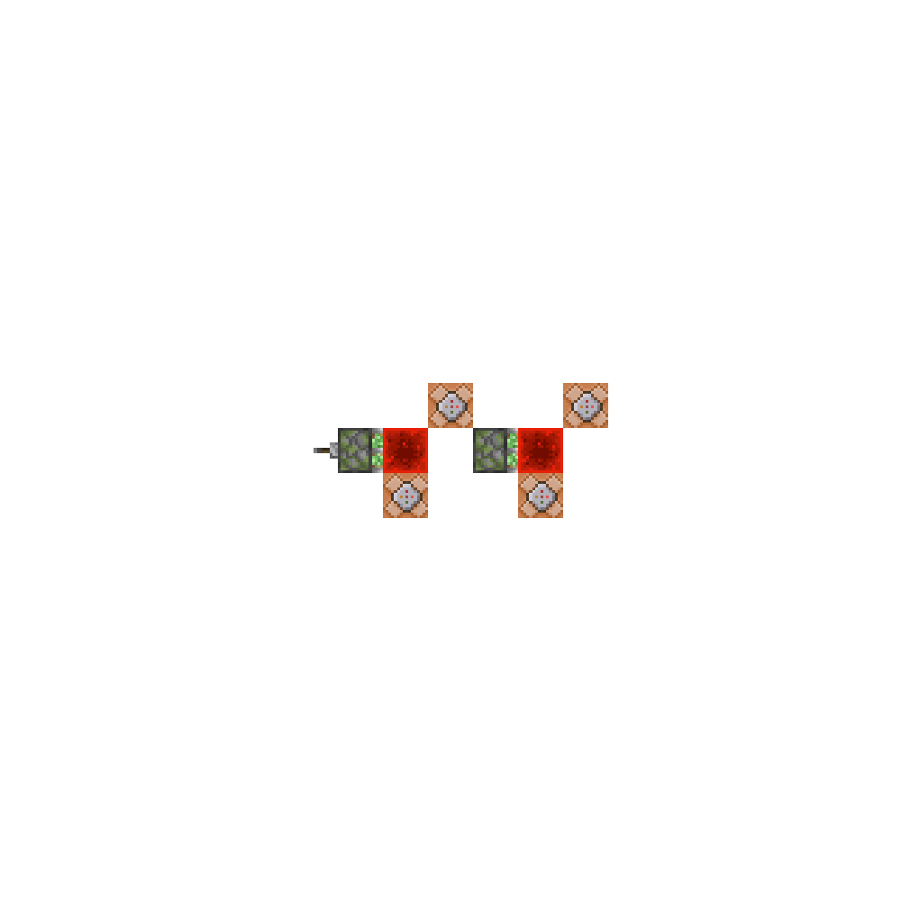

# #02 刻内时序

## 2.1 刻内时序的观测

> 这天小B做了一个装置：
>
> 

请各位猜猜按下按钮会发生什么？

1. 什么都不会发生
2. 左边活塞伸出了
3. 右边活塞伸出了
4. 两个活塞同时推出
5. 游戏崩溃

> 于是小B按下了按钮
>
> 
> 
> 左……左边的活塞伸出了！！！！！！
>
>根据前两天看[01-刻与刻间时序](./01-刻与刻间时序.md)学到的知识：他进行了以下计算：
>
> 这个中继器延迟2gt，那个比较器延迟2gt……？哇两个活塞应该同时推出！那为什么只推出了一个活塞呢？明明是同一gt却有个先后顺序，gt不是最小单位了？
>
> 面对这样的疑问，聪慧至极的小B给出了惊人的结论：~~游戏出bug了！~~

当然不是这样的！所有的玩家都应该建立一个这样的一个观念：在 Minecraft 中，大多数游戏逻辑是运行在单线程中的，这意味着从逻辑层面上看，事件的执行必定是有顺序的，而非严格意义上的同时！

于是一切都解释的通了，在同1gt内必定存在某种更加精细的时序，我们称在1刻内的精细时序为**刻内时序**。正如前文所提到的，进行如上的~~明明理论上是同一gt发生但偏偏有个先后顺序~~的测试，便完成了一次**刻内时序的观测**。

这里还有个例子：
当按下按钮，两个装置分别出现了以下症状：

明明在同一gt内，加个中继器就大有不同，怎么有这么诡异的事情！为什么呢？本篇就将简要的探讨以上现象！

什么你问这玩意有什么用？

多的是呢！上到极为复杂的红石装置，下至最最基本的精确时序分析，都用得上。刻内时序理论的研究也在很大程度上促进了红石研究！包括但不限于推动上限检测，BED等听起来**高大上**的红石装置和理论。

这里选取一段Void先生写的文字：

> ...
> 因此，刻内时序的学习之所以必要，不仅仅是为了解决设计中遇到的问题、解释以前无法解释的经验结论。更重要的是，有很多人轻视刻内时序的学习，不愿意学习刻内时序而将其仅仅视为一个问题的来源，在红石设计中常常遇到刻内时序导致的问题，却殊不知刻内时序是红石设计中最强大的工具之一，善用刻内时序的知识可以大大精简红石电路的设计，并提高红石机器的性能。刻内时序知识的缺乏使得许多人从一开始就不知道这件工具是可以利用的，这个情景从社区的良性发展的角度，是需要尽力避免的。

## 2.2 微时序理论

### 2.2.1 微时序的阶段划分

**1gt**就像现实世界中的**一天**，而在一天之内，我们又会有一定顺序的安排：起床、早饭、午饭、晚饭、睡觉……在Minecraft中，以1gt为最小单位的时序称为宏观时序，而某1gt内的更加细分的时序就称为微时序。

在前文中我们知道，MC执行任何东西总是有优先顺序的，我们通过源码、实验等途径发现——Minecraft在1gt内总是大致按照以下顺序执行固定的事件：

1. **<WTUColor>World Tick Update</WTUColor>** ，简称<WTUColor>WTU</WTUColor>，中文译作世界时间更新。游戏内存在一个和世界绑定的计时器，在世界创建时被初始化为0。在本游戏阶段内，该计时器自增1。我们称第n刻，也就是包含使得世界计时器增加到n的那个世界事件更新计划的刻。
2. **<TTColor>Schedule Tick / Tile Tick / Next Tick Entry\*</TTColor>** ，简称<TTColor>TT</TTColor>/<TTColor>NTE*</TTColor>，中文译作计划刻，大部分具有延迟执行行为的元件都是由计划刻控制的。*（在此处提及NTE和Next Tick Entry的**错误**译名旨在帮助各位读者看懂部分早期的其他文档，不希望各位继续使用这两个名字。）*
3. **<CTColor>Chunk Tick</CTColor>** ，简称<CTColor>CT</CTColor>，中文译作区块刻。区块刻由分为**天气**和**随机刻**（Random Tick）。在此阶段内，游戏先处理雷、雪等天气事件；然后处理随机刻：当在存在玩家在一定距离内时，会发生作物生长、草方块蔓延、水结冰等随机刻事件。在每个区块刻阶段，游戏遍历玩家附近的所有区块，然后在这些区块里面随机选取方块，执行这些事件。
4. **<BEColor>Block Event</BEColor>** ，简称<BEColor>BE</BEColor>，中文译作方块事件。最重要的在方块事件阶段运作的元件是活塞。当活塞发现自己的实际状态和供能状态不符的时候，会添加一个方块事件。在某个方块事件之外添加的方块事件，会等到下一个方块事件阶段执行；在方块事件阶段内添加的方块事件，会在本个方块事件阶段执行。
5. **<EUColor>Entity Update</EUColor>** ，简称<EUColor>EU</EUColor>，中文译作实体运算。实体需要每刻都主动进行运动、实体 AI 等行为。所有的实体行为，比如生物运动、TNT 爆炸、怪物攻击，都发生在这个阶段。非玩家踩下压力板、绊线使得它们产生红石信号，也发生在这个阶段。
6. **<TEColor>Block Entity / Tile Entity</TEColor>** ，简称<TEColor>TE</TEColor>，中文译作方块实体。有部分方块需要每刻运行自己相关的逻辑，这些事情发生在方块实体阶段。漏斗会在方块实体阶段吸取物品、传输物品；被活塞推动的方块，会变成移动中的方块（b36），它们会在自己创建后的前两次方块实体阶段进行推动实体的逻辑，并且在第三次方块实体阶段变回普通的方块。
7. **<ATColor>Async Task / Network Update</ATColor>** ，简称<ATColor>AT</ATColor>/<ATColor>NU</ATColor>，中文译作异步事件。也可称为Player Action/玩家操作。玩家操作实际上是从客户端发往服务端的网络数据包。在每一刻的结尾，服务端会统一执行所有在这一刻内收到的
玩家操作数据包。

这些是在平常分析时主要涉及的游戏阶段，后文中我们也会围绕这些事件展开叙述。

### 2.2.2 瞬时

在上文中，我们认识到1gt内又划分成了不同的阶段。就像早饭只能在早上吃、午饭只能在中午吃一样，Minecraft中的许多事件只能遵循一定的顺序，发生在特定的阶段。但还有一些“立刻响应”的事件，就像我们渴了就可以立刻去喝水，而不关心早上、中午、还是晚上。

如果一个方块的行为可以在任意阶段发生的、只由**方块更新**触发，那么这个方块就称为**瞬时元件**。

举例来说，红石粉亮灭是瞬时的。如果玩家关闭了一个拉杆，那么可以导致红石粉在玩家操作阶段熄灭；如果活塞推走了一个红石块，就可以导致红石粉在方块事件阶段熄灭。

### 2.2.3 延时

既然有瞬时事件，就必然有“延时”事件。举例来说，如果玩家放置了一个红石块，红石块激活了一个中继器，这个中继器就会在2gt后亮起。中继器亮起的这一行为具有**延时**，且**由游戏控制**（由计划刻控制），在**特定阶段发生**（计划刻阶段），中继器就不是瞬时事件。

在接下来的几部分中，我们将详细地展开这些**不同的游戏阶段**。

### 2.3 常见元件的运行阶段

| 元件种类 | 运行阶段 |
| :---: | :---: |
| 命令方块运行指令 | <TTColor>计划刻TT</TTColor> |
| 中继器、比较器、红石火把、侦测器的亮灭 | <TTColor>计划刻TT</TTColor> |
| 红石粉、铁轨改变状态 | 瞬时 |
| 栅栏门、活板门改变状态 | 瞬时 |
| 漏斗因红石信号改变状态 | 瞬时 |
| 漏斗吸收、传递物品 | <TEColor>方块实体TE</TEColor> |
| 音符盒、钟因红石信号改变状态 | 瞬时 |
| 音符盒、钟发出声音 | <BEColor>方块事件BE</BEColor> |
| 发射器、投掷器因红石信号改变状态 | 瞬时 |
| 发射器发射/投掷器投出物品 | <TTColor>计划刻TT</TTColor> |
| 红石灯的亮起 | 瞬时 |
| 红石灯的熄灭 | <TTColor>计划刻TT</TTColor> |
| 按钮、压力板、绊线的亮起 | 瞬时[^1] |
| 按钮、压力板、绊线的熄灭 | <TTColor>计划刻TT</TTColor> |
| 重力方块判定下落、创建实体 | <TTColor>计划刻TT</TTColor> |
| 重力方块下落、到位 | <EUColor>实体运算EU</EUColor> |
| 活塞推出或收回 | <BEColor>方块事件BE</BEColor> |
| b36[^2] 推动实体 | <TEColor>方块实体TE</TEColor> |
| b36 自然到位 | <TEColor>方块实体TE</TEColor> |
| b36 被粘性活塞收回到位[^3] | <BEColor>方块事件BE</BEColor> |

[^1]: 但是压力板的亮起只能由实体运动触发，所以实际上只能在实体运算或玩家操作；类似地，按钮只能被玩家或者箭矢按下，所以也限制在这两个阶段。

[^2]: b36 : minecraft:moving_piston,移动中的活塞。

[^3]: 当粘性活塞收回的时候前方是 b36，则会立刻将其到位，也就是所说的粘性活塞短脉冲。

### 2.4 刻内时序基础分析

在这里，我们给出一个基本的例子。

下图中，所有的命令方块内指令都为time query gametime

上升沿 *（拉下拉杆，粘性活塞推出）*：

|刻数|阶段|事件|
|---|---|---|
|0|<ATColor>AT</ATColor>|玩家拉下拉杆|
|0|<ATColor>AT</ATColor>|第一个活塞添加方块事件|
|1|<BEColor>BE</BEColor>|第一个活塞推出|
|3|<TEColor>TE</TEColor>|第一个红石块到位|
|3|<TEColor>TE</TEColor>|命令方块计划在4刻（延迟1刻）运行|
|3|<TEColor>TE</TEColor>|第二个活塞添加方块事件|
|4|<TTColor>TT</TTColor>|第一个命令方块读数4|
|4|<BEColor>BE</BEColor>|第二个活塞添加方块事件|
|6|<TEColor>TE</TEColor>|第二个红石块到位|
|7|<TTColor>TT</TTColor>|第二个命令方块读数7|

下降沿 *（拉回拉杆，粘性活塞收回）*：

|刻数|阶段|事件|
|---|---|---|
|0|<ATColor>AT</ATColor>|玩家关闭拉杆|
|0|<ATColor>AT</ATColor>|第一个活塞添加方块事件|
|1|<BEColor>BE</BEColor>|第一个活塞收回|
|1|<BEColor>BE</BEColor>|第一个红石被撤去|
|1|<BEColor>BE</BEColor>|第二个活塞添加方块事件|
|1|<BEColor>BE</BEColor>|第二个活塞收回|
|3|<TEColor>TE</TEColor>|两个红石块到位|
|4|<TTColor>TT</TTColor>|两个命令方块都读数4|

（改自void的例子）
