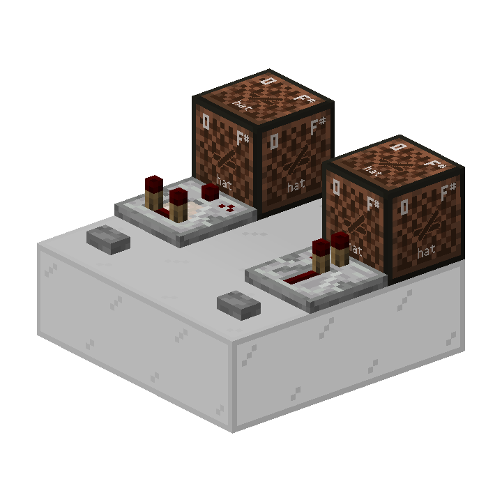

# #03 计划刻

本部分将解析计划刻及计划刻元件是如何运行的。

**基础部分**

- 计划刻的概念与内容
- 常见的计划刻元件
- 简单实例分析

**进阶部分**

- 计划刻队列的维护
- 4gt侦测器高频的时序解析
- 深入解析比较器的计划刻执行逻辑
- 计划刻抑制

## 3.1 计划刻的概念与内容

### 3.1.1 什么是计划刻？

在Minecraft中，我们常常见到许多红石元件在被触发后并不是立即变化的，例如中继器、比较器。这些元件总是在被触发后延迟一段时间，再发生变化。

让我们以一个生活中的例子来看。上午，你收到了一封邮件，于是你计划下午去处理这封邮件，然后定了一个闹钟。到了下午，闹钟响了，你想到自己要处理邮件了，于是打开邮箱开始处理邮件。

必须要注意的是：**这个“闹钟”并没有任何“文字注释”。它只负责在你的手机中、在正确的时间、提醒你一个人“有事情”。至于具体是什么事情，闹钟并不关心。** 这个闹钟包含且只包含这些内容：

- 什么时候响
- 这是第几个闹钟
- 有多重要
- 在谁的手机上响
- 提醒谁

计划刻就是这样一个“闹钟”。红石元件在被触发后，为自己添加了一个计划刻。当计划刻执行时，就像是闹钟响了，红石元件就变化了。

由计划刻控制行为的红石元件，也就称为**计划刻元件**

### 3.1.2 计划刻的内容

像上文中的闹钟一样，**计划刻只包含这些内容**，我们称之为一个**计划刻的信息结构**：

- 执行时间`triggerTick`：在何时执行，或称延迟多久后执行[^1]
- 子顺序`subTickOrder`：计划刻添加顺序
- 优先级`priority`：计划刻有多优先
- 位置`pos`：执行的坐标
- 方块种类`type`：哪一方块种类执行这个计划刻
<!-- suborder的译名仍有待确定 -->
[^1]: “延迟多久后执行”并不严谨。实际上，执行时间记录的是世界刻，“延迟`x`gt”就是`执行时间的世界刻=当前世界刻+x`。`当前世界刻>=执行时间的世界刻`时，计划刻执行。但这一区别并不影响大多数情况下的计划刻分析，区块卸载的情况除外。

**位置**和**方块种类**都是易于理解的属性。毕竟，方块自己的计划刻不能由其他方块乱执行 ~~（如果你恰好在方块执行计划刻前把它推走或破坏掉换成其他方块的话）~~ 、也不能在世界里到处乱跑。

**执行时间**，指的是宏观时序上计划刻的执行时间，也就是计划刻应该在哪一gt执行。例如，一个1挡位的中继器被触发后添加2gt后的计划刻，2gt后，该计划刻就会被执行。我们通常说的“计划刻元件的延迟”就是指计划刻在多少gt后执行。

**子顺序**，指的是相同时间内的计划刻添加顺序。例如，在同一gt内，中继器A先被触发，中继器B后被触发。那么，在子序列中，中继器A就在中继器B前面。

**优先级**，指的是计划刻的优先程度。优先级是一个-3~3的整数[^2]，其中数值越小，优先级越高。也就是说，在同一gt内，优先级为-3的计划刻总是比优先级-2、-1、0的计划刻更先执行。

[^2]: 但是目前并没有优先级为1、2、3的计划刻。它们只是在代码中被声明了。

> 通常在讨论优先级时，“优先级更高”和“优先级数值更低”的意思是相同的。为了避免由“优先”这一概念和“优先级数值”造成的歧义，我们更推荐读者在向其他人说明时使用“某一元件的计划刻更优先”来表述。

同样的，就和上文中的闹钟一样：**计划刻只是一个“提醒方块有事要做”的闹钟，它并不关心方块实际要做什么。一切执行计划刻时的行为都由方块自身控制，“执行计划刻的行为”并不在“计划刻的信息结构”中。**

而当我们说“某一元件已存在一个计划刻时”，指的就是在当前位置、存在一个方块类型和当前方块相同的、且还没有被执行的计划刻。[^3]

[^3]: 由于后文说明需要，基础部分仅作简单表述。具体内容涉及计划刻队列的维护，参见进阶部分。

### 3.1.3 计划刻的执行顺序

在前两篇中，我们已经学过了宏观时序的分析，并且认识了微时序。我们知道，**宏观时序总是优于微时序的**，计划刻也是同理。对于执行时间不同的计划刻，执行时间早的计划刻总是更先执行。对于执行时间相同的计划刻，优先级更优先的计划刻总是更先执行。对于优先级相同的计划刻，子序列更小的、也就是更早添加计划刻的总是更先执行。

所以，在比较计划刻执行顺序时，我们可以遵循这样的逻辑：

1. **比较宏观时序**，宏观时序更早即更先执行。
2. **比较计划刻优先级**，优先级更优先即更先执行。
3. **比较计划刻添加顺序（子顺序）**，计划刻添加更早即更先执行。

这就像比数字一样，宏观时序就是百位，优先级就是十位，添加顺序就是个位。

### 3.1.4 计划刻顺序的实例

那么，让我们来看看实际的例子。

已知在图示情况下，比较器的优先级为0，中继器的优先级为-1。比较器和中继器的延迟都为2gt。

1. 如果在不同gt下，先按下比较器的按钮，再按下中继器的按钮，哪一个音符盒会先响起？
2. 如果在同一gt内，先按下比较器的按钮，再按下中继器的按钮，哪一个音符盒会先亮起？

答案：
1. 比较器先亮起。因为宏观时序上，比较器先亮起，而后间隔一定gt中继器才亮起。
2. 中继器先亮起。因为在计划刻上，虽然比较器比中继器先添加计划刻，但是中继器的优先级为-1，比比较器的优先级0更优先，而计划刻优先级>计划刻添加顺序，所以中继器先亮起。

## 3.2 常见的计划刻元件

### 3.2.1 中继器

中继器和比较器统称为**红石二极管**或**红石门**（Redstone Gate）[^4]

[^4]: 因为在源码中，它们继承自同一个抽象基类`AbstractRedstoneGateBlock`

在[刻与刻间时序](01-刻与刻间时序.md#12-中继器比较器初步)中，我们已经初步认识了中继器和比较器。现在，让我们深入中继器的计划刻行为。

**若中继器被锁定，则不会添加计划刻，也不会在执行计划刻时改变任何状态。** 若中继器未被锁定，则具有以下行为：

**添加计划刻行为**：
- 当中继器受到NC更新时，它会检查自身状态。若自身不存在计划刻，且应当改变状态 *（即自身没有亮起，但输入端有红石信号；或自身亮起，但输入端没有红石信号）*，那么添加计划刻。
- 中继器添加的所有计划刻的延迟都为`中继器挡位*2 gt`

**执行计划刻行为**：
- 若中继器亮起，则立即熄灭。
- 若中继器未亮起，则立刻亮起。这一步不受输入端信号影响。
  - 若此时没有输入信号，则再添加计划刻（用于熄灭）。

**举个例子**：

从表现上来看，举例来说，如果给一个2挡位中继器一个时长小于2gt[^5]的信号，中继器的行为如下：
- 受到NC更新，添加计划刻
- 4gt后，执行计划刻
  - 检测到自身未亮起，于是立即亮起
  - 检测到输入端无红石信号，添加计划刻（用于熄灭）
- 再4gt后，执行计划刻
  - 检测到自身亮起，于是立即熄灭

[^5]: 准确来说，应为“在中继器执行计划刻（进行亮起）前熄灭的信号”

这一例子中包含了中继器的全部计划刻行为。

**特殊的优先级变化**：

- 若中继器指向一个横放的红石二极管或指向一个红石二极管的输入端，则计划刻的优先级为`-3`
- 否则，若中继器添加计划刻时处于亮起状态（即这一计划刻是用于熄灭的），则计划刻的优先级为`-2`
- 否则，计划刻的优先级默认为`-1`

### 3.2.2 比较器

**添加计划刻行为** :
- 当比较器受到NC更新时，它会检查自身状态。若自身不存在计划刻，且应当改变状态 *（即自身没有亮起，但输入端有红石信号；或自身亮起，但输入端没有红石信号）*，那么添加计划刻。
- 比较器添加的所有计划刻的延迟都为`2gt`

**执行计划刻行为**：

在比较器执行一个计划刻的时候，会根据自己的***输出信号状态***和***输入信号状态***来决定自己的行为。

| 
比较器状态
 | 
信号输入
 | 
比较器的行为
 |
|------------------------|-----------------------|-------------------------|
| 已亮起                    | 有信号输入且能量等级与自己的输出相符    | 无事发生                    |
| 已亮起                    | 有信号输入且能量等级与自己的输出不符    | 将输入同步到输出                |
| 已亮起                    | 无信号输入                 | 熄灭                      |
| 未亮起                    | 有信号输入                 | 亮起                      |
| 未亮起                    | 无信号输入                 | 无事发生                    |

**比较器输出能量等级计算**

如果信号输入是红石粉或者其他比较器，则继承输入的能量
如果是容器，请查看此部分内容[比较器信号强度计算](../BlockUpdate/01-更新概念与不同类型的更新?id=_152-比较器信号强度计算)

特别的，当同时有容器信号和红石信号输入时，比较器会根据情况优先选择不同的信号输入来计算输出,这一现象也被称为容器屏蔽

| 输入端              | 输出                              |
|------------------|---------------------------------|
| 比较器输入端直接与容器相连    | 只计算容器的输入，忽略红石信号                 |
| 比较器输入端隔着实体方块检测容器 | 当红石信号为15时，输出15信号强度，其他情况优先计算容器输入 |

案例(木桶中均没有物品)：

**特殊的优先级变化**：

- 若比较器指向一个横放的红石二极管或指向一个红石二极管的输入端，则计划刻的优先级为`-1`
- 否则，计划刻的优先级默认为`0`

### 3.2.3 侦测器

### 3.2.4 红石火把