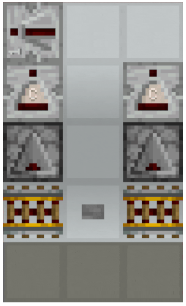
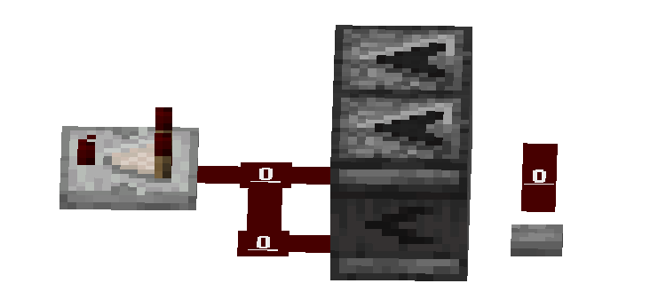
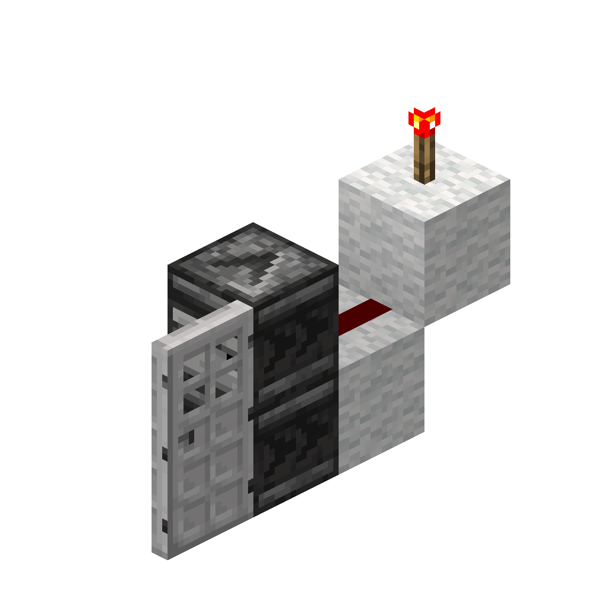

# #03 计划刻

本部分将解析计划刻及计划刻元件是如何运行的。

**基础部分**

- 计划刻的概念与内容
- 常见的计划刻元件
- 简单实例分析

**进阶部分**

- 计划刻队列的维护
- 4gt侦测器高频的时序解析
- 深入解析比较器的计划刻执行逻辑
- 计划刻抑制

## 3.1 计划刻的概念与内容

### 3.1.1 什么是计划刻？

在Minecraft中，我们常常见到许多红石元件在被触发后并不是立即变化的，例如中继器、比较器。这些元件总是在被触发后延迟一段时间，再发生变化。

让我们以一个生活中的例子来看。上午，你收到了一封邮件，于是你计划下午去处理这封邮件，然后定了一个闹钟。到了下午，闹钟响了，你想到自己要处理邮件了，于是打开邮箱开始处理邮件。

必须要注意的是：**这个“闹钟”并没有任何“文字注释”。它只负责在你的手机中、在正确的时间、提醒你一个人“有事情”。至于具体是什么事情，闹钟并不关心。** 这个闹钟包含且只包含这些内容：

- 什么时候响
- 这是第几个闹钟
- 有多重要
- 在谁的手机上响
- 提醒谁

计划刻就是这样一个“闹钟”。红石元件在被触发后，为自己添加了一个计划刻。当计划刻执行时，就像是闹钟响了，红石元件就变化了。

由计划刻控制行为的红石元件，也就称为**计划刻元件**

### 3.1.2 计划刻的内容

像上文中的闹钟一样，**计划刻只包含这些内容**，我们称之为一个**计划刻的信息结构**：

- 执行时间`triggerTick`：在何时执行，或称延迟多久后执行[^1]
- 子顺序`subTickOrder`：计划刻添加顺序
- 优先级`priority`：计划刻有多优先
- 位置`pos`：执行的坐标
- 方块种类`type`：哪一方块种类执行这个计划刻
<!-- suborder的译名仍有待确定 -->
[^1]: “延迟多久后执行”并不严谨。实际上，执行时间记录的是世界刻，“延迟`x`gt”就是`执行时间的世界刻=当前世界刻+x`。`当前世界刻>=执行时间的世界刻`时，计划刻执行。但这一区别并不影响大多数情况下的计划刻分析，区块卸载的情况除外。

**位置**和**方块种类**都是易于理解的属性。毕竟，方块自己的计划刻不能由其他方块乱执行 ~~（如果你恰好在方块执行计划刻前把它推走或破坏掉换成其他方块的话）~~ 、也不能在世界里到处乱跑。

**执行时间**，指的是宏观时序上计划刻的执行时间，也就是计划刻应该在哪一gt执行。例如，一个1挡位的中继器被触发后添加2gt后的计划刻，2gt后，该计划刻就会被执行。我们通常说的“计划刻元件的延迟”就是指计划刻在多少gt后执行。

**子顺序**，指的是相同时间内的计划刻添加顺序。例如，在同一gt内，中继器A先被触发，中继器B后被触发。那么，在子序列中，中继器A就在中继器B前面。

**优先级**，指的是计划刻的优先程度。优先级是一个-3~3的整数[^2]，其中数值越小，优先级越高。也就是说，在同一gt内，优先级为-3的计划刻总是比优先级-2、-1、0的计划刻更先执行。

[^2]: 但是目前并没有优先级为1、2、3的计划刻。它们只是在代码中被声明了。

> 通常在讨论优先级时，“优先级更高”和“优先级数值更低”的意思是相同的。为了避免由“优先”这一概念和“优先级数值”造成的歧义，我们更推荐读者在向其他人说明时使用“某一元件的计划刻更优先”来表述。

同样的，就和上文中的闹钟一样：**计划刻只是一个“提醒方块有事要做”的闹钟，它并不关心方块实际要做什么。一切执行计划刻时的行为都由方块自身控制，“执行计划刻的行为”并不在“计划刻的信息结构”中。**

而当我们说“某一元件已存在一个计划刻时”，指的就是在当前位置、存在一个方块类型和当前方块相同的、且还没有被执行的计划刻。[^3]

[^3]: 由于后文说明需要，基础部分仅作简单表述。具体内容涉及计划刻队列的维护，参见进阶部分。

### 3.1.3 计划刻的执行顺序

在前两篇中，我们已经学过了宏观时序的分析，并且认识了微时序。我们知道，**宏观时序总是优于微时序的**，计划刻也是同理。对于执行时间不同的计划刻，执行时间早的计划刻总是更先执行。对于执行时间相同的计划刻，优先级更优先的计划刻总是更先执行。对于优先级相同的计划刻，子序列更小的、也就是更早添加计划刻的总是更先执行。

所以，在比较计划刻执行顺序时，我们可以遵循这样的逻辑：

1. **比较宏观时序**，宏观时序更早即更先执行。
2. **比较计划刻优先级**，优先级更优先即更先执行。
3. **比较计划刻添加顺序（子顺序）**，计划刻添加更早即更先执行。

这就像比数字一样，宏观时序就是百位，优先级就是十位，添加顺序就是个位。

### 3.1.4 计划刻顺序的实例

那么，让我们来看看实际的例子。


已知在图示情况下，比较器的优先级为0，中继器的优先级为-1。比较器和中继器的延迟都为2gt。

1. 如果在不同gt下，先按下比较器的按钮，再按下中继器的按钮，哪一个音符盒会先响起？
2. 如果在同一gt内，先按下比较器的按钮，再按下中继器的按钮，哪一个音符盒会先亮起？

答案：
1. 比较器先亮起。因为宏观时序上，比较器先亮起，而后间隔一定gt中继器才亮起。
2. 中继器先亮起。因为在计划刻上，虽然比较器比中继器先添加计划刻，但是中继器的优先级为-1，比比较器的优先级0更优先，而计划刻优先级>计划刻添加顺序，所以中继器先亮起。

## 3.2 常见的计划刻元件

### 3.2.1 中继器

中继器和比较器统称为**红石二极管**或**红石门**（Redstone Gate）[^4]

[^4]: 因为在源码中，它们继承自同一个抽象基类`AbstractRedstoneGateBlock`

在[刻与刻间时序](01-刻与刻间时序.md#12-中继器比较器初步)中，我们已经初步认识了中继器和比较器。现在，让我们深入中继器的计划刻行为。

**若中继器被锁定，则不会添加计划刻，也不会在执行计划刻时改变任何状态。** 若中继器未被锁定，则具有以下行为：

**添加计划刻行为**：
- 当中继器受到NC更新时，它会检查自身状态。若自身不存在计划刻，且应当改变状态 *（即自身没有亮起，但输入端有红石信号；或自身亮起，但输入端没有红石信号）*，那么添加计划刻。
- 中继器添加的所有计划刻的延迟都为`中继器挡位*2 gt`，除了下面这种情况：
- 当中继器被放置时，它会检查自身状态，若应当改变状态，则添加1gt后的计划刻。

**执行计划刻行为**：
- 若中继器亮起，则立即熄灭。
- 若中继器未亮起，则立刻亮起。这一步不受输入端信号影响。
  - 若此时没有输入信号，则再添加计划刻（用于熄灭）。

**举个例子**：

从表现上来看，举例来说，如果给一个2挡位中继器一个`时长<=4gt`[^5]的信号，中继器的行为如下：
- 受到NC更新，添加计划刻
- 4gt后，执行计划刻
  - 检测到自身未亮起，于是立即亮起
  - 检测到输入端无红石信号，添加计划刻（用于熄灭）
- 再4gt后，执行计划刻
  - 检测到自身亮起，于是立即熄灭

[^5]: 准确来说，应为“在中继器执行计划刻（进行亮起）前熄灭的信号”

这一例子中包含了中继器的全部计划刻行为。

**特殊的优先级变化**：

- 若中继器指向一个横放的红石二极管或指向一个红石二极管的输入端，则计划刻的优先级为`-3`。
- 否则，若中继器添加计划刻时处于亮起状态（即这一计划刻是用于熄灭的），则计划刻的优先级为`-2`。
- 否则，计划刻的优先级默认为`-1`。


### 3.2.2 比较器

**添加计划刻行为** :
- 当比较器受到NC更新时，它会检查自身状态。若自身不存在计划刻，且应当改变状态 *（即自身没有亮起，但输入端有红石信号；或自身亮起，但输入端没有红石信号）*，那么添加计划刻。
- 比较器添加的所有计划刻的延迟都为`2gt`，除了：
- 当比较器被放置时，它会检查自身状态，若应当改变状态，则添加1gt后的计划刻。

**执行计划刻行为**：

比较器在执行计划刻时，实际上只做了一件事情：
- 根据比较器现在的输入状态和比较器模式，更新自己的输出能量等级。

这里的**输出能量等级**指的就是比较器经过计算后得出的输出能量等级 *（具体计算方法见后文）*。而这里的**更新**包括了**更新能量等级**和**发出更新**两件事。并且对于比较器来说，从表观上可能会有输出能量等级不发生变化的情况，但实际上此时比较器依然“更新”了自己的输出能量等级。

比较器还有相对复杂一点的更新行为——

**比较器发出更新的行为**：

1. 在执行计划刻时，若比较器的充能属性改变 *（即自身由熄灭变为亮起，或由亮起变为熄灭）*，则先发出NC更新，再发出PP更新。
2. 如果比较器为比较模式，或比较器为减法模式且自己的输出能量等级发生变化，则发出NC更新。

举例来说，就是：
- 首先，这段内容全部建立在比较器**确实执行了计划刻**的前提下——
- 只要比较器为比较器模式，就算它的输出等级不改变，包括由0变成0，也会有一次NC更新。
- 如果比较器的输出能量等级由0（熄灭）变为1、2、3、4、5……14、15（亮起），或者由亮起变成熄灭，那么它会先发出一次NC更新，再发出一次PP更新，最后又发出一次NC更新。
- 如果比较器为减法模式，它的输出能量等级由1、2、3、4、5……变成任意一个其他的能量等级，只会有一次NC更新。

这些行为在一些特殊的布线中可能会有所应用。如果读者对这部分的理解感到困难，可以暂时只记忆比较器最常规的用法——即比较信号大小并判断是否输出、检测容器容量和减法模式，或者直接查表。

| 比较器模式 | 计划刻行为          | 更新行为       |
|-------|----------------|------------|
| 比较模式  | 充能属性改变         | NC->PP->NC |
| 比较模式  | 充能属性未改变        | NC         |
| 减法模式  | 充能属性改变         | NC->PP->NC |
| 减法模式  | 能量等级改变，充能属性未改变 | NC         |
| 减法模式  | 充能等级和能量属性均未改变  | 不更新        |

**比较器输出能量等级计算**

如果信号输入是红石粉或者其他比较器，则继承输入的能量。

如果是容器，请查看此部分内容[比较器信号强度计算](../BlockUpdate/01-更新概念与不同类型的更新?id=_152-比较器信号强度计算)。

特别的，当同时有容器信号和红石信号输入时，比较器会根据情况优先选择不同的信号输入来计算输出,这一现象也被称为容器屏蔽。

| 输入端              | 输出                              |
|------------------|---------------------------------|
| 比较器输入端直接与容器相连    | 只计算容器的输入，忽略红石信号                 |
| 比较器输入端隔着实体方块检测容器 | 当红石信号为15时，输出15信号强度，其他情况优先计算容器输入 |

案例(木桶中均没有物品)：


**特殊的优先级变化**：
- 若比较器指向一个横放的红石二极管或指向一个红石二极管的输入端，则计划刻的优先级为`-1`
- 否则，计划刻的优先级默认为`0`

至此，我们已经可以分析上一章中的案例

<div style="display: flex; align-items:flex-start;">
    <!-- 图片 -->
    
    <!-- 表格 -->
    <table border="1">
        <tr>
            <th></th>
            <th>左侧</th>
            <th>右侧</th>
        </tr>
        <tr>
            <td>gt0</td>
            <td>按钮按下铁轨激活<br/>侦测器添加2gt计划刻</td>
            <td>按钮按下铁轨激活<br/>侦测器添加2gt计划刻</td>
        </tr>
        <tr>
            <td>gt2</td>
            <td>侦测器亮起<br/>侦测器添加2gt计划刻(优先级0)<br/>比较器添加2gt计划刻(优先级-1)</td>
            <td>侦测器亮起<br/>侦测器添加2gt计划刻(优先级0)<br/>比较器添加2gt计划刻(优先级0)</td>
        </tr>
        <tr>
            <td>gt4</td>
            <td>比较器计划刻优先级-1,侦测器计划刻0,比较器计划刻先执行，比较器亮起<br/>侦测器熄灭</td>
            <td>由于侦测器和比较器优先级相同，侦测器计划刻先添加，先执行侦测器计划刻，侦测器熄灭<br/>比较器执行计划刻，由于此时侦测器已经熄灭，所以比较器不亮起</td>
        </tr>
    </table>
<style>
@media (max-width: 1200px) {
    div {
        display: block !important;
    }
    img {
        margin-bottom: 15px;
    }
    table {
        width: 100%;
    }
}
</style>
</div>

读者可以自行分析一下下面这个类似的案例，在按下按钮后，比较器是否会亮起。


### 3.2.3 侦测器

**添加计划刻行为**：

- 侦测器在受到面前的方块发出的PP更新后，如果自身未亮起且当前位置不存在自身的计划刻[^6]，则添加2gt后的计划刻。

[^6]: 由于计划刻的执行逻辑，在当前gt即将执行的计划刻不会视为“存在计划刻”。也就是说，如果在某一gt侦测器将会亮起，而在侦测器亮起前对侦测器发出PP更新，此时侦测器也会添加计划刻。该逻辑是4gt侦测器高频的核心原理。具体行为和实例详见进阶部分。

**执行计划刻行为**：
- 若自身未亮起，则亮起，发出PP更新，再添加2gt后的计划刻，最后发出NC更新。
- 若自身亮起，则熄灭。

### 3.2.4 红石火把

**添加计划刻行为**：

- 红石火把在受到NC更新后，如果自身亮起但应当熄灭且当前位置不存在自身的计划刻，则添加2gt后的计划刻。

**执行计划刻行为**
- 如果自身亮起但应当熄灭，则熄灭。
  * 如果自身**燃尽**，则**熄灭**[^7]，并添加160gt后的计划刻。
- 如果自身熄灭但应当亮起，且没有燃尽，则亮起。

[^7]: 此处熄灭通过`WorldEvent`（世界事件）控制，而非直接调用`setblockstate`。

**应当熄灭/亮起**：红石火把所附着的方块是否为实体方块且受到红石信号。

**燃尽**：如果红石火把在160gt内亮起了8次，那么自身燃尽。

红石火把燃尽后，你可以通过破坏再重新放置一个红石火把来让它“亮起”，或者等到160gt后火把执行计划刻自行亮起。

## 3.3 简单的计划刻时序分析

### 3.3.1 侦测器能熄灭红石火把吗？

**通常不能。** 让我们来简单分析一下：

侦测器和红石火把的优先级都是**0**。并且侦测器亮起时**先发出PP更新**，然后**添加计划刻**，最后**发出NC更新**。红石火把**接受NC更新**。这里的**执行计划刻内的行为顺序**和**元件接受什么更新**根本上影响了接下来的分析。所以假设一个侦测器对着一个红石火把附着的实体方块，它的计划刻顺序如下：

- 侦测器亮起：
  * 发出PP更新，无事发生。
  * 侦测器**添加计划刻**
  * 发出NC更新：
    + 红石火把受到NC更新：
      * **添加计划刻**

2gt后：
- 侦测器**执行计划刻**，熄灭。
- 红石火把**执行计划刻**，此时检查自身是否应当熄灭，发现不应熄灭（因为侦测器熄灭了，附着方块没有受到充能），于是不执行任何行为。

所以概括来说就是：红石火把在要亮起的时候发现没充能了，遂开摆）

**但是**，到这里我们就可以发现一个问题：假如我放置两个侦测器，其中一个侦测器用来 **“触发”红石火把添加计划刻**，另一个用来 **“延续”红石信号来熄灭火把**，那么红石火把是不是就可以亮起了呢？没错。一个简易的结构如下图所示：



### 3.3.2 侦测器能使比较器亮起吗？

### 3.3.3 什么是“末端常亮”中继器？

## 3.4【进阶】计划刻队列的维护

在本部分的说明中，我们会省略一些已被声明但未被调用或极少涉及的变量。

为了提高读者在阅读**计划刻执行过程**中的流畅度，我们会先解释所有涉及的重要概念和方法，最后再解释计划刻的执行逻辑。在阅读时，你可以先初步了解这些概念和方法，再在理解计划执行逻辑遇到困难时回看查阅。

### 3.4.1 基础

整个世界的计划刻在实际执行时都是由一个**世界层计划器**（`WorldTickScheduler`，或称**世界层计划刻调度器**）[^8]控制的；每个位置的计划刻在添加与存储时都由对应区块的一个**区块层计划器**（`ChunkTickScheduler`，或称**区块层计划刻调度器**）控制。

[^8]: 本部分（3.4）所使用的这些译名均为编者自行拟定，目前尚未在其他相关文献中发现对应译法。如果读者有更好的译名或修改意见，请直接提交issue与我们联系。

### 3.4.2 计划刻类

一个包含了计划刻的所有信息的对象可称为**计划刻对象**。计划刻类`OrderedTick`则定义了计划刻对象的属性和方法。它除了具有方块类型`type`、坐标`pos`，执行时间`triggerTick`、优先级`priority`、子顺序`subTickOrder`这五个基本属性外，还实现了以下四个方法：

#### 执行时间比较

先比较`triggerTick`大小；若相同，则比较`priority`大小；若仍然相同，则比较`subTickOrder`大小。

此方法实现了**区块层计划器**中的**优先级队列**中的“优先级”比较（见下文）。

#### 简单比较

不比较`triggerTick`大小。仅先比较`priority`大小；若相同，则比较`subTickOrder`大小。

此方法实现了**世界层计划器**中的**区块层计划器优先级队列**中的“优先级”比较（见下文）

#### 哈希化

对`type`和`pos`的哈希码进行运算后得到该计划刻对象的哈希码：

```java
31 * pos.hashCode() + type.hashCode()
```

*在Java中，所有的哈希码都是整数。*

#### 快速实例化

除了常规的实例化方法外，计划刻类还实现了一个`create`方法，用于只基于`type`和`pos`临时创建一个计划刻对象。它的其他三个属性都为`0`。这一临时计划刻对象用于判断某一位置是否存在某一方块的计划刻。

### 3.4.3 区块层计划器

区块层计划器管理计划刻的**添加**、**“检查”**与**存储**。它主要维护了一个**优先级队列**（`PriorityQueue`）和一个**哈希集**（`ObjectOpenCustomHashSet`）

#### 添加计划刻

尝试向**哈希集**中添加**哈希化后的计划刻**，若添加成功（即集合中不存在该计划刻），则同时向**优先级队列**中添加该计划刻的**计划刻对象**。

#### 计划刻存储

所有计划刻的哈希码都存储在对应区块的区块层计划器的哈希表中，所有计划刻的计划刻对象则按顺序存储在对应区块的区块层计划器的优先级队列中。

优先级队列的排序依据[**触发时间比较**](#触发时间比较)，即它将同时考虑`triggerTick`、`priority`和`subTickOrder`。

#### 访问下一计划刻 `peekNextTick`

或称“访问头部计划刻”，此方法会返回当前区块下一个执行的计划刻的计划刻对象，即优先级队列中的第一个计划刻

#### 取出下一计划刻 `pollNextTick`

或称“取出头部计划刻”。此方法会尝试取出当前区块下一个执行的计划刻的计划刻对象，若取出成功，则同时删除哈希表中该计划刻对象的哈希码。

### 3.4.4 世界层计划器

世界层计划器管理计划刻的“检查”和执行。在计划刻的执行阶段，它统筹管理所有区块的区块层计划器，并按一定逻辑按顺序取出计划刻放入可执行计划刻列表中，最后一并执行。

详见[执行计划刻](#346-执行计划刻)。

### 3.4.5 检查计划刻是否存在

此方法即我们常说的“某元件自身不存在计划刻”或“某元件当前位置不存在自身计划刻”，显而易见的，它描述了两个核心参数：“某原件”——方块类型`type`，“自身”“当前位置”——坐标`pos`。

#### 方法1：由区块层计划器控制的检查方法
    
即上文中描述的**添加计划刻**方法。向哈希集中添加哈希化后的计划刻实际上就是一种“检查”：如果哈希集中已经存在位于某一坐标的某一方块的计划刻，此时这一方块再尝试添加位于该处的计划刻时就会失败。

#### 方法2：检查计划刻是否“将要执行” `isTicking`
    
此方法用于检查元件自身是否会在当前gt执行计划刻。

它接收方块类型和坐标两个参数，先复制一份当前gt将执行的计划刻的队列，然后检查这一队列中是否存在方块类型、坐标都相同的计划刻。
    
在执行计划刻时，当前tick的所有可执行的计划刻（如果没有达到计划刻上限的话）都会被从各个区块层计划器的哈希集和优先级队列中取出（详见下文**执行计划刻**），也就是说——如果元件将在这一gt执行计划刻，此时又恰好在执行前尝试添加计划刻，那么这一添加行为就无法被**方法1**“拦截”。

中继器、比较器、红石火把等元件在添加计划刻时就会使用此方法检查计划刻是否“将要执行”。以中继器为例，由于此方法的作用，假如中继器在第2gt时将亮起，那么在第2gt时、中继器亮起前，由于中继器检查到自身将在当前gt执行计划刻，那么无论信号如何变化，它都不会添加计划刻；而在第0gt和第1gt时，如果中继器输入端的充能状态改变且中继器受到更新，那么它就会尝试添加计划刻，但由于方法1的“检查”，这一添加行为不会成功。所以方法1和方法2共同保证了中继器不会在执行计划刻前重复添加计划刻。

#### 方法3：检查计划刻是否在队列中 `isQueued`
    
此方法是侦测器所调用的的“检查计划刻是否存在”方法，其实际功能和方法1完全一致。

*我真的不知道它除了可能能减少卡顿外有什么用。 ——tanh_Heng*

它接收方块类型和坐标两个参数，先将坐标对应到区块，再访问该区块对应的区块层计划器，然后快速实例化一个具有对应`type`和`pos`的计划刻，最后检查哈希集中是否存在与这一临时计划刻的哈希码相同的计划刻。

显而易见的，与方法2的根本区别就在于此方法不会检查当前gt将要执行的计划刻。这是4gt侦测器高频的核心原理。

### 3.4.6 执行计划刻

执行计划刻分为**收集**（`collect`）、**执行**（`run`）和**清理**（`cleanup`）三个阶段。其中最重要的是收集阶段。在收集阶段，世界层计划器将按如下步骤将计划刻添加至**可执行计划刻列表**（`tickableTicks`）中：

#### 描述说明

**区块层计划器的头部计划刻**：区块层计划器中，排在最前面的、将要最先执行的那一计划刻。

所有没有明确表述**取出计划刻**的描述都为**访问**方法。

**达到了计划刻上限**：游戏中每gt能够执行的计划刻数量是有限的，**达到了计划刻上限**即指可执行计划刻列表中计划刻的数量大于等于计划刻上限`maxmaxTicks`。

#### 第一步：筛选可执行的区块层计划器 `collectTickableChunkTickSchedulers`

1. 扫描所有区块层计划器（负责管理单个区块内的计划刻）。只选择那些：
    - 内部有等待执行的计划刻 (存在计划刻)。
    - 其队列中头部计划刻的执行时间正好是当前gt。
    - 该计划刻对应的区块本身满足加载要求。

2. 把这些符合条件的区块层计划器放入一个优先级队列中，称为可执行的区块层计划器的优先级队列（`tickableChunkTickSchedulers`，以下简称计划器队列）。

那么，这个优先级队列如何排序？队列根据每个区块层计划器的头部计划刻进行排序。排序使用[简单比较](#简单比较)（即与区块层计划刻的**执行时间比较**相比，简单比较不会考虑`triggerTick`属性）。这个排序机制是后续[计划刻抑制器](#347-计划刻抑制器)实现的关键。

#### 第二步：从队列中提取可执行计划刻 `collectNextTicks`

1. **取出第一个计划器：** 从计划器队列的最前面取出一个区块层计划器。我们称它为**当前区块层计划器**。

2. **取出它的第一个计划刻：** 从当前区块层计划器的计划刻队列中取出其头部计划刻。

3. **标记为可执行：** 把这个取出的计划刻添加到可执行计划刻列表中，等待实际执行。

4. **尝试连续提取更多计划刻：** 接下来，游戏会尝试从当前区块层计划器中连续地、尽可能多地取出后续的计划刻（只要满足特定条件）：

    1. **上限检查：** 如果已经达到了本次处理允许的计划刻上限，则停止整个连续提取过程。

    2. **访问队列下一个计划器：** 访问当前计划器队列最前面的区块层计划器（因为第一个计划器已经被取走了，所以这是原本的队列中的第二个计划器）。我们称它为**区块层计划器2**。

    3. **检查队列是否非空：** 如果计划器队列不是空的（即成功访问到区块层计划器2），那么访问区块层计划器2的头部计划刻。

    4. **开始连续取出：** 如果还没达到计划刻上限，就循环执行下面的步骤 (5 和 6)。

    5. **查看当前计划器的下一个计划刻：** 再次访问当前区块层计划器的计划刻队列，获取当前它最前面的计划刻（和步骤2同理，因为第一个计划刻已经被取走了，所以这是排在原先的头部计划刻的后面的那一个计划刻）。

    6. **决定是否取出 (核心条件)：**

        - 如果当前区块层计划器中确实还有计划刻（成功访问到其当前头部计划刻），

        - 并且这个计划刻也需要在当前游戏刻（gt）执行，

        - 并且使用**简单比较**规则判断，当前区块层计划器 的这个计划刻的执行时间早于区块层计划器2的头部计划刻的执行时间，

        - 那么就把当前区块层计划器的这个计划刻也取出来，加入到可执行计划刻列表中。

        - 如果以上任何一个条件不满足（没有计划刻了、不是当前gt执行、或者不比队列里下一个计划器的计划刻早），就退出这个连续提取的循环，即**不再尝试连续提取更多计划刻**。

5. **处理未完成计划器：** 当步骤4的连续提取循环结束后，意味着暂时无法再从当前区块层计划器中连续取出更多符合条件的计划刻了。此时检查：

    - 如果当前区块层计划器里还有未被取出的计划刻（队列没空），

    - 并且它现在队列最前面的计划刻（新的头部计划刻）仍然需要在当前游戏刻（gt）执行，

    - 并且整个处理过程还没有达到计划刻上限，

    - 那么就把当前区块层计划器重新加入到计划器队列中（根据其新头部计划刻的执行优先级重新排序），等待后续再次处理。

6. 循环以上步骤（步骤1至步骤5），直到达到计划刻上限或计划器队列被取空。

概括来讲，上述步骤可以这样描述：

游戏首先筛选出所有在当前gt有计划刻要执行、且区块已加载的区块层计划器，并按它们最优先计划刻（头部计划刻）的简单比较顺序排队。然后，它从队头取一个区块层计划器，将它最优先的计划刻加入准备执行的队列中，并尝试从这个计划器里“连续”提取更多同样在当前gt执行的、且比队列里下一个计划器最优先的计划刻还要优先的任务来一起加入准备执行队列中（目的是提高效率）。如果连续提取被打断（比如下一个计划刻不够优先、或者达到执行上限），而这个区块还有当前gt的计划刻未被添加且未超上限，就把当前计划器按照头部计划刻的优先顺序放回计划器队列中，以便稍后继续处理它剩下的任务。

#### 第三步：延迟未被添加的区块层计划器 `delayAllTicks`

将所有计划器队列中还没有被取出的区块层计划器加入一个`区块坐标 -> 下一执行时间`的映射表（`nextTriggerTickByChunkPos`）中，以待后续执行。

### 3.4.7 计划刻抑制器

由执行计划刻的逻辑我们可以注意到：区块层计划器的排序是不考虑`triggerTick`的。也就是说，如果某个或某几个区块层计划器的头部计划刻优先级足够高、且该计划器中的计划刻数量足够多，就可以使世界层计划器不断地只从这几个计划器中取出计划刻直到达到计划刻上限，而不会取出其他计划器中的计划刻。并且这一抑制器只能对抑制器所在区块外的其他区块生效。

例如，如果在某几个区块以一定高频激活足够多的中继器，在其他区块的优先级为0的元件就会在高频期间被“抑制”，如比较器不亮起、侦测器高频不工作，直到高频结束这些计划刻才会重新执行。