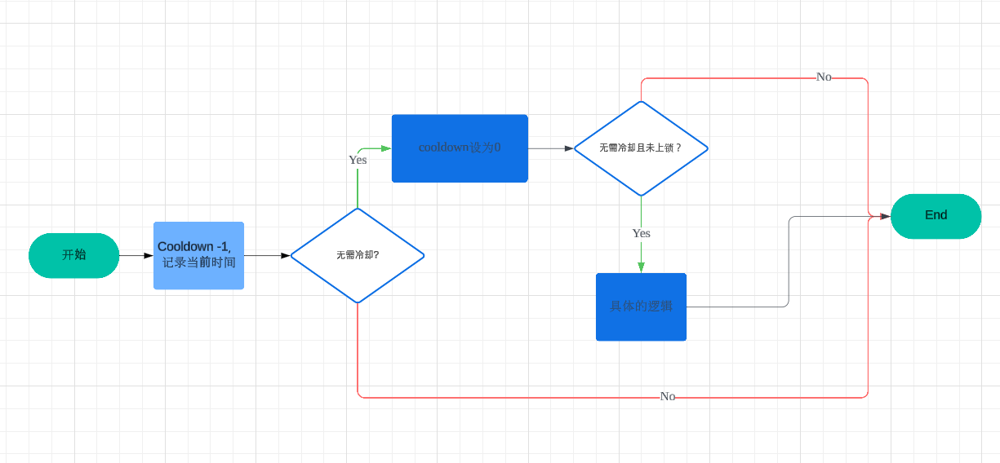
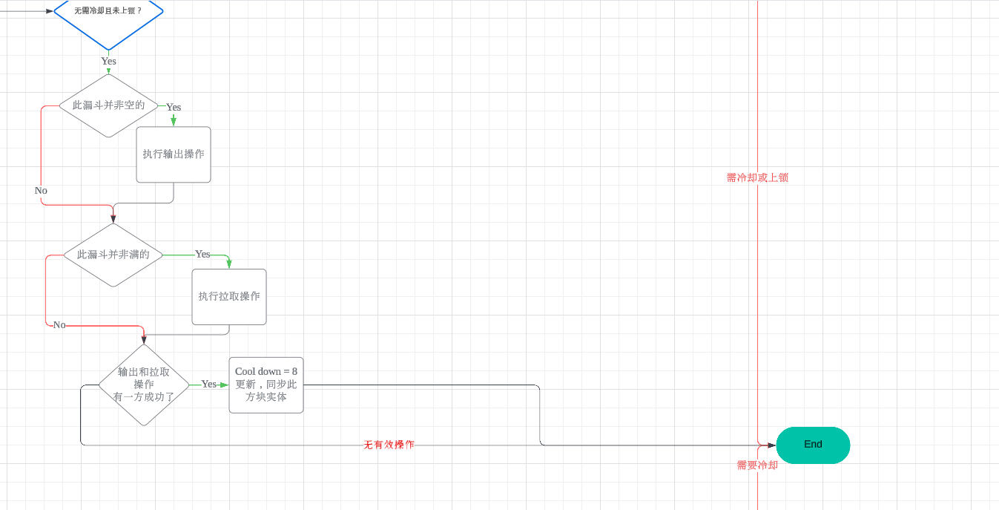
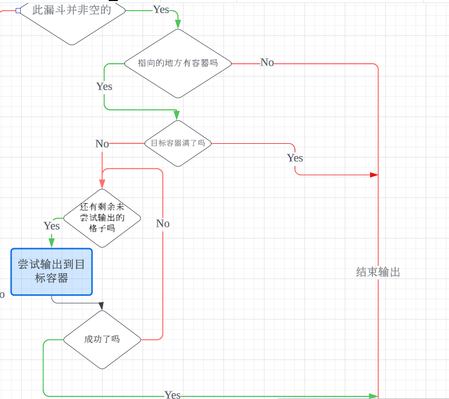
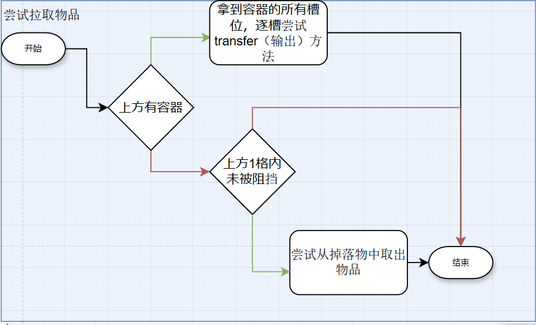
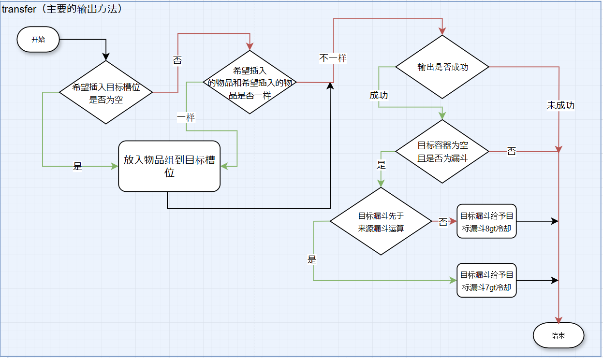

# #04 方块实体

## 4.1 方块实体的概念与内容

### 4.1.1 什么是方块实体？

方块本身通过预定义的有限 BlockState 集合保存数据；通过默认的方块渲染行为渲染模型；通过更新系统、计划系统等决定执行逻辑。
但是，这样的模式具有局限性, 无法直接满足在游戏交互中一些方块的功能。

因此，我们需要一种专门帮助特定方块存储数据，实时处理逻辑，进行额外渲染的组件。我们叫它们***方块实体***。
方块实体相为普通方块提供了三个重要的额外功能： ***使用NBT存储数据***、***自定义的渲染行为*** 和 ***在每一次tick中进行更新***。

方块实体通过NBT来存储数据，和实体一样。而且，与方块状态不同，
方块实体的数据不会自动同步到客户端: 方块实体必须自己声明何时同步以及同步哪些数据。

### 4.1.2 方块实体的内容

方块实体是因方块而异的，但一个抽象的，基本的方块实体含有以下基本信息与功能:

#### 携带的信息

- type 类型
- world 所在的世界
- pos 位置
- removed 是否已被移除
- cachedState 缓存的，对应方块的状态;

#### 提供的重要功能

- readNbt 读入NBT数据
- writeNbt 写出NBT数据
- tick 在服务器tick中执行逻辑
- render 进行自定义的渲染

### 4.1.3 带有方块实体的方块

方块实体与世界绑定，每个方块位置仅有一个方块实体实例。

| 方块                       | 用途                             |
|--------------------------|--------------------------------|
| 蜂箱（Beehive）              | 用于储存蜜蜂数量和其中的蜂蜜等级。              |
| 蜂巢（Bee Nest）             | 用于储存蜜蜂数量和其中的蜂蜜等级。              |
| 告示牌（Sign）                | 用于储存显示的文字。                     |
| 悬挂式告示牌（Hanging Sign）     | 用于储存显示的文字。                     |
| 旗帜（Banner）               | 用于储存显示的图案。                     |
| 箱子（Chest）                | 用于储存物品，支持战利品表信息。               |
| 陷阱箱（Trapped Chest）       | 用于储存物品，支持战利品表信息。               |
| 发射器（Dispenser）           | 用于储存物品，支持战利品表信息。               |
| 投掷器（Dropper）             | 用于储存物品，支持战利品表信息。               |
| 合成器（Crafter）             | 用于存储禁用哪些槽位，以及战利品表信息。           |
| 酿造台（Brewing Stand）       | 用于储存当前的酿造时间。                   |
| 漏斗（Hopper）               | 用于储存下一次传送物品的间隔时间。              |
| 熔炉（Furnace）              | 用于储存当前烧炼物的时间和燃料的剩余时间。          |
| 高炉（Blast Furnace）        | 用于储存当前烧炼物的时间和燃料的剩余时间。          |
| 烟熏炉（Smoker）              | 用于储存当前烧炼物的时间和燃料的剩余时间。          |
| 营火（Campfire）             | 用于储存和显示其状态。                    |
| 潜影盒（Shulker Box）         | 用于储存物品，支持战利品表信息。               |
| 木桶（Barrel）               | 用于储存物品，支持战利品表信息。               |
| 讲台（Lectern）              | 用于存储书当前所在的页面。                  |
| 雕纹书架（Chiseled Bookshelf） | 用于存储最近一次放入或取出的书的槽位号。           |
| 可疑的沙子（Suspicious Sand）   | 用于储存它容纳的物品。                    |
| 可疑的沙砾（Suspicious Gravel） | 用于储存它容纳的物品。                    |
| 信标（Beacon）               | 用于储存金字塔的层数、被激活的效果和容纳的物品。       |
| 刷怪笼（Spawner）             | 用于储存生成的实体类型、生成时间间隔、数量及附加值。     |
| 音符盒（Note Block）          | 用于保存它需要播放的音符。                  |
| 移动中的活塞（Piston Arm）       | 用于保存方块的移动状态和方向，以及被移动方块的ID和数据值。 |
| 唱片机（Jukebox）             | 用于播放所包含的音乐唱片。                  |
| 附魔台（Enchantment Table）   | 用于控制悬浮书的状态。                    |
| 末地传送门（End Portal）        | 用于局域性粒子效果显示。                   |
| 末影箱（Ender Chest）         | 用于局域性粒子效果显示。                   |
| 生物头颅（Mob Head）           | 用于储存头颅种类和朝向，以及所属玩家信息（如果存在）。    |
| 命令方块（Command Block）      | 用于储存命令方块种类、保存的命令、输出的信号强度和输出文字。 |
| 末地折跃门（End Gateway）       | 用于传送的位置和是否渲染光柱。                |
| 结构方块（Structure Block）    | 用于储存有关结构的信息。                   |
| 钟（Bell）                  | 用于渲染摇摆动画。                      |
| 潮涌核心（Conduit）            | 用于激活范围和状态渲染。                   |
| 幽匿催发体（Sculk Catalyst）    | 用于储存其蔓延信号。                     |
| 幽匿感测体（Sculk Sensor）      | 用于监听周围的振动游戏事件。                 |
| 幽匿尖啸体（Sculk Shrieker）    | 用于监听周围的振动游戏事件。                 |
| 磁石（Lodestone）            | 用于绑定磁石指针。                      |
| 黑板（Chalkboard）           | 用于储存显示的文字。                     |
| 化合物创建器（Compound Creator） | 用于储存实验物品和进程。                   |
| 饰纹陶罐（Decorated Pot）      | 用于存储陶片样式及容纳的物品。                |
| 宝库（Vault）                | 用于储存其配置数据、渲染数据等信息。             |

## 4.2 重要的带有方块实体的方块

### 4.2.1 漏斗

在 Minecraft 中，漏斗是一种重要的方块实体，主要用于物品的自动化传输。

#### 漏斗方块实体携带的信息

一个可爱的漏斗方块实体携带以下基本信息:

- `inventory` 储存空间（5格）
- `transferCooldown` 冷却（默认为-1）
- `lastTickTime` 上一tick的世界时间
- `facing` 朝向

#### 漏斗方块实体的功能

- **将物品传输到目标容器**
- **从容器中吸取物品**
- **尝试吸取物品实体**

#### 漏斗方块实体的工作流程

每个游戏刻（tick），漏斗都会执行以下步骤：

1. **减少冷却时间（cd, Cooldown）**

    - 若 cd 仍大于 0，漏斗不会执行任何拉取或输出操作，而是直接结束运算。
    - 若 cd 归零，漏斗会开始尝试执行**输出**和**拉取**操作。

2. **执行物品传输逻辑**

    - **首先尝试输出**（将物品放入目标容器）
    - **随后尝试拉取**（从上方容器吸取物品）
    - **如果吸取或输出成功**，则漏斗会重置冷却时间，并同步更新自身数据。

现在，让我们移步到***尝试拉取和输出的具体的逻辑***。

当漏斗确定自己需要做些什么时，它会先尝试向指向的容器输出。随后，它会尝试从上方吸取物品。最后，如果吸取和输出中有任意一方成功了，它就会设置冷却，并更新同步自己的数据。

我们分别来看输出和拉取的逻辑。

先看***输出***...
***输出***输出操作由 `insert()` 方法完成，它的作用是将物品从漏斗传输到目标容器，并返回一个布尔值来表示是否成功传输。如果传输成功，则漏斗进入冷却状态。

**输出的基本逻辑：**

1. **确认目标容器是否可用**

    - 如果目标容器已满，则输出失败。
    - 如果目标容器有可用槽位，则尝试传输物品。

2. **尝试输出物品**

    - 遍历漏斗中的物品槽，逐个尝试传输物品到目标容器。
    - 只要有一次传输成功，就返回“成功”；否则返回“失败”。

当调用 `transfer()` 方法尝试传输物品时，`transfer()` 方法会返回一个物品组：

- 若返回值为空，则说明物品已完全传输，输出成功。
- 若返回值不为空，则说明物品未能全部传输，输出失败。

到此，输出的部分已经完成，接下来，我们来看看***拉取***的部分。
拉取物品的逻辑与输出类似，但方向相反：

- **输出** 时：漏斗 `transfer()` 物品至**目标容器**。
- **拉取** 时：某个**容器** `transfer()` 物品至**漏斗**。

由于 `transfer()` 方法的逻辑马上会详细解释，因此这里不再赘述。

`transfer()` 是漏斗实现物品传输的核心方法。它接收以下参数：

- **from**：物品来源（可以是漏斗或其他容器）
- **to**：传输目标（可以是容器或另一个漏斗）
- **itemStack**：希望传输的物品组
- **slot**：目标容器中的目标槽位

执行流程如下：

1. **检查目标槽位的状态**

    - 如果该槽为空，直接将 `itemStack` 放入，并清空 `itemStack`。
    - 如果该槽已有相同类型的物品，并且仍有剩余空间，则合并物品并清空 `itemStack`。

2. **判断是否传输成功**

    - 传输后，若 `itemStack` 为空，则表示成功传输，否则表示失败。

3. **特殊处理漏斗间传输的时序**

    - 如果目标是另一个漏斗，则会给目标漏斗增加 `8gt`（游戏刻）的冷却时间。
    - 若源漏斗 `from` 已先于目标漏斗 `to` 计算，则目标漏斗 `to` 仅会得到 `7gt` 的冷却时间。

到此，你已经完全了解了漏斗的基本运作机制。相信这将会对之后的篇章理解提供很大的帮助。

#### 4.2.2移动中的活塞

另外一个及其重要的方块叫moving_piston，移动的活塞，俗称b36。

#### 移动的活塞方块实体携带的信息

一个移动活塞方块实体携带一下基本信息:

- `pushedBlock` 存储的方块
- `facing` 朝向
- `extending` 是否在伸出（与动画播放的方向有关）
- `source` 是否是收回中的活塞本体
- `progress` 当前的移动进度
- `savedWorldTime` 上次执行逻辑时的世界时间

#### 移动的活塞方块实体的功能

- **处理活塞推送实体**
- **更新动画进度**
- **如果`progress>=1`，则将 MOVING_PISTON 替换为`pushedBlock`中存储的方块**
- **在客户端渲染动画**

#### 移动的活塞方块实体的工作流程

详情见[5.7](./MicroTiming/05-方块事件?id=_57-b36的到位)。

## 4.3方块实体间的时序
