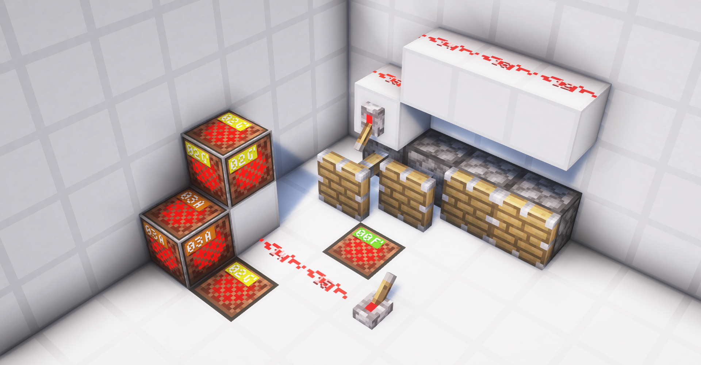

# 05-方块事件

## 5.1 方块事件的概念与内容
### 5.1.1 什么是方块事件？
在游戏交互中，为了减少网络压力，一些数据较多，会大量出现，或者行为复杂的方块应当避免把所有的数据同步到客户端。
相反的，我们可以告诉客户端服务器发生了一些事件，并让客户端的方块把服务端发生的一些事情模拟一遍。
方块事件就是为此而生的。

### 5.1.2 方块事件的内容
一个**方块事件的信息结构**：包含以下内容

- 位置`pos`：在哪里发生
- 方块种类`block`：哪一方块种类执行这个计划刻
- 种类`type`：是哪种事件（有效于活塞，记录伸出和收回等）
- 数据`data`：执行时必要的数据（有效于活塞，记录推动的朝向）
### 5.1.3 方块事件元件
>相当少的红石元件会产生方块事件，确切地说，只有2个 -- 活塞和音符盒


| <center>元件种类</center> | <center>方块事件内容</center>        |
|----------------------|--------------------------------|
| 活塞                   | 坐标，活塞(粘性/普通)，（伸出，收回，瞬推收回），活塞朝向 |
| 音符盒                  | 坐标，音符盒，0，0                     |
### 5.2 活塞的组成

> 完整意义上的活塞有两部分组成，分别是活塞底座和活塞头。

活塞底座完全控制活塞头，并且活塞有两种状态，分别是`收回`和`伸出`。通常情况下，当活塞处于被激活状态时，其会同时更改其活塞底座为伸出状态，并出现活塞头。当活塞处于收回状态时，其活塞头也随之消失。但是，也有部分手段可以创造出只有伸出的活塞底座没有活塞头的**无头活塞**(更确切地说，并不是没有活塞头，而是将它的活塞头指向了某个其他方块)，我们稍后会详细了解这种特殊状态的活塞。在1.16以前，活塞头只会检查自己后方是否存在活塞底座，而不会在意其朝向，这给了制作“多头活塞”的机会。但是，在1.16后，活塞头不仅会检查身后活塞底座的存在性，还会检查其朝向，使得这种“多头活塞”不复存在。考虑到其在1.20.1的不可行性，我们在此处对其不做讨论。

## 5.3 活塞的自检

> 关于其它类型的自检，可以先查看[其它类型的自检](../BlockUpdate/01-更新概念与不同类型的更新.md)

```java
//被玩家放置
    public void onPlaced(World world, BlockPos pos, BlockState state, LivingEntity placer, ItemStack itemStack) {
        if (!world.isClient) {
            this.tryMove(world, pos, state);
        }

    }
//被NC更新
    public void neighborUpdate(BlockState state, World world, BlockPos pos, Block sourceBlock, BlockPos sourcePos, boolean notify) {
        if (!world.isClient) {
            this.tryMove(world, pos, state);
        }

    }
//被其他东西放置
    public void onBlockAdded(BlockState state, World world, BlockPos pos, BlockState oldState, boolean notify) {
        if (!oldState.isOf(state.getBlock())) {
            if (!world.isClient && world.getBlockEntity(pos) == null) {
                this.tryMove(world, pos, state);
            }

        }
    }
```

活塞当且仅当以下两种情况发生时自检：

- 被放置[^1]
- 被更新
- 被玩家放置

[^1]:值得注意的是，这种放置包括被其它活塞放置。

同时，必须强调的是，活塞的自检是可以发生在任意阶段的，活塞会在任意阶段自检，并视情况决定其是否在方块事件阶段添加事件。

### 5.3.1 活塞对红石信号的检查

```java
private boolean shouldExtend(RedstoneView world, BlockPos pos, Direction pistonFace) {
    // 遍历所有方向（上、下、北、南、东、西）
    for (Direction direction : Direction.values()) {
        if (direction != pistonFace && world.isEmittingRedstonePower(pos.offset(direction), direction)) {
            return true;// 如果活塞所在的一格接受到红石信号，活塞应当伸展
        }
    }
    if (world.isEmittingRedstonePower(pos, Direction.DOWN)) {
        return true;  // 如果下方有红石信号，活塞应当伸展
    } else {
        // 如果下方没有红石信号，检查活塞上方的方块
        BlockPos blockPos = pos.up(); // 获取活塞上方的方块位置(这是为了QC冲能准备的)
        for (Direction direction2 : Direction.values()) {
            // 如果当前方向不是向下（活塞本体所在的位置），并且该方向的方块发出红石信号
            if (direction2 != Direction.DOWN && world.isEmittingRedstonePower(blockPos.offset(direction2), direction2)) {
                // 如果活塞上方的一格接受到红石信号，活塞应当伸展
                return true;
            }
        }
        // 如果没有任何方向的方块发出红石信号，活塞不应伸展
        return false;
    }
}
```

接下来我们将详细探讨活塞是如何判断其激活源的。其总是按照以下步骤执行：

1. 活塞检查自身毗邻的方块，不包括其朝向方块，是否发出红石信号，如果发出，则激活活塞
2. 如果直接毗邻活塞的方块没有一个正在发出红石信号，则检查其上方方块毗邻的方块，包括活塞自己，是否发出红石信号，如果发出，则激活活塞
3. 若以上条件都不满足，则不激活活塞

以上步骤揭示了为何活塞具有的重要性质之一，半连接性(Quasi-Connectivity)，简称QC，若不清楚可以返回[QC性质说明](../BlockUpdate/01-更新概念与不同类型的更新.md)查看。

### 5.3.2 活塞自检逻辑

```java
private void tryMove(World world, BlockPos pos, BlockState state) {
    // 获取活塞的朝向（通过状态中的FACING属性）
    Direction facing = (Direction)state.get(FACING);
    
    // 判断是否有红石信号
    boolean shouldExtend = this.shouldExtend(world, pos, facing);
    
    // 如果应该伸出且活塞当前没有伸出（EXTENDED属性为false）
    if (shouldExtend && !(Boolean)state.get(EXTENDED)) {
        // 创建一个PistonHandler对象来尝试推动方块
        // 如果成功推动，则添加一个方块事件
        if ((new PistonHandler(world, pos, facing, true)).calculatePush()) {
            world.addSyncedBlockEvent(pos, this, 0, facing.getId());
        }
    }
    // 如果不应该伸出且活塞当前处于伸出状态（EXTENDED属性为true）
    else if (!shouldExtend && (Boolean)state.get(EXTENDED)) {
        // 计算活塞头前方的位置（当前活塞位置向活塞推出朝向进行2个单位的偏移）
        BlockPos pistonHeadFront = pos.offset(facing, 2);
        
        // 获取目标位置的方块状态
        BlockState headFrontState = world.getBlockState(pistonHeadFront);
        
        // 初始化状态码（默认为1）
        // 状态码的代表状态：
        // 0：伸出
        // 1：收回
        // 2：瞬推收回
        int actionType = 1;
        
        
        if (headFrontState.isOf(Blocks.MOVING_PISTON) // 如果目标方块是一个正在移动的活塞
                && headFrontState.get(FACING) == facing //并且其朝向与当前活塞相同
                && world.getBlockEntity(pistonHeadFront) 
                        instanceof PistonBlockEntity pistonBlockEntity // 如果方块实体是移动的活塞（b36）
                && pistonBlockEntity.isExtending()// 如果目标b36正在伸出
                && (pistonBlockEntity.getProgress(0.0F) < 0.5F //如果伸出进度小于50%
                        || world.getTime() == pistonBlockEntity.getSavedWorldTime() 
                        || ((ServerWorld)world).isInBlockTick())
        ) {
            actionType = 2;// 因该瞬推收回
        }

        // 添加方块事件
        world.addSyncedBlockEvent(pos, this, actionType, facing.getId());
    }
}
```
>值得注意的是，actionType=2时，活塞瞬推收回并不在乎这个b36是否是自己产生的。

现在再让我们看回到活塞自检，其总是按照如下步骤执行：

1. 如果活塞处于收回状态但实际上应该伸出，则添加活塞头，若成功伸出，则添加方块事件
2. 如果活塞处于伸出状态但没有红石信号支持，则考虑收回活塞
3. 若自己正在伸出且进度小于50%，则瞬推收回，添加方块事件
4. 否则正常收回，添加方块事件

## 5.4 b36转化顺序

### 5.4.1 可推动方块

```java
public static boolean isMovable(BlockState targetState, World world, BlockPos pos, Direction direction, boolean canBreak, Direction pistonDir) {
    // 判断方块位置是否在有效的世界区域内
    // pos.getY() >= world.getBottomY() 且 pos.getY() <= world.getTopY() - 1 确保方块在世界的有效Y轴范围内
    // world.getWorldBorder().contains(pos) 确保方块位置在世界边界内
    if (pos.getY() >= world.getBottomY() && pos.getY() <= world.getTopY() - 1 && world.getWorldBorder().contains(pos)) {
        
        // 如果方块是空气，活塞可以推动空气
        if (targetState.isAir()) {
            return true;
        }
        
        // 如果方块是不可推动的特殊方块（如黑曜石、哭泣的黑曜石、重生锚、强化深板岩等）
        else if (!targetState.isOf(Blocks.OBSIDIAN) 
                && !targetState.isOf(Blocks.CRYING_OBSIDIAN) 
                && !targetState.isOf(Blocks.RESPAWN_ANCHOR) 
                && !targetState.isOf(Blocks.REINFORCED_DEEPSLATE)
        ) {
            
            // 如果是向下推动且方块处于世界的最低Y值，则不能推动
            if (direction == Direction.DOWN && pos.getY() == world.getBottomY()) {
                return false;
            }
            // 如果是向上推动且方块处于世界的最高Y值，则不能推动
            else if (direction == Direction.UP && pos.getY() == world.getTopY() - 1) {
                return false;
            } 
            else {
                // 如果方块不是活塞或粘性活塞
                if (!targetState.isOf(Blocks.PISTON) && !targetState.isOf(Blocks.STICKY_PISTON)) {
                    // 如果方块的硬度为-1.0F，表示它是无法破坏的（如某些特殊方块）
                    if (targetState.getHardness(world, pos) == -1.0F) {
                        return false;
                    }

                    // 根据方块的活塞行为来决定是否可以推动
                    switch (targetState.getPistonBehavior()) {
                        case BLOCK:
                            // 如果活塞行为是BLOCK，表示方块无法被推动
                            return false;
                        case DESTROY:
                            // 如果活塞行为是DESTROY，表示方块可以被破坏，取决于canBreak参数
                            return canBreak;
                        case PUSH_ONLY:
                            // 如果活塞行为是PUSH_ONLY，只有在推动方向与活塞方向一致时才可以推动
                            return direction == pistonDir;
                    }
                } 
                // 如果方块是活塞本身并且是扩展状态，则不能推动
                else if ((Boolean)targetState.get(EXTENDED)) {
                    return false;
                }

                // 检查方块是否有方块实体，如果有方块实体，不能被推动
                return !targetState.hasBlockEntity();
            }
        } else {
            // 如果方块是特殊的不可推动的方块（如黑曜石等），直接返回false
            return false;
        }
    } else {
        // 如果方块位置超出有效世界范围或在世界边界之外，返回false
        return false;
    }
}

```

当活塞判断是否可以推动方块时，总是会做以下判断：

1. 如果活塞的推动在世界边界外，其推动方块会被推到世界边界外，或大于游戏高度上限或小于游戏高度下限，则不会推出。
2. 如果活塞尝试推动的方块是空气，则可以推出
3. 若活塞尝试推动黑曜石，哭泣黑曜石，重生锚，或强化深板岩，则拒绝推出
4. 若活塞尝试推动的方块是硬度为-1的方块（如末地传送门，基岩，屏障等），则拒绝推出
5. 若活塞尝试推动的方块拥有Block活塞行为的属性，则拒绝推出
6. 若活塞尝试推动的方块拥有DESTROY活塞行为属性，则视情况破坏该方块
7. 若活塞尝试推动的方块拥有PUSH_ONLY活塞行为的属性，则只有在活塞推动的方向和活塞方向一致时才能被推动
8. 若活塞尝试推动的方块具有方块实体(如箱子，漏斗等)，则拒绝推出

## 5.5 方块事件

## 5.6 更新顺序

## 5.7 b36的到位

## 5.8 方块事件延迟

## 5.9 复制

## 5.10 信息不一致的方块事件

## 5.11 无头活塞
