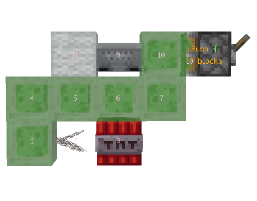
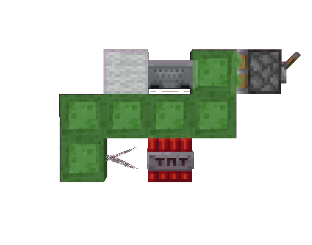
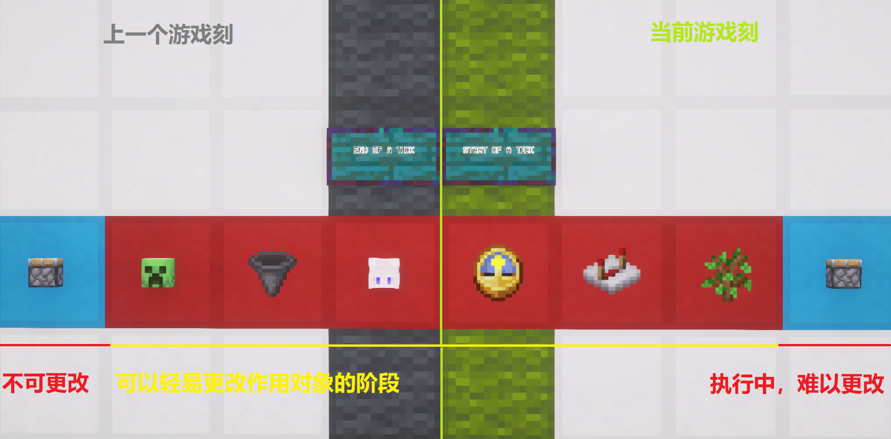
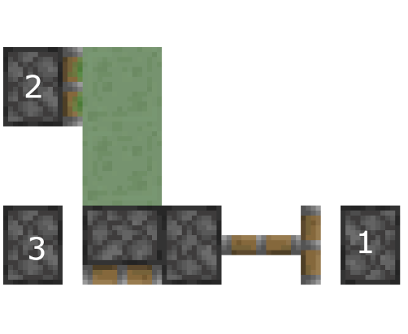
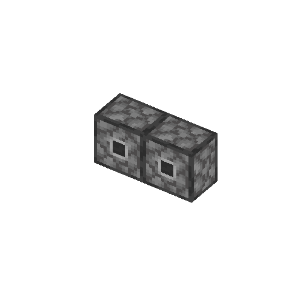

# #06 元件与特性

## 6.1 活塞

**基础部分**

- 活塞的组成与组成
- 活塞的自检触发方式与红石信号判定(QC半连接性)
- 活塞尝试移动方块的结构分析与通俗逻辑
- 活塞的更新顺序与方块事件响应
- b36的常规到位与瞬时到位
- 无头活塞的创建

**进阶部分**

- 活塞自检与信号判定的源码调用
- b36转化顺序与推拉结构分析
- 方块移动底层实现与哈希表运用
- b36到位与实体运算

### 6.1.1 活塞的组成

完整意义上的活塞由两部分组成，分别是**活塞底座**与**活塞头**。

活塞底座完全控制活塞头，并且活塞由两种状态：`收回`与`伸出`。通常情况下，当活塞处于被激活状态时，其会同时更改活塞底座为伸出状态，并出现活塞头。当活塞处于收回状态时，其活塞头也随即消失。也有部分手段可以创造出只有活塞底座，没有活塞头的**无头活塞**；也可以通过某些手段创造出只有活塞头没有活塞底座的活塞。

### 6.1.2 活塞的自检机制

#### 6.1.2.1 触发方式

活塞当且仅当以下两种情况发生时触发自检：

1. 被放置(包括被玩家放置，或被其他活塞推拉到位放置)
2. 受到NC更新

必须强调的是，活塞的自检是可以发生在任意阶段的。换言之，其自检是瞬时的。当上述情况发生时，活塞会立即自检并通过一定的逻辑尝试推出或收回。这里的“尝试”并不代表一定会成功执行。

#### 6.1.2.2 红石信号的检查与QC充能

自检的本质是为了确认活塞是否需要动作，因此它会先判断自己是否被充能。

活塞检查信号的范围包括：

- 自身一阶毗邻(除推动方向外)的所有方块是否正在输出红石信号
- 自身**正上方一格方块为核心**的一阶毗邻方块是否正在输出红石信号

由于活塞会检查其上方方块的毗邻充能情况，这就导致了活塞可以通过上方的空间被“隔空”充能。这种充能无法直接对活塞发出NC更新，因此需要额外的NC更新来更新它，这就是活塞的半连接性(Quasi-Connectivity, 简称QC)的来源。这也是为什么BUD只能检查NC更新。

#### 6.1.2.3 自检逻辑通俗解释

活塞自检时，总是会遵循以下行为树：

1. 应伸出且未伸出：创建一个分析实例尝试分析前方的推动结构。如果分析失败(超过推动上限，有不可推动方块阻挡等)，则不动作；如果分析成功，则给自己当前位置添加一个**伸出**的方块事件
2. 不应伸出且已伸出：活塞需要收回

   - 如果前方是一个正在伸出的同向移动的"移动的活塞"(Moving_Piston, 或称B36,36号方块, 后续均简称b36)，且当前刻不会到位(进度<50%)，则触发**瞬推收回**，添加对应方块事件
   - 否则，执行**普通收回**，添加对应方块事件。

### 6.1.3 活塞的推拉与可推动方块

#### 6.1.3.1 可推动方块判定

一个方块要是能被活塞推动，必须同时满足以下要求:

1. 在世界有效高度范围内
2. 不能是黑曜石，哭泣的黑曜石，重生锚，或强化深板岩等硬编码不可推动方块
3. 方块硬度不能为-1
4. 如果是带釉陶瓦，被推动方向必须与活塞推动方向一致
5. 该方块不能带有方块实体(如箱子、熔炉、漏斗)

#### 6.1.3.2 尝试移动方块与结构分析

活塞在尝试推动时，会动态维护两个列表：**推动方块列表**与**破坏方块列表**。

它会以一定的顺序去顶前方将要推动的方块和将要破坏的方块结构。活塞只会注意在推动轴方向的可破坏方块，若方块附着在推动结构的侧面，则会在稍后被更新并掉落，而不会进入破坏列表。

> 提示：由于结构分析极其复杂(直线分析与分支分析交替入栈)，人工分析极为困难。强烈建议使用[Fallen_Breath的](https://fallenbreath.me/)[PistOrder模组](https://github.com/Fallen-Breath/pistorder)来直接在游戏内查看活塞尝试推动的方块到位顺序。

### 6.1.4 活塞的更新顺序

活塞的更新顺序总的来说分为五种情况：

- 活塞/粘性活塞只伸出
    1. 同活塞/粘性活塞推动方块，只是移动方块为空
- 活塞/粘性活塞只收回
   1. 创建活塞底座b36，发出PP更新和NC更新
   2. 移除活塞头，发出PP更新和NC更新
- 活塞/粘性活塞推动方块
   1. 移除破坏方块位置的方块
   2. 在移动的目标位置创建b36，发出PP更新
   3. 创建活塞头b36，发出红石粉prepare更新与PP更新
   4. 在破坏方块位置发出红石粉prepare更新和NC更新
   5. 在移动原位置发出NC更新
   6. 在活塞头位置发出NC更新
   7. 在活塞底座发出PP更新和NC更新。
- 粘性活塞收回方块
   1. 创建活塞底座b36，发出PP更新和NC更新
   2. 移除破坏方块位置的方块
   3. 在移动目标位置创建b36，发出PP更新
   4. 移除未被覆盖的方块，发出红石粉prepare更新，PP更新
   5. 移动原位置，发出NC更新
- 粘性活塞收回失败
   1. 创建活塞底座b36方块，发出PP更新和NC更新

我们发现，这个行为中不具备任何在活塞头的更新，也就是我们常说的粘性收回方块失败无更新。这里给几个实例：

### 6.1.5 b36与方块到位

#### 6.1.5.1 常规到位

在每个游戏刻的方块时阶段，b36会给自己的推动进度+0.5

- 0gt BE：开始推动，创建b36，此时进度为0
- 0gt TE：进度+0.5，进行实体位移运算
- 1gt TE：进度+0.5，进行实体位移运算，此事总进度达到1.0
- 2gt TE：发现进度已经大于等于1.0，b36变回原来方块，发出最终的PP和NC更新。

若我们从0gt AT开始观测的话，在3gt AT才算完全完成方块到位，因此就有了所谓活塞3gt延迟的说法

#### 6.1.5.2 瞬时到位

当活塞触发瞬推收回时，方块不会经理常规的TE阶段累加，而是直接强制到位。触发条件为：

- 收回事件，且活塞头位置当前方块时b36.
- 收回事件，粘性活塞伸出方向一格外为b36且该b36正在朝活塞推动轴同方向移动。

这里举两个例子做演示：

**活塞头位置为b36**

我们看如下的一个实例：

在这个实例中，红色玻璃被瞬间到位，这是从观测角度而言的，而从理论上，我们给出如下解释：

中继器的优先级高于红石火把，所以普通活塞先添加方块事件，无头粘性活塞再添加方块事件，尝试拉回更前方1格的方块（实际上此时actionType=1）

但是，在BE阶段，由于b36的插入，粘性活塞拉回受阻，并不会破坏这个b36，此时活塞头位置为b36，触发瞬时收回，红色玻璃瞬时到位。

**粘性活塞伸出方向一格外为b36且b36移动方向与活塞移动方向一致**

在以上实例中，红色玻璃被瞬时到位，是因为：

活塞推动粘液棒子，红色玻璃被移动，发出NC更新，触发无头粘性活塞的自检。此时，粘性活塞可以成功拉回，并且在伸出方向一格外存在b36，该b36推动方向与粘性活塞推动方向是一致的，因此被瞬时到位。

---
当然，值得注意的是，这种瞬时到位只会影响一格方块，也就是粘性活塞面前的方块，其余方块仍然会被转化为b36，所以，我们可以利用这一点稍微解读一下一种在许多人看来是魔法的装置：

在这个装置中，当拉杆被拉下，粘性活塞会在方块到位1gt后移动它侧翼的方块，此时这个方块被粘液块带着向前推动，但由于粘性活塞是被侦测器激活的，该粘液块被提前到位，被活塞回推，而此时这个方块尚处于b36的状态，因此被留在了被带过去的位置，这样就实现了对方块流的延长。

瞬时到位会将进度直接设为1.0，移除b36方块实体，直接替换为原本的方块并发出更新。值得注意的是，瞬推不会附带对周围实体的位移推拉运算。

值得注意的是，由于笨蛋麻将并没有在这部分写任何实体运算或对含水方块的特殊判断，所以瞬推不会影响实体，也不会消除含水状态。但是值得注意的是，如果在此前经历了TE阶段的实体运算，在此前的实体运算会被保留，仅有当前gt的TE阶段的实体运算会被忽略。

### 6.1.6 复制

#### 6.1.6.1 亮起侦测器的移除运算

亮起侦测器被移除时会向后方发出NC更新并熄灭自己。

#### 6.1.6.2 基于侦测器的复制

复制的本质实际上是这个方块添加进了移动列表，但是这个时候方块还没转化为b36。我以某种迅雷不及掩耳盗铃的姿势插入一个更新，这个时候这个更新导致了某些东西被激活/掉落，但是因为这个方块本身已经滚进移动方块列表，到位的时候又被以b36的形式放下来了。

我们将复制分为两种，基于侦测器和基于附着性方块的。其中，基于侦测器的复制正利用了上述只要侦测器被移除（换成了b36）的时候就会瞬时产生NC更新。

这里给出基于侦测器的铁轨复制：

在移动方块列表中，当粘性活塞推出时，会先移动左侧侦测器，在目标位置创建b36，再移动粘液块，覆盖了亮起侦测器，更新，铁轨发现下面居然是b36，掉落。移动铁轨，在目标位置创建b36。

这样我们就完成了一次复制

#### 6.1.6.3 基于附着方块破碎的复制

##### 基于BUD的TNT复制

附着方块的掉落同样会产生更新，但是由于附着方块通常会直接掉落而难以二次利用。例如：

##### 基于粉导向的极简TNT复制

##### 地毯复制
下图中是一种极为流行的地毯复制:

当活塞收回时其完成一次复制，我们在这里对其稍做分析：

移动方块列表：

1. 移动最下方的粘液块，在目标位置创建b36
2. 移动失活的珊瑚扇，在目标位置创建b36，发出PP更新，自检发现自己应该掉落，发出PP更新和NC更新，引导上方地毯连锁掉落
3. 移动其余粘液块和地毯

这就完成了复制。

### 6.1.7 信息不一致的方块事件

根据5.1章节、6.1.5章节等，我们可以发现：活塞在执行方块事件时只对其`方块位置`和`方块类型`进行校对。尽管记录了`活塞朝向`，但它只管辖b36的方向。

而活塞执行方块事件时的`真实方向`是即时采样的。

这意味着，在一个活塞的方块事件实例被在方块事件阶段中执行前，存在一个时段：此时，我们可以随意改变其对应位置的活塞的属性，甚至对此活塞本生进行破坏，更换。

如图所示，从上一游戏刻的EU到当前游戏刻的BE，这段时间内我们可以修改某一方块事件的作用对象。
同理，从当前游戏刻的EU到下一游戏刻的BE，也存在这样一段时间。
但只要执行到这个活塞的方块事件实例时，如果执行位置有活塞，且活塞类型没有改变，那么活塞尝试推出/拉回的朝向就会由执行时的朝向决定，尽管这个朝向可能并不是方块事件添加时的朝向。

>有趣的是，b36的收回时的动画仍然以方块事件传入的data参数为准，
>所以，尽管方块事件执行时活塞朝向与添加时不同，活塞头的动画仍会面向方向方块事件添加时的活塞朝向（但碰撞箱是准确的）。
>

#### 6.1.7.1 破基岩

##### 跨越游戏刻的破基岩

>活塞的逆袭之旅

正如前面所提到的，我们可以在活塞的方块事件阶段前，偷偷摸摸地修改活塞的属性，包括朝向。
这意味着我们可以在活塞推出时，将其朝向改为朝向基岩，然后在活塞收回时，就会将基岩当作活塞头摧毁。
下面的展示动画是一个典型,在方块事件阶段前更改活塞朝向的破基岩例子。

在整个过程中，发生了如下重要事件

#CECECE{gt0}-EU阶段

- 左侧TNT爆炸。
  - 爆炸破坏拉杆。
  - 爆炸破坏圆石。

  - 右侧TNT爆炸。
    - 爆炸破坏活塞头,发出nc更新。
    - 活塞基座被更新，由于拉杆已经被炸掉，活塞给自己添加**收回**的方块事件。
        >可惜的是，它已经错过了这个游戏刻的BE阶段，所以只能在gt1的BE阶段默默等待了。。
    - 活塞头破坏活塞基座。

#CECECE{gt0}-AT阶段

- 玩家放置朝下的活塞新活塞。

#CECECE{gt0}-BE阶段

- 活塞按照现有朝向收回，破坏基岩。

以上便是破基岩的全部过程。

但是，在破基岩机等结构内，由玩家放置活塞是不可能的，我们必须通过其他方式来实现这个效果。

##### 在方块事件阶段完成的破基岩

"在活塞的方块事件阶段前"的"前"不仅仅适用于其他的游戏阶段。就算在方块事件阶段内，你仍然可以在某个方块事件之前更改它对应的方块。

如你所见，下图是部分破基岩机中的破基岩结构的简化版本..

如动图所示，在整个过程中，发生了如下重要事件

>前提--上图面标记的数字是各个活塞的深度，他们按照这个顺序在BE阶段尝试伸出或收回。

#CECECE{gt0}-BE阶段

- 1号活塞收回，破坏活塞头,发出nc更新
  - 1号活塞前方的活塞基座被更新，由于处于BUD状态，活塞给自己添加**收回**的方块事件。
      >由于深度1，2，3已被占用，它将会被安排到4号，也就是目前情况下的"最后执行"。
  - 活塞头破坏活塞基座。
- 2号活塞伸出，创建了3个b36。
- 3号粘性活塞收回，将正前方的朝下的活塞的b36强制瞬间到位。
- 朝下的活塞现在的位置拥有先前1号活塞导致的方块事件，按照现有朝向收回，破坏基岩。

### 6.1.8 欺骗活塞添加/取消添加方块事件

#### 6.1.8.1 欺骗活塞取消添加方块事件:推动上限检测

方块事件也会出现活塞觉得自己要执行的事件与实际状况不一致的情况，最典型的便是推动上限检测。

推动上限检测机制最初由玩家_Kayleigh和Landmining发现，其核心在于"欺骗"活塞。这里展示的是Bright_Observer制作的简化版本，便于分析理解。

该装置虽具有方向性设计，但这并不影响其检测功能，因此可自由选择建造方向。

运行现象：

- 放下紫色羊毛(羊毛连接了一根很长很长的柱子...)后敲击音符盒，普通活塞会启动
- 破坏紫色羊毛后敲击，普通活塞则保持不变

原理分析：

1. 上推活塞在被更新时自检
2. 系统检查推动上限条件
3. 若羊毛放下，因上方玻璃柱子已超出推动上限，活塞不会添加方块事件
4. 此时激活两个普通活塞
5. 粘性活塞被普通活塞更新，自检后伸出
6. 羊毛不存在时：  
   粘性活塞正常运作  
   上方普通活塞的推出状态取决于朝向  
   下方普通活塞因深度关系保持原位

关键发现：  
粘性活塞的计划动作与实际执行时推动结构可能存在差异，这种特性被巧妙地用于检测机制。

#### 6.1.8.2 欺骗活塞添加方块事件

遗憾的是，如果你试图复刻***5.10.1 破基岩***的布局和激活顺序

### 6.1.9 无头活塞

#### 6.1.9.1 无头活塞的创建

创建无头活塞的办法其实很多，有炸的，有通过卡顿的，有通过结构生成的，也有通过特殊信号的。
