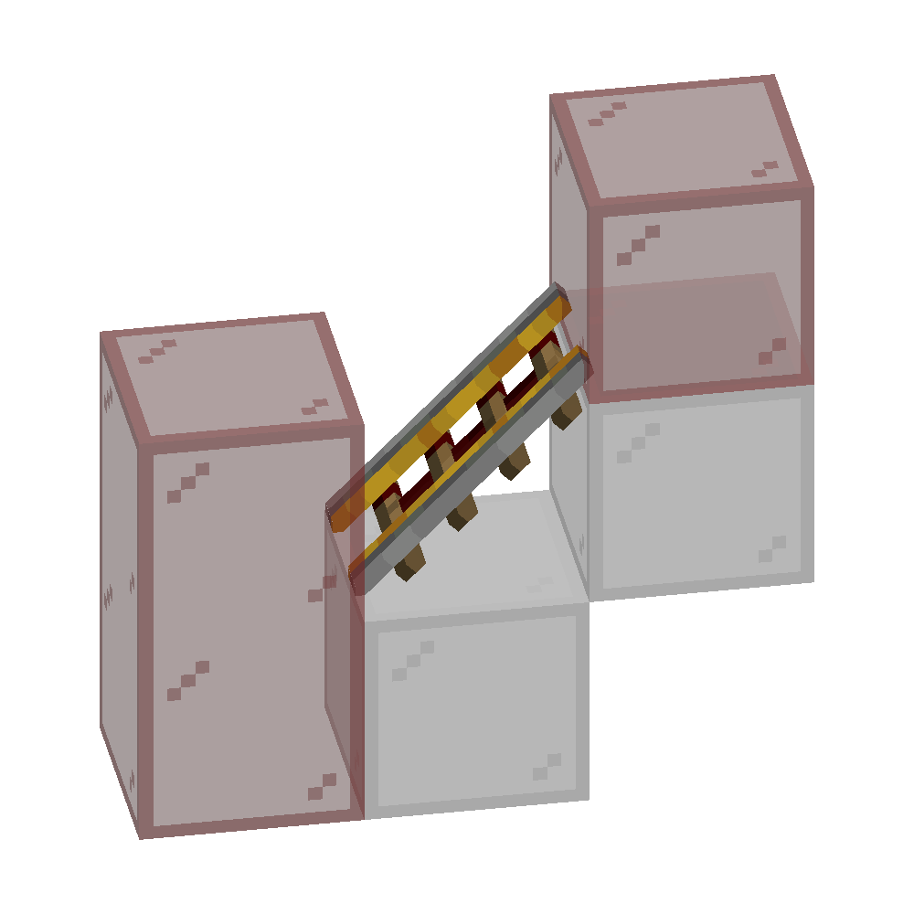

# #01 铁轨

## 1.1 铁轨的更新

除普通铁轨外，特殊铁轨（动力铁轨、激活铁轨、探测铁轨）都具有特殊的更新范围。

### 1.1.1 动力铁轨/激活铁轨的更新

动力铁轨和激活铁轨的更新行为是完全一致的。[^1]

[^1]: 动力铁轨和激活铁轨都由`PoweredRailBlock`类实现，因此它们在源码层面的行为完全相同。两者对矿车产生的不同效果，是由矿车自身进行判断和处理的，而不是由铁轨决定的。

当动力铁轨/激活铁轨的激活状态改变时，它将以这些位置为更新核按序发出NC更新：
1. 上方一格（如果铁轨是倾斜的）
2. 自身
3. 下方一格
4. 自身
5. 下方一格
6. 上方一格（如果铁轨是倾斜的）

也就是说，对平放的动力铁轨/激活铁轨而言，它以**自身->下方->自身->下方**方块为更新核发出4次NC更新；

对倾斜的动力铁轨/激活铁轨而言，它以**上方->自身->下方->自身->下方->上方**方块为更新核发出6次NC更新。

### 1.1.2 探测铁轨的更新

*暂未完成*

## 1.2 铁轨激活条件检测

**此段落中的所有“铁轨”皆指动力铁轨或激活铁轨**

### 1.2.1 激活方式

有两种条件能够使铁轨激活：
- 直接与红石信号源相邻，称为**直接激活**
- 与自身**相连**的8个铁轨中（不含自身）有1个铁轨直接与红石信号源相邻，称为**间接激活**

例如，一个铁轨直接与一个红石块相邻，它就是被**直接激活**的；

而一个铁轨与另外几个铁轨相连，构成一条铁轨链，在铁轨链上有一个相邻的红石块，且这一红石块在该铁轨的8格内，这个铁轨就是被**间接激活**的。

### 1.2.2 “相连”的判断条件

一个未被直接激活的铁轨会通过一种“寻找”机制，判断自己是否被间接激活。具体来说，它会在上查找是否有距离自身8格以内的、与自身**相连**的、**直接激活**的铁轨。

通俗来讲，想象你正要去一个餐厅。你会打开地图，搜索餐厅，看看自己能不能走过去；餐厅不会飞到你的面前，告诉你“我距离你800m，你可以走过来”。

铁轨也是这样。每个铁轨都会自己“寻找”符合条件的信号源——也就是说，铁轨会尝试沿着铁轨链“走”最多8格，看自己能不能找到信号源——也就是能不能找到和信号源直接相连的铁轨。

而一个十分朴素的想法是：如果铁轨“走”到一半，铁轨链“断了”，那么它肯定就走不下去了。

铁轨在某一位置寻找相连的铁轨时，会根据自身的**形状**（即是否为倾斜的），查找**特定位置**的、与自身**方向相同**的铁轨，即铁轨判断下一个铁轨是否与自身相连，只与这三个因素有关：
- 自身的形状（自身是否是倾斜的）
- 下一个铁轨的位置
- 下一个铁轨的方向

而与**下一个铁轨的形状**无关。

平铁轨会检查这些位置：
- 铁轨两端的、和自身相同高度的位置
- 铁轨两端的、比自身低一格的位置

范围如图中红色玻璃位置所示：

例如，图中最右侧的平铁轨在向左侧“寻找”直接激活的铁轨时，会判断左侧的铁轨铁轨与自身相连。图中前三种情况是“符合直觉”的，而最后一种则是**铁轨检查相连时不考虑下一个铁轨的形状**导致的。：

斜铁轨会检查这些位置：
- 斜铁轨较低一端的、和自身相同高度的位置
- 斜铁轨较低一端的、比自身低一格的位置
- 斜铁轨较高一端的、比自身高一格的位置

范围如图中红色玻璃位置所示：

例如，图中最右侧的斜铁轨在向左侧“寻找”直接激活的铁轨时，会判断左侧的铁轨铁轨与自身相连。图中前三种情况是“符合直觉”的，而最后一种则是**铁轨检查相连时不考虑下一个铁轨的形状**导致的。

结合以上两点，我们可以发现：铁轨“相连”具有单向性：即铁轨A判断铁轨B和自己相连时，铁轨B不一定判断铁轨A和自己相连:

从直观上来看，图中铁轨链红石信号可以从右侧传向左侧，但不能从左侧传向右侧；从“寻找”的视角来看，就是：左侧的斜铁轨判断右侧的平铁轨和自身不相连，而右侧的平铁轨判断左侧的斜铁轨和自身相连。

分析这两个铁轨的各自检查相连的位置：上图中橙色玻璃对应的水平位置为斜铁轨检查相连的位置，红色玻璃对应的水平位置为平铁轨检查相连的位置。也就是说，斜铁轨在平铁轨的检查位置上；而平铁轨不在斜铁轨的检查位置上，导致了**铁轨相连具有单向性**。

这可以用于制作一些只能单向传递铁轨信号的铁轨链。

### 1.2.3 “寻找”的方向

铁轨在寻找相连的铁轨时遵循固定的顺序：对两端分别进行独立搜索，且每次搜索都是单向的（不会折返）。

- **搜索流程：** 先从一端沿该方向连续向外搜索，搜索过程中不会改变方向（即只“进”不“退”）；该端搜索结束后，再对另一端重复相同的搜索过程。
- **方向规则：** 南北走向的铁轨总是先向南搜索，再向北；东西走向的铁轨先向西搜索，再向东。

因此，多个铁轨是否能被判定为“相连”不仅取决于距离，还取决于搜索的方向顺序。这就能解释图示中的差异：在第一种情况，红石块两侧的铁轨都能被找到并激活；在第二种情况，只有红石块左侧的铁轨能够被激活，因为右侧的搜索方向无法经过中间的某个铁轨去到目标位置，从而找不到直接激活的铁轨。

如图，在第一种情况中，红石块左右两侧的铁轨都可以被激活。

而在第二种情况中，只有红石块左侧的铁轨可以被激活。红石块左侧的铁轨在**向右**寻找直接激活的铁轨时，会先寻找到2号铁轨，然后**向右**（下）寻找到3号铁轨。

红石块右侧的铁轨在**向左**寻找直接激活的铁轨时，同样会先找到2号铁轨；但由于此时的寻找方向为**向左**，而3号铁轨在2号铁轨的**右侧**，于是就不能寻找的3号铁轨，也就找不到直接激活的铁轨，无法激活。