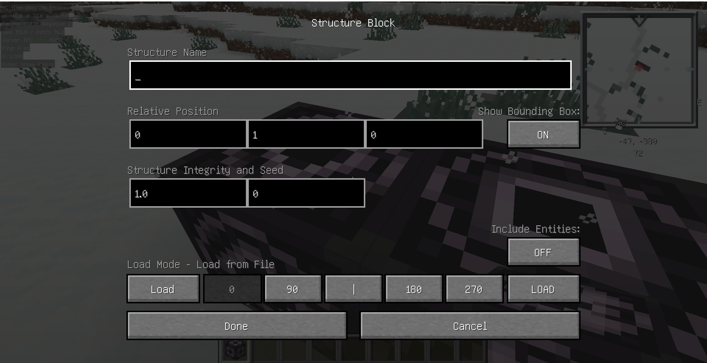
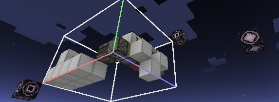
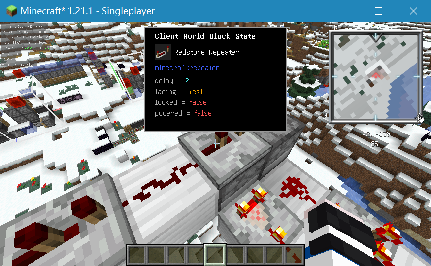
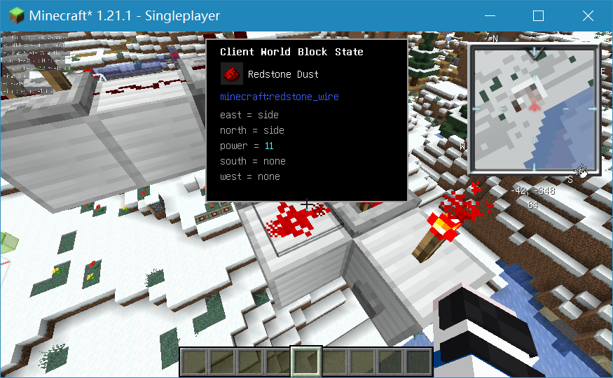
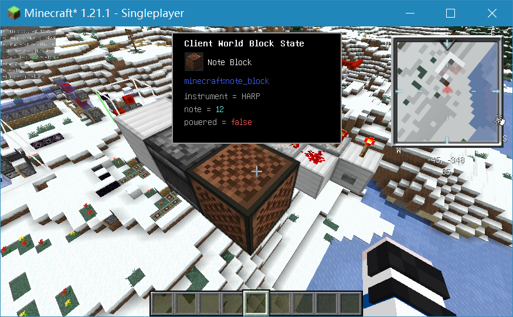
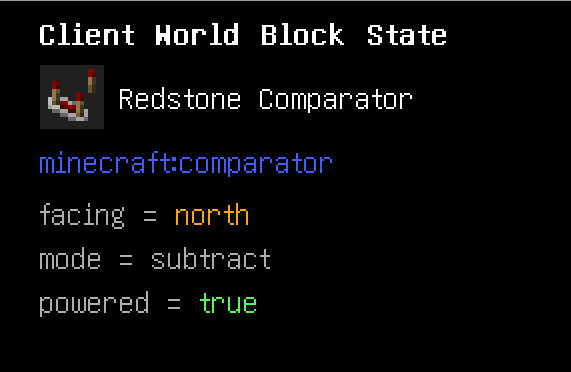

# #11 前置与准备

---

绿萌需要一些mod, 大部分就是生电玩法常见的mod, 例如Carpet, Tweakeroo, Litematica. 但是, 你还需要一定的指令能力, 包括直接进行指令的运用和命令方块的运用. 此外, 我们还需要进行结构方块的学习. 

本教程中不对World Edit做要求( ~~因为本人也不会~~ ), 所以我们需要对指令熟练.

## 1.1.1 原版指令

_这里讲解原版的 `fill` , `setblock` , `clone` 指令和 `effect` , `enchant` 指令, 比较基础, 可以选择性跳过_

### a) 方块交互指令

#### /setblock

setblock指令基础语法为 `setblock <pos> <block>` , 可以在 `<pos>` 位置放置一个方块, 其中 `<pos>` 为一组 `<x> <y> <z>` 坐标.

绿萌中机器都在天上开始设计, 因此一般在 `~ ~ ~` 位置放一个方块, 作为开始搭建的起点.

如此输入

``` Keys
/set<tab> <tab> <tab> <tab> <tab> 
```

你会放置一个金合欢木的按钮, 再另外放置个方块就可以开始搭建了.

#### /fill

fill指令的基础语法为 `/fill <from> <to> <block>` , 在以 `<from>` , `<to>` 这两个对角之间立方体内填充指定方块, 其中 `<from>` , `<to>` 各为一组 `<x> <y> <z>` 坐标.

该指令非常常用, 如清除大量方块, 为盾构机 世吞等创建场地 挖世吞沟等.

如此操作

``` Keys
<看向起点方块>
/fill <tab> <tab> <tab> <Enter>
```

你将得到如下提示

``` Log
Unknown or incomplete command, see below for error
...<x> <y> <z> <-- [Here]
```

接下来

``` Keys
<看向终点方块>
/<up> <tab> <tab> <tab> ...
```

由此可以在两个位置填充指定方块

当然第二个位置也经常为 `~ ~ ~` , 一般用于测试或清除用.        

### b) 结构交互指令

#### /fill高级运用

fill指令在 `block` 后面可以再加几个参数, 完整fill指令语法为

`/fill <from> <to> <block> [replace|keep|outline|hollow|destroy]`

我们将逐个进行讲解

1. `destroy` 参数

	添加该参数后, fill指令破坏方块, 方块会掉落.

2. `hollow` 参数

	添加该参数后, fill指令只会填充外层, 内部清空, 形成一个空壳.

	该指令可以直接生成一个小房子, 便于测试写其他东西, 对于绿萌来说用处可能不大.

3. `keep` 参数

	添加该参数后, 填充会保留原有方块, 仅填充空气方块.

4. `outline` 参数

	与 `hollow` 参数类似, 但是内部不会清空.

5. `replace` 参数

	个人认为该参数为fill指令里的最强参数, 语法如下
	
	`/fill <from> <to> <block> replace <block0>`
	
	该指令可以检测范围内的 `<block0>` , 仅替换掉指定方块.
	
	该指令给了设计者选择方块的能力, 如设计结束后把所有陶瓦换到同一个方向, 将各色玻璃换为同一种玻璃...
	
	操作如下
	
	``` MCCommand
	/fill ... ... minecraft:white_stained_glass replace #c:glass_blocks
	```
	
	搭配类选择器, 将范围内所有玻璃均替换为常用的白色玻璃

除这些参数外, 这里我们将学习一下方块的标签选择

例如, 我们fill一堆半砖, 即使是使用上述 `replace` 参数进行选择, 填充的任然是下半砖, 那么对于上半砖(一般用于附着红石粉, 中继器等), 将引起严重的问题

所以我们要学会如何选择方块的属性

打开F3, 右下角区域为 `Targeted Block` 区, 展示准星所 选中方块的属性. 以平滑石半砖为例, 你将看到如下信息

``` Info
Targeted Block: ..., ..., ...
minecraft:smooth_stone_slab
type: bottom
waterlogged: false
#minecraft:mineable/pixkaxe
#minecraft:slabs
```

这些信息从上到下分别是方块坐标, 方块名称, 属性(对于展示的方块, 有 `type` 和 `waterlogged` 两种属性), 所属类(对于平滑石半砖, 有可挖掘/工具类型和半砖类两种)

上述属性就是我们可以选择的标准, 下面展示如何替换所有平滑石上半砖为平滑石英上半砖

``` MCCommand
/fill ... ... minecraft:smooth_quartz_slab[type=top] replace minecraft:smooth_stone_slab[type=top]
```

中间 `<block>` 和结尾 `<block0>` 都指明了 `[type=top]` , 意为 "半砖类型 = 上"

稍后我们会讲解如何方便的查看方块的属性, 选择正确的类型(详见 1.1.5 ).

#### /clone

clone基础语法有两种, 也可以添加参数, `/help` 中写的不太清晰, 下面仅介绍一个比较简单且常用的

`/clone <begin> <end> <destination>` , 其中 `<begin>` , `<end>` , `<destination>` 各为一组 `<x>` , `<y>` , `<z>` 坐标.

该指令可以将在以 `<begin>` , `<end>` 这两个对角之间立方体中的方块复制到 `<destination>` 位置, 其中对应关系为 `<begin>` 位置对应 `<destination>` 位置.

注意: 改指令进行复制会产生更新, 需使用Carpet内功能关闭更新(详见 1.1.2 a) ). 

### c)其他

#### /effect

effect指令基础语法为 `/effect give <targets> <effect> <seconds>` 和 `/effect clear [<target>]` , 前者用于给予效果, 后者用于清除效果.

设计中, 可能需要给予自己夜视效果(虽然Gamma可直接调整).

1. 效果给予

	语法为 `/effect give <target> <effect> <second> <amplifier> <hideParticles>` , 其中 `<target>` 为作用对象, 例如 `@a` ; `<second>` 为持续时间; `<amplifier>` 为放大强度; `<hideParticles>` 为一个 `bool` 类型值, 指是否隐藏粒子效果.

	较高版本中, `<second>` 可直接填入 `infinite` 表示无限时长; 低版本可以填入一堆9直至呈红色(超出范围)

	`<amplifier>` 对于某些指令并不适用, 譬如夜视, 没有强弱之分.

	`<hideParticles>` 填入 `true` 防止粒子干扰视线

	夜视操作如下

	``` MCCommand
	/effect give @a minecraft:night_vision infinite 1 true
	```

2. 效果清除

	语法为 `effect clear <targets> <effect>` , 其中 `<target>` 和 `<effect>` 均可选. 若留空, 意为自己和所有效果.

#### /enchant

enchant指令基础语法为 `/enchant <targets> <enchantment> [<level>]` , 可以给 `<target>` 选定玩家主手所拿物品进行附魔.

该指令貌似对绿萌一点用没有... 但如果你的机器上刷了个怪或者... ~~好吧确实没啥用~~ 你可以给自己个力量效果, 再附一把锋利5的合金剑快速清除掉 ~~那为什么不直接kill~~

~~不管了~~ , 获得锋利V合金剑操作如下

``` Keys
<物品栏里找把合金剑拿在主手>
<关闭物品栏>
/enchant @a minecraft:sharpness 5
```

## 1.1.2 Carpet指令

Carpet Mod, 中文常直接叫做"地毯", 是由Gnembon编写的一个功能强大, 操作简单的一个辅助性模组, 下载安装这里不进行讲解.

_该部分指令大部分生电教程, 视频都有所讲解, 也可选择性跳过_

### a) Carpet命令面板

输入 `/carpet` 即可打开Carpet命令面板, 你将看到以下提示

``` Logs
Current Carpet Mod settings:
Carpet Mod version: ...
Browse categories:
[dispenser] [feature] ...
```

1. 语言

	由于Carpet自带中文, 所以我们不需要"硬啃"英文 (尽管本教程讲解仍使用英文模式)

	切换语言指令为 `/carpet language [<value>]` , 其中 `<value>` 可选 `en_us` , `fr_fr` , `pt_br` , `zh_cn` , `zh_tw` , 分别对应美式英语, 法语, 德语, 简体中文等

	切换简体中文方法如下

	``` MCCommand
	/carpet language zh_cn
	```
 
	此时我们再使用 `/carpet` 指令, 可得到如下信息

	``` Logs
	目前启用的 Carpet Mod 选项:
    - 语言(language) [en_us] [fr_fr] [pt_br] [zh_cn] [zh_tw]
    Carpet Mod 版本: ...
    浏览分类:
    [发射器] [特性] ...
	```

	我们可以看到 `语言` 中 `[en_us]` 为绿色, 意为默认; `[zh_cn]` 带有下划线, 意为当前.

2. 更新
	
	Carpet可以防止TNT放置时直接点燃(用于TNT复制机, 设计时不需要再推矿车), 防止fill等指令使用时产生更新

	`/carpet tntDoNotUpdate true` 可关闭TNT放置时的更新, 当我们在能量源旁边直接放置TNT时, TNT不会被点燃, 受到更新后才会被点燃.

	`/carpet fillUpdates false` 可以关闭fill时的方块更新, 除此之外, `setblock` , `clone` , 结构方块的更新均会受抑制.

3. 防爆

	`/carpet explosionNoBlockDamage true` 打开后, 爆炸不会破坏方块(这里的爆炸包括TNT, 苦力怕, 末影水晶等), 但是伤害和冲击还是会产生的.

	该指令十分常用, ~~你总不希望你的机器还没启动就炸膛吧~~

4. 设置默认

	再你输入上述指令后, 会弹出提示如下

	``` Logs
	tntDoNotUpdate: true, [Change permanently?]
	```
 
	简体中文模式为

	``` Logs
	tntDoNotUpdate: true, [永久更改?]
	```

	点击后, 输入框内自动填充如下指令

	``` MCCommand
	/carpet setDefault tntDoNotUpdate true
	```

	确认后, 我们每次重进游戏, 就会一直保持这个状态.

	推荐将两个更新指令设为默认, 防爆指令不建议(如果你测试基岩机, 防爆忘了关, 机器就完全粘在一起了)

5. 其他

	`/carpet flippinCactus true` 仙人掌扳手, 打开后可使用仙人掌调整方块方向; 当仙人掌放在副手时, 会放置相反方向的方块.

	`/carpet creativeNoClip true` 创造无碰撞箱, 打开后, 创造模式飞行时, 将像旁观模式一样失去碰撞箱, 即可以穿墙, 不能推动实体.

### b) 假人指令

`/player` 应该是整个Carpet中使用最多的指令了, 使用该指令召唤假人, 使假人做各种动作, 踢出假人.

1. 召唤与清除
	
	使用 `/player <name> spawn` 可以在当前位置召唤一个假人, 若想控制召唤位置和初始朝向, 使用如下指令

	``` MCCommand
	/player molforte spawn at <pos> facing <direction> in <dimension> in <gamemode> 
	```

	`<name>` : `molforte` 不区分大小写, 优先匹配正版玩家, 其次生成不存在的玩家. 这里以另一个教程的作者莫尔为例.
	
	`<pos>` 为一组 `<x>` , `<y>` , `<z>` 坐标; `facing` 后面 `<direction>` 为一组 `<yaw>` , `<pitch>` , 即方位角和俯仰角

	`in` 后面 `<dimension>` 为游戏维度, 再后面 `in` 接 `<gamemode>` 游戏模式.

	使用 `/player <name> kill` 清除一个在线的假人.

	_你可以召唤一个假人, 向他投掷物品, 然后kill掉, 再到新位置上线杀掉, 这就是假人快递_
	
2. 行动

    使用 `/player <name> (stop|use|jump|attack|drop|dropStack|swapHands|sneak|unsneak|sprint|unsprint|look|turn|move)` 等使假人行动, 功能直接翻译即可.

    例如 `/player Molforte attack` 使假人Molforte进行一次攻击/挖掘(前提是假人Molforte存在).

     大部分操作后面都可接参数, 以攻击为例:

     `/player Molforte attack` 后可接参数 `continuous` , `interval` , `once` , 分别为一直攻击, 间隔攻击, 仅攻击一次, 其中间隔攻击后需接间隔tick数.

### c) tick指令

_高版本该指令以整合到MC本体中, 但仍推荐安装Carpet_

1. 冻结
	
	使用 `/tick freeze` 使游戏冻结, 再次使用可解冻; 高版本下需要使用 `/tick unfreeze` 解冻.
	
	冻结后, 游戏停止运行, 但玩家不受影响.

2. 调速

	使用 `/tick rate <rate>` 调整游戏tps(Ticks Per Second), 每秒的游戏刻数, 默认20, 即1s = 20ticks, 1tick = 0.05s.

3. 按步行动

	在游戏冻结的基础上可以使用 `/tick step <time>` 按步运行游戏. 当我们观察一个东西运动时, 可以一点一点流逝时间, 更清晰的观察.

	例如, 观察活塞时, 先 `/tick freeze` ; 接下来活塞旁边放置红石块, `/tick step 2` 发现活塞已伸出. (此处为观察到的伸出, 具体活塞运行时间有待商榷)

	测试时, 大多以4ticks为时间间隔进行测试, 该时间为多数情况下飞行器中粘性活塞完整伸出缩回的时间.

## 1.1.3 结构方块

### a) 获取

使用 `/give @s minecraft:structure_block` 指令可获取一个结构方块.

结构方块有三种模式(较老版本为四种), 分别为 `Load` , `Corner` , `Save` 模式, 中文为 `加载模式` , `角落模式` , `保存模式` . 结构方块放下默认为 `Load` 模式.



单击左下角 `Load` 可切换模式.

### b) 存储与加载

`Save` 模式下, 首先写入 `Structure Name` 结构名称, 然后调整 `Relative Position` 和 `Structure Size` 框定选区(前者为选区基准点与结构方块的相对位置, 后者为选区大小), 单击 `DETECT` 开始探测.

此时, 你将看到一个白框标记选区. 此时右下角单击 `SAVE` 即可保存选区, 聊天区提示如下:

``` Log
Structure saved as 'minecraft:...'
```

此时我们准备一个 `Load` 模式的结构方块, `Structure Name` 结构名称中填入刚才保存的名称, 然后调整 `Relative Position` 相对位置. 

单击右下角 `LOAD` , 游戏中出现白框标记选区范围, 并且得到如下提示:

``` Log
Structure 'minecraft:...' position prepared
```

此时打开结构方块, 再次单击 `LOAD` 按钮, 结构即被加载出来.

_该加载会产生更新, 详见 1.1.2 a)_

此外, `Load` 模式还可以进行旋转和镜像


下方 `[0] [90] [|] [180] [270]` 按钮中, `[0] [90] [180] [270]` 互相单选, 表示结构绕基准点顺时针旋转角度

如图所示为四个箭头不同旋转角度, 其中白框标记的为0度


`[|]` 为选择按钮, 共有 `[|]` , `[← →]` , `[↑ ↓]` 三种模式. 分别意为正常, 左右镜像, 前后镜像, 请自行尝试.

此外, `Save` 模式框选大小时, 可以使用 `Corner` 模式进行框选. 将 `Corner` 和 `Save` 中写入相同的 `Structure Name` , 然后两个 `Corner` 模式结构方块放置于结构两个对角, 再次点击探测, 会发现结构已被成功探测起来.

_注意: `Corner` 模式探测大小, 不包括结构方块本身_



## 1.1.4 Litematica

Litematica Mod, 中文常叫做"投影", 是一款功能强大, 使用频繁, 上手简单的mod.

由于Litematica Mod十分常用, 教程众多, 本教程中不再讲解此mod的下载安装, 以及框选/投影/粘贴等简单功能, 只讲解本人在使用过程中使用的一些比较冷门的功能.

### a) 轻松放置协议

`easyPlace` 轻松放置是投影中一个非常常用的功能, 但是对于楼梯, 半砖, 甚至音符盒, 轻松放置可能出现问题. 下面讲解如何选择轻松放置协议.

`easyPlaceProtocolVersion` 轻松放置协议路径为 `投影主菜单/Configuration menu/Generic/easyPlaceProtocolVersion` , 对应中文 `投影主菜单/配置菜单/通用/轻松放置协议` (也有译为"简单放置协议"的)

`easyPlaceProtocolVersion` 有 `Auto` , `Version 3` , `Version 2` , `Slabs only` , `None` 五种, 默认为 `Auto` . 如果你搞不清楚这些协议的区别, 这边推荐无脑选最大的, 也就是优先 `Version 3` , 若服务器不支持 `Version 3` 则使用 `Version 2` . 其他模式一般不使用.

### b) 方块信息

`renderInfoOverlay` 方块信息可以展示所选中方块的属性信息, 有些mod(例如jade)也可以显示方块信息, 但我不推荐新人安装大量mod, 且投影方块信息展示也完全足够.

`renderInfoOverlay` 方块信息路径为 `投影主菜单/Configuration menu/Hotkeys/renderInfoOverlay` , 对应中文 `投影主菜单/配置菜单/热键/方块信息` .

由于 `hotkey` (`热键`) 栏目功能众多, 建议直接搜索 `info` 关键词, 注意搜索结果非 `toggleInfoOverRendering` ( `方块信息展示` )), 避免混淆.

本人将快捷键设为 `LAlt` , 使用时直接准星对准方块, 按下左Alt即可, 如图所示.







_图示为1.14以下版本堆叠村庄刷铁机的门控计数器_

可以看到方块缩略图, 方块名称, 注册表名称, 接下来是方块属性. 我们以比较器为例分析一下.



``` Info
Client World Block State
... Redstone Comparator
minecraft:comparator
facing = north
mode = subtract
powered = true
```

这与 `F3` 中 `Targeted Block` 信息是一样的. 属性直接翻译即可, 分别为朝向 = 北, 模式 = 减法, 已充能 = 是.
