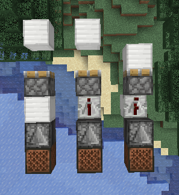
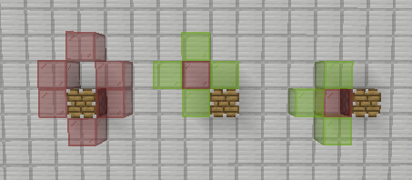
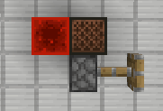
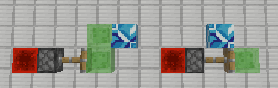
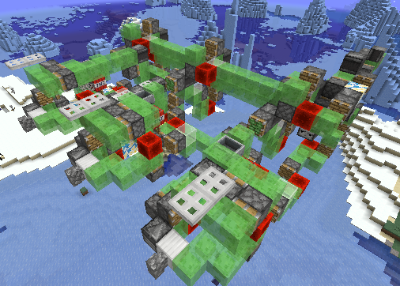

# #12 元件入门

---

是"元件"啦, 不是"原件"啊. 电路元件, 控制元件这些东西都"元件", 类似最小结构单元的东西.

本节课讲述各种"能动"的元件功能和作用, 这里不会讲述十分深入的内容, 毕竟只是入门教程.

我们在学习时, 会把电流类比为水流, 又把红石能量类比为电流. 但是, 绿萌教程中, 没办法进行任何类比, 我们只能自行记忆.

## 1.2.1 信号

红石块能产生稳定的信号, 供活塞等使用.

侦测器可以在探测到变化, 或者自己发生移动后, 产生2gt的信号. 该长度的信号可以使粘性活塞推出方块而不拉回.

有些信号源还可能使用载有矿车的探测铁轨, 一般用于TNT复制机的推动.

可以使用侦测器搭配音符盒, 栅栏门, 活板门进行信号的传递; 多数时候还会使用它们作为整个机器的开关.

_"我们直接启动", 直接破坏了栅栏门, 对侦测器产生了一次更新, 也可以启动整个机器_

## 1.2.2 活塞

活塞分为普通活塞和粘性活塞. 普通活塞接到信号会伸出, 信号断掉会缩回, 伸出过程可以推动前方的方块, 推动力上限为12个方块; 粘性活塞同理, 只是正常接收信号时, 信号断开活塞收回, 可以把方块拉回, 推动和拉回上限也都是12个方块.

无法被活塞推动的方块有容器, 两种黑曜石, 基岩以及伸出的活塞. 还有一些方块会被推动是会被破坏, 如植物, 部分红石元件等. 特别地, 带釉陶瓦能被推动但无法被拉回.

粘性活塞在接受到小于等于2gt长度的信号时, 会推出方块而不拉回, 因此可以通过这个制作双向的飞行器.

_粘性活塞, 图中从左到右分别为2gt, 2gt, 4gt_

活塞还有一个特殊的性质, 称为"半连接态", 简称 `QC` . 由于1.5时代将活塞当成门来写, 所以活塞上方一个周围5个空间的信号也可以维持活塞伸出.

活塞得到信号和更新才会伸出, 当信号直接传入活塞时, 同时更新了活塞, 活塞伸出; 信号传入活塞上方, 活塞没有受到更新时会保留原有状态, 更新活塞后, 活塞变成对应状态. 此处的更新指的是 `NC更新` , 详见更新理论教程.

_图为活塞范围展示, 左为可为活塞提供信号的位置, 中右展示了两个信号位可产生的更新位置. 图中仅展示了同一层的, 三维的示意图并未画出_

图中红石块可以为活塞提供信号, 但无法更新到活塞. 此时, 红石块先更新音符盒, 音符盒更新活塞. 因此活塞得以伸出.

_Java版的大多数方块都不是一直检测自己状态是否需要改变的"事件侦听器", 而是需要别人的更新才触发自己检测一次; 所以当方块放下/状态改变/充能时, 会更新周围方块. 只有这个时候周围方块才会检测自己状态._

_因此, 在你的想法中, 也要从"元件主动检测"这种想法转移到"元件被动检测"上_

## 1.2.3 其他方块

音符盒, 栅栏门, 活板门能在收到信号时发现变化, 该变化可以被侦测器检测, 从而将信号传递下去. 同时, 音符盒, 栅栏门, 木制活板门还可以接受玩家点击, 作为开关.

铁轨被推动时, 若目标位置也能维持现有状态, 则不会掉落, 否则会被破坏. (此处维持现有状态指的是铁轨的 `shape` 属性, 例如, 倾斜的铁轨若推动后, 倾斜方块无可以附着的方块, 铁轨就会掉落)

TNT接受到信号和更新时会被点燃. 红石灯接受到信号时会瞬间亮起, 在失去信号后还能维持4gt的时间再熄灭.

## 1.2.4 方块

方块算什么元件? 确实不算, 但是, 水路中不可能没有管道, 电路中不可能没有导线... 绿萌中的方块, 就是这个作用.

### a) 粘性方块

传统的粘性方块为 `粘液块` , 又称 `史莱姆方块` , 这也是"绿萌"这个名称的由来.

粘液块可以互相粘连, 在与活塞的交互上会一起移动, 还可以粘连各种元件和辅助方块. 由于活塞推力上限为12, 故一般史莱姆方块连接不超过12b.

史莱姆方块无法粘连活塞无法推动的方块, 推动破坏方块以及带釉陶瓦. 特别地, 带釉陶瓦可以被推动, 但是无法粘连.

蜂蜜块是1.15版本加入的新方块, 它为绿萌玩家提供了更多的选择. 蜂蜜块具有和粘液块一样的粘连特性, 但是和粘液块不会互相粘连. 

蜂蜜块表面不完整, 无法充能和附着铁轨.

### b) 功能方块

绿萌中除元件外, 有些方块也具有一定的功能. 如经常用于作为飞行器"座位"的炼药锅和堆肥桶. 此外, 还有用于卡碰撞箱的栅栏和石墙, 用于精确定位的各种体积的方块. 这些方块数目众多, 分类复杂(毕竟你意想不到设计者为了实现某些功能, 往机器里塞什么东西), 我们具体遇到再进行分析.

### c) 辅助方块

辅助方块大概分这么几类

1. 占位方块: 玻璃等

	此类方块不起任何功能性作用, 只是用于推动(卡住)其他结构, 是最普通的方块.
	
2. 充能方块: 平滑石, 铁块等实心方块

	在占位方块的基础上, 此类方块需要能被充能, 用于信号的传递.

3. 特殊粘连方块: 带釉陶瓦

	上述内容已讲明带釉陶瓦(常简称"陶瓦")的特殊性, 这里不在赘述.

_图为星空花夜的第一代连发盾构机_
