# #13 飞行器入门

---

经过整整两节的学习, 我们终于要做一个可以动的机器啦!

本节课我们只认识并建造一点点简单的飞行器, 不会太深入分析飞行器的运动, 学习起来会比前两节容易很多哒.

## 1.3.1 原理

_左脚踩右脚, 螺旋升天!_

高中物理的动量彻底毁了我们的武侠梦, 所幸的是, mc的方块又没有动量的概念. 所以我们可以做到如下操作.

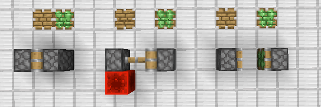

如图所示, 我们实现了"左脚踩右脚"的过程, 这个过程中作为"右脚"的普通活塞位置没有变化.

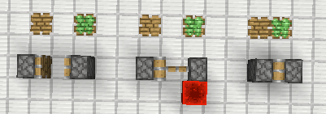

如图所示, 为把"右脚"拉回的过程, 这个过程中粘性活塞位置没有变化.

上述两个过程, 整个结构变向前移动了一格, 我们连贯起来.

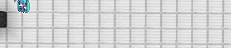

将按顺序激活的电路塞到飞行器本体中, 就是简单的飞行器了.

## 1.3.2 简单飞行器

### a) 9gt单向飞行器

如图所示是个非常容易理解的9gt单向飞行器

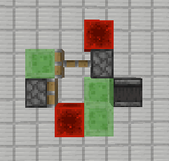

其中右向的为普通活塞, 左向的为粘性活塞, 以右为前, 打掉最上面的红石块以启动.

我们使用 `/tick freeze` 和 `/tick step` 来观察一下这个飞行器的运行.

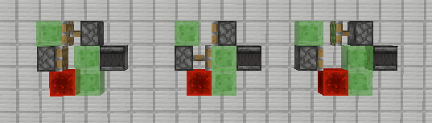

如图所示为此飞行器的运行状态. 粘性活塞先将后面部分拉回; 接着后面都普通活塞在红石块的作用下, 将前面部分推出; 前面部分到位后, 侦测器响应, 粘性活塞再拉回后面部分, 完成循环.

_该飞行器周期为9gt_

### b) 10gt侦测器双向飞行器

上述飞行器中, 普通活塞由红石块激活, 而粘性活塞由侦测器激活. 我们把他们都改成侦测器激活, 如图所示.

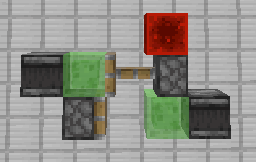

运行过程与上述飞行器并无区别, 只是周期从9gt变为了10gt.

由于侦测器信号长度较短, 可以使粘性活塞只推出不拉回, 所以可以将后方的普通活塞换成粘性活塞, 不影响其运动.

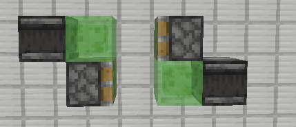

该飞行器中心对称, 因此, 既然可以向右运动, 那么向左运动也是可行的. 这便是最简单的双向飞行器.

绿萌中几乎所有的简单飞行器都是10gt飞行器, 为该飞行器的变体. 

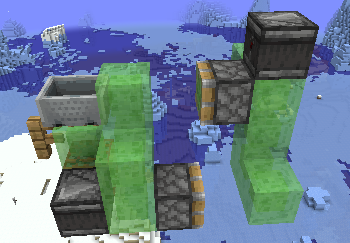

_图为芒果牌世界吞噬者的轰炸机部分, 可以看到该轰炸机只是改变了一下活塞, 侦测器和史莱姆的位置, 抽象结构是一样的_

### c) 12gt活塞BUD飞行器

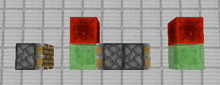

_图中三个活塞从左到右分别为普通活塞, 粘性活塞, 普通活塞_

在1.11之前没有侦测器的版本, 流行着这样的飞行器, 不过目前基本上不再使用. 请有余力者自行研究如何启动以及运动过程.

## 1.3.3 挂载与拓展

由于绿萌圈一直没有统一的标准, 只有一些约定俗成的说法, 因此, 这里以我自己的命名进行分类.

### a) 挂载

对于上述10gt双向飞行器来说, 我们可以改变一下结构的形状, 然后粘连一些其他的方块作为挂载. 例如上述"芒果牌世界吞噬者的轰炸机部分"便是在10gt飞行器基础上粘连方块进行挂载得到的.

同理, 挂载也可以挂载额外的侦测器和活塞, 使你的飞行器也具有方块交互的能力. 我们也可以实现一些有趣的功能.

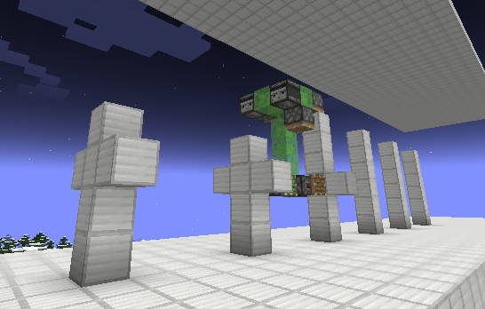

_图为可将6高柱子转换为特定形状的飞行器"坟头机"_

原理便是在10gt简单飞行器基础上挂载几个特定方向的活塞, 这里基本上不涉及关于飞行器的知识, 请自行尝试.

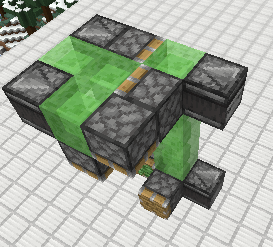

**作业: 请自行设计一个将4高柱子转换为如下雕像的机器**

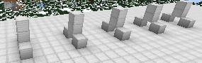

### b) 拓展

既然我们可以挂载侦测器和活塞实现额外的功能, 但是, 由于单个活塞12b的推力限制, 对于一些功能的实现还是有局限性的, 因此, 我们可以通过活塞进行结构的拓展.

我们可以在简单飞行器的基础上, 可以通过前向的普通活塞推动前方结构, 也可以通过后向的粘性活塞拉回后方结构, 如图所示:

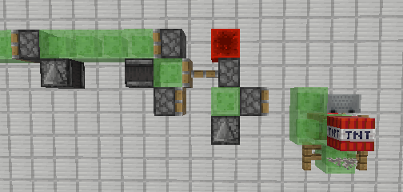

_图中从左到右, 从上到下分别为粘性活塞, 粘性活塞, 普通活塞, 粘性活塞, 普通活塞_

该飞行器在简单飞行器的基础上, 向前拓展了一个12b的双TNT复制机, 向后拓展延伸出屏幕外.

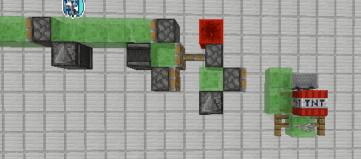

之后, 简单的飞行器会直接称为"引擎", "挂载"的概念也包含"拓展". 了解这些, 你已经踏入飞行器的大门了, 接下来的知识, 笼统的讲就是各种各样的引擎, 各种各样的挂载与拓展, 以及, 如何将多个飞行器优雅的整合在一起, 加油!

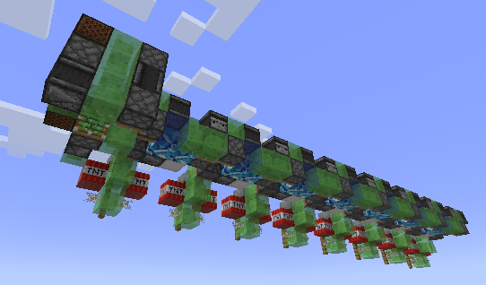

_图为本人的单向推土机_