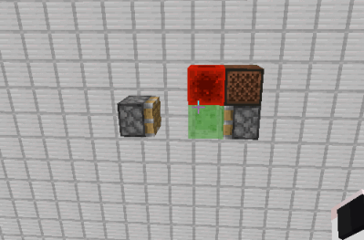
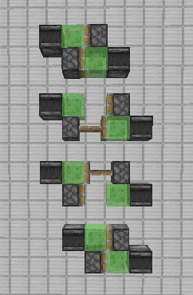
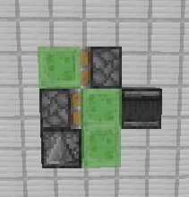
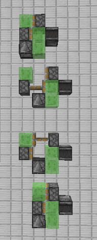
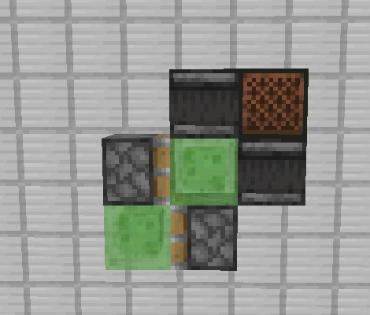
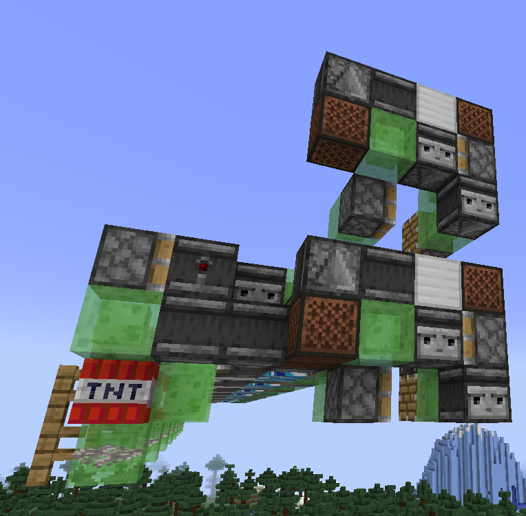
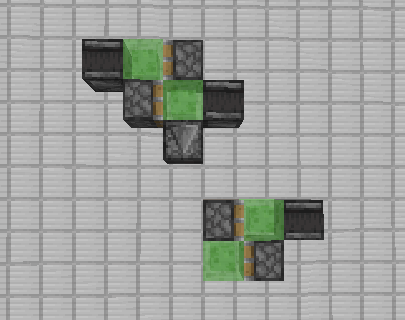
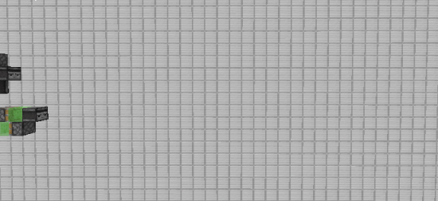

# #22 半动机与拓展

---

本节我们探索两个特殊的飞行器引擎, 一种依赖于其他独立引擎, 将能动传递下去的结构. 

## 2.2.1 半动机

`半动机` 是一个计次的引擎, 当接收一次外界信号时, 会移动一格. 如图所示

上述半动机结构简单, 十分常用, 但在现在常见的10gt标准引擎中, 该结构并不能正常工作, 因此, 我们探究一下如何使飞行器从 `不能动`, 到 `一直动` , 再到 `动一次` .

上一节中提到, 飞行器必要结构为

- 两个相向的活塞, 至少一个为粘性活塞
- 两个侦测器, 分别激活两个活塞
- 用于连接的粘液块

两个侦测器便是实现`一直动` 的关键, 它们完美的提供了一直动所需的时序. 

分析10gt飞行器可知, 接下来的运动, 是由于左侧侦测器到位重新提供信号, 使整个飞行器进入下一个周期. 所以想要是飞行器仅运动一次, 只要组织侦测器到位洗好提供给活塞即可.

如图所示, 我们将左侧侦测器挂载到右侧结构中, 这样, 启动时侦测器可以给予活塞信号, 但是, 到位时, 侦测器和活塞恰好分开, 阻止了下一个周期的启动.

_注意, 图中左侧活塞不能为粘性活塞, 由于信号长度问题, 若换成粘性活塞, 将导致结构震荡_

我们将上面半动机的结构简化一下, 并添加一个音符盒作为开关

从中我们可以总结出简单半动机的必要结构

- 两个相向的活塞, 朝向前进方向的为普通活塞, 背向前进方向的为粘性活塞
- 两个侦测器, 可以激活两个活塞, 但挂载在同一边
- 用于连接的粘液块

实际上, 目前的各种盾构机, 单向推土机, 都是巨大的半动机, 它们接受玩家的信号, 向前移动一格, 复位, 等待下次信号的到来.

_图为本人的单向推土机以及拆出来的半动开关_

## 2.2.2 拓展

我们在 `1.3.3` 就讲解了飞行器的挂载与拓展, 这里我们不再区分挂载和拓展的区别.

### a) 能动拓展

最简单的拓展结构便是前向的普通活塞和背向的粘性活塞, 利用侦测器和活塞, 将能动传递下去, 这里不再讲解.

### b) 信号拓展

结合上面的半动机, 我们利用飞行器, 给半动机周期性的信号, 半动机便可以周期性的运动起来, 与飞行器同步.

图中上面结构为普通的10gt飞行器, 挂载了一个额外的侦测器, 下面结构为一个半动机, 它们可以同步运动.

_这里你可能会问, 半动机特征就是为了只动一次, 我们又用飞行器连接半动机, 半动机不就"没用"了嘛, 为什么不直接做另一台飞行器?_

_实际上, 半动机是个很简单的拓展结构, 一方面, 可能主飞行器达到推限, 无法通过侦测器活塞的方式将能动传递下去, 这时便可以使用相对少挂载到半动机; 另一方面, 半动机并不是 `只动一次` , 而是 `动后即停` , 也就是说, 如果主飞行器因为某些原因停下, 半动机作为拓展, 必须立即停下, 倘若单独做一个飞行器, 将引发严重的问题._

此外, 还有这样的广义信号拓展, 该信号不仅仅为红石信号.

为了方便观察, 我将主飞行器也做成了半动机, 当主飞行器移动时, 作为拓展的半动机侦测到移动信号, 跟着移动.

