# #31 连杆

---

让好大一坨东西同时移动是个很麻烦的事, 因为活塞12的推力上限, 我们只能使用后多个活塞把`能动`传过去, 但这样我们不得不仔细调整延时, 且传递越远, 延时越复杂.

因此, 我们有了`无延时连杆`的概念. 本节我们将介绍几种应用不同原理的连杆. 

## 3.1.1 基于活塞收回的单向连杆

粘性活塞链收回是无延时的.

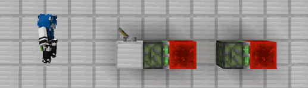

实际上粘性活塞无论伸出还是收回, 都会立即响应. 这时被推动/拉动的方块瞬间转换为`b36`, 2gt后运动完成方块再转换回真正的方块.

> **补充: 活塞传递时间详细描述**
> 
> 若初始时, 所有活塞均为未伸出状态, 第一个活塞可由拉杆激活, 在第0刻拉下拉杆, 则时序如下:
> | 时刻 | 阶段 | 事件 |
> |--|--|--|
> | 0 | AT | 拉杆拉下 |
> | 1 | BE | 活塞1伸出 |
> | 3 | TE | 红石块1到位 |
> | 4 | BE | 活塞2伸出 |
> | 6 |	TE | 红石块2到位 |
> | 7 |	BE | 活塞3伸出 |
> | 9 |	TE | 红石块3到位 |
> | ... | ... | ... |

只不过对于活塞链, 如果是伸出, 那么只有在方块移动且到位后, 才会激活下一个活塞, 因此每个活塞都会多出一部分时间.

但缩回完全不同, 红石块变成`b36`的瞬间, 便意味着信号消失, 前面的活塞将立即响应, 因此活塞链收回不会产生延时.

我们修改一下, 让活塞主动伸出.

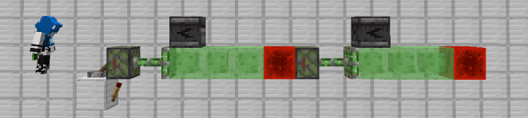

如图所示, 我们让活塞收回后自动伸出, 这时即可保证整个活塞链的同步.

根据这个原理, 我们应用到`飞行器`中, 也就是前面提到的`半动机`:

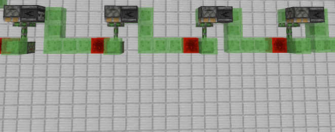

图中每个结构单元, 使用向上的粘性活塞进行无延时信号传递, 同时挂载一个向下的普通活塞, 用于将粘性活塞归位.

这便是最常见的连杆结构, 同理我们可以做出好多相同结构的连杆.

_图为`ilmango`世界吞噬者轰炸机一侧的停靠架, 本质上就是一个连杆挂载了几个侦测器和活塞_

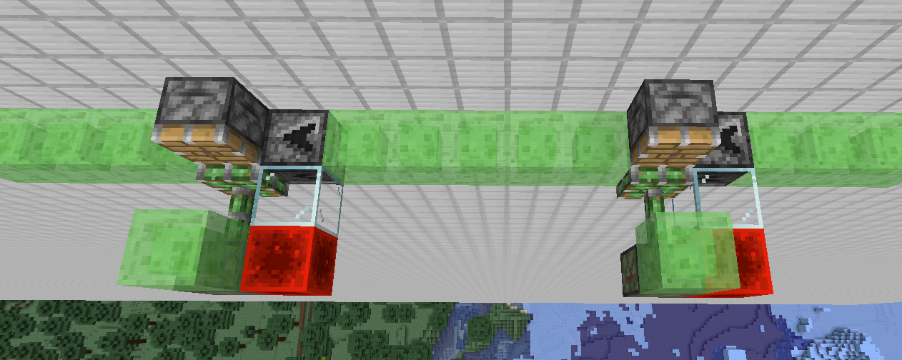

_图为`星空花夜、`连发盾构机的一根连杆, 该连杆为水平运动, 但原理无异_

## 3.1.2 基于活塞收回的连杆拓展

### a) ???

该结构第一次见到是在`Eular`的窄沟世吞中, 他使用了这样一个连杆:

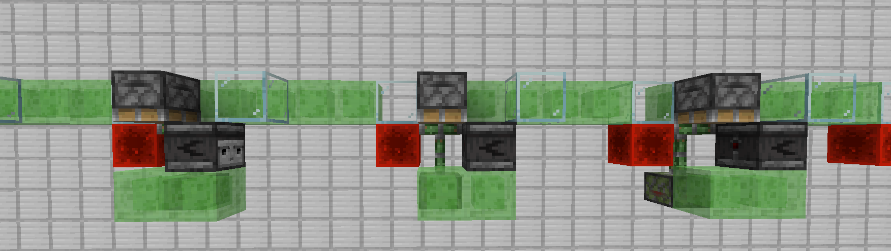

该连杆中粘性活塞被bud位置的红石块激活, 也就是收回瞬间, 红石块变成`b36`时"断电". 但当红石块完全到位后, 又会激活活塞, 无法下降.

因此该结构必须在活塞收回但还未再次伸出时, 把结构推下去.

注意该结构的侦测器位置, 它在下方, 粘性活塞收回阶段它不会动. 也就是当上方普通活塞和玻璃(用于更新侦测器)到位后, 它能立即发出信号, 不需要等待.

这样, 普通活塞会立即把结构推下去, 完美卡住了时间.

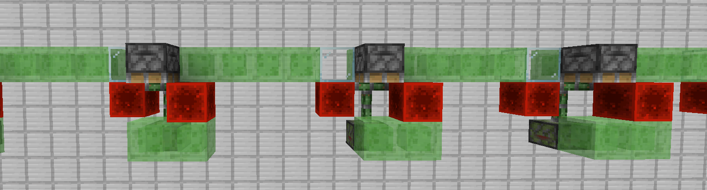

上面侦测器换成红石块也可以, 只要保证普通活塞能不等待直接下推即可.

### b) 双向传递连杆

上面那个特殊的连杆是为了这个做准备, 来自`comet107`可拓展盾构机的主连杆.

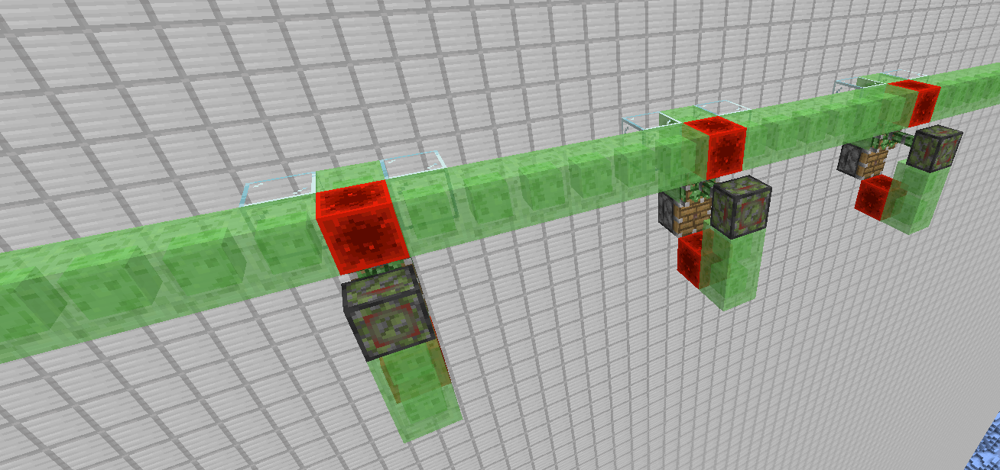

上面的连杆只能从一端激活, 但这个连杆可以从任意位置激活, 使整个结构前进.

为了方便, 我们拆下一个单元来研究

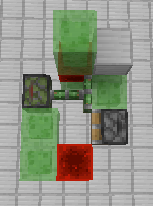

这个单元的前进和刚才`3.1.2 a)`的原理一样. 它两边对称的连接到上面的红石块, 都可以激活这个结构; 同时这个结构对称的和上面连接, 将能动传递下去.

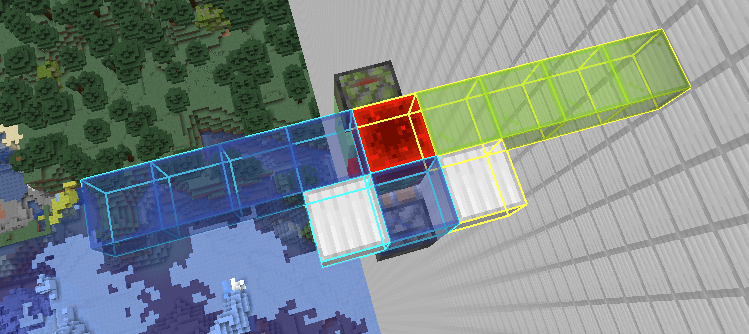

我使用不同颜色区分了两个部分, 其中绿色部分先动, 带走红石块, 蓝色部分后动, 传递下去(尽管它们是同时的, 但微时序有这样一个差异). 反之亦然.

## 3.1.3 基于活塞bud的连杆

还有一个更常见的结构, 如图所示.

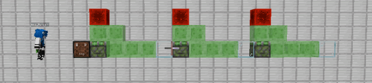

BUD态活塞受到更新即可运动, 而由静止到运动本身又是一种更新, 因此信号瞬间传递, 各个模块同时运动.

我们结合`2.2.1`的半动机, 即可做出这样的结构:

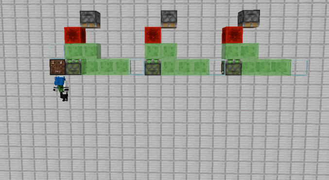

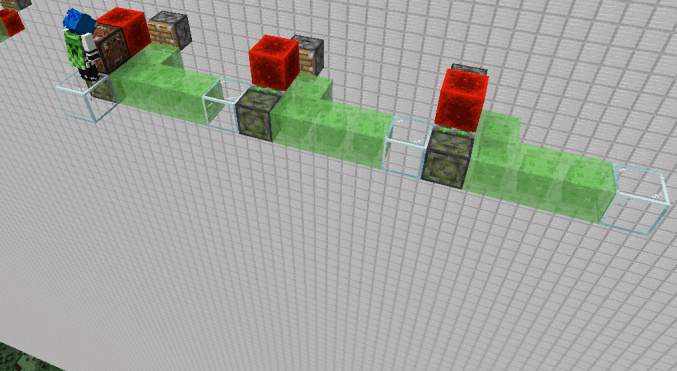

第二种连杆被广泛应用于连发盾构中, 因为一旦我们在前面阻挡, 连杆就只能原地震荡, 无法前进, 可以作为连发信号的传递.

## 3.1.4 其他连杆

以上的连杆均为无延时连杆, (毕竟连杆的本意就是无延时连杆). 但从功能上讲, 只要是实现多个模块移动的结构, 都可以称为连杆, 不一定要是无延时的.

