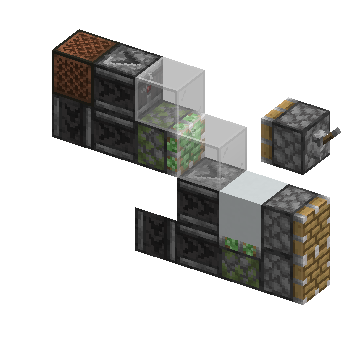
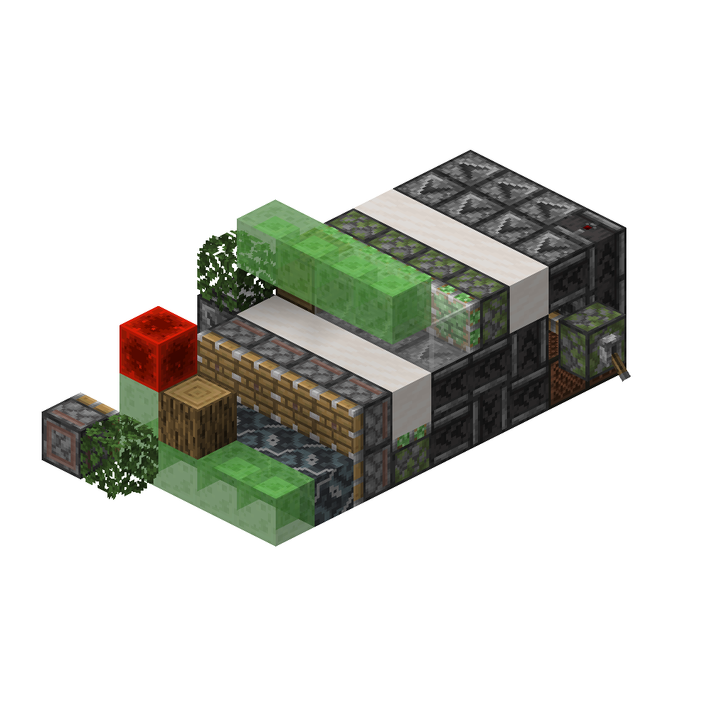

# #04 为什么你的树场慢——高速树场入门

如果不出意外的话，你在上一章设计的树场效率只有一万出头，处理周期轻松突破30甚至40gt

是什么造成了这些？我们一点点分析

## 4.1 开始之前——0t

在[1.1.2](./01-前置知识与树场的基本结构.md)中，我们提到，mc的时序分为**刻间时序**与**刻内时序**。如果我们能将原本通过刻间时序实现的功能**使用刻内时序实现**，我们就成功地对一台树场提速了。其中，最重要的实现方式是被称为**0t**的**活塞动作和布线模式**。

### 4.1.1 0t的概念

在[1.1.2](./01-前置知识与树场的基本结构.md)中，我们同样提到：

>BE原件（活塞与音符盒）在BE中会按**受到更新，确认需要变更状态**的顺序执行运算。这个顺序有时被称为**深度**。音符盒不会增加深度（即延后其更新的对象在BE内的运算顺序）

那么想象一个活塞：

在`0gt BE`，某个深度接收到**上升沿**信号，在其伸出后接收到一个更深（深度更深，即在BE执行队列中更靠后）的**下降沿**信号

显然，它应当在被充能的时候推出，退充能的时候收回。这就完成了一次**0t动作**。特别的，对于粘性活塞，它推动的第一个方块会在**比下降沿信号“深一个活塞”的深度**到位，拉动则与平常一致

>事实上以活塞添加的深度作为深度单位并不严谨，由于活塞推动顺序的差异，事实上在推出的时候可以通过创建b36的顺序造出小于“一个活塞”的深度差异，有时候会以“珊瑚”作为单位（因为最广泛的使用似乎是在基于珊瑚的TNT复制上）。这有时候有点用，但并不会对整体布线造成太大的影响

### 4.1.2常用的0t发生器

思路非常简单：在**同一个gt内的BE结束前**，在一个稍早的位置给活塞上升沿，稍晚的位置给下降沿，我们就可以获得一个0t动作

比如下图这个非常经典的基于**比较器和中继器在TT内执行顺序差异**的0t发生器：

由于一般而言中继器优先于比较器，在2gt TT，会优先为0t活塞添加BE，再为移除充能的活塞添加，因此移除充能的活塞必定晚于0t活塞动作，由此创造出了**晚于0t活塞伸出的下降沿信号**，从而完成0t

再比如这个非常经典的基于**红石粉**（*希望你还记得红石粉时瞬时的*）的0t发生器：<!--记得补图-->

在`0gt NU`，红石块被放置，`1gt BE`，移除压线方块的粘性活塞运动，由于移除红石块的粘性活塞被QC，**在移除压线方块的粘性活塞更新它之后才添加BE**，由此创造了一个在`1gt BE`，位于**1活塞深度**的上升沿，**2活塞深度**的下降沿。这样的信号足够被充能的活塞完成0t了*当然你也可以通过更多的一路更新过去的QC活塞添加下降沿的深度，从而激活在输出端只能QC而被其他活塞更新的活塞*

>值得注意的是，红石粉转向只有PP更新，我们需要额外的操作NC更新充能的目标活塞，从而完成上升沿信号（也就是对于活塞，上升沿和下降沿信号事实上是指其受到NC更新，确认需要推出或收回

## 4.2 “底座”

对于高速树场，我们很大程度上必须将**催熟**、**检测**、**树根处理**与**树苗循环**视为一体设计，称为**底座**

### 4.2.1 树根处理

这次我们必须先选择树根处理的模式了

在[1.2.2](./01-前置知识与树场的基本结构.md)中，我们提到：
>树根处理一般而言，有与主干一同处理、**上推**、**下吸**和**侧吸**四种方式<!--记得补图-->

如果你仔细思考，就会发现，与主干一同处理，我们就**只能在催熟上使用一个发射器**，**上推**我们至少在树场运行的**第6gt**才能种树，**下吸**则是**第3gt**，**侧吸**最快可以做到**0gt**。在高速树场中，我们一般选择**下吸**或者**侧吸**

>因为玩家操作在NU阶段，在gt最后，泥土归位在BE或者TE阶段，因此在泥土归位的那一个gt，我们就可以种树了

>事实上上推的问题不止慢，还记得丛林木最高可以长12格吗？算上泥土，就超过活塞的推动上限了。还记得金合欢的侧枝吗？上推会导致同y最多有三个原木，极大增加处理的难度，因此上推现在基本上是被废弃的

### 4.2.2 催熟与树苗循环

~~虽然蝎子很想讲催熟机制但我觉得没必要，因为~~高速树场的催熟事实上约等于**堆发射器**。简单而言，**不要在乎骨粉消耗**，尽可能多地放置催熟用的发射器，增加玩家种下树苗到树苗可以长成前**预催熟**的次数，和树苗可以长成之后的**生长窗口**（因此我们会引入**交叉催熟**，即错开发射器发射骨粉的时间。一般而言会错开2gt）<!--记得补图-->

高速树场催熟结构需要面临最大的问题事实上来自于**树苗循环**。拥挤的底座空间会导致催熟的骨粉供应链和树苗循环漏斗**各种打架**。一般而言我们会将骨粉供应链设计的尽可能规整和紧凑，为树苗循环留更多的空间。~~事实上没啥真的可以写到课本里的，只能自己多做几次~~<!--记得补图-->

对于树苗循环，由于~~沟槽的麻将乱改树叶掉落导致~~树叶会掉落木棍，我们需要更多的投掷器处理大量的物品，另外我们也需要尽可能“拉直”漏斗链，以最大化物品传输效率

>事实上树苗循环还会受到主干和树叶处理架构的影响，对于高速树场而言，有时还要在主干和树叶处理布线中加入用于收集树苗的漏斗和漏斗矿车<!--可以考虑补图-->

### 4.2.3 推动上限检测

*这是一个由Bright_Observer制作的推动上限检测单元*

>当上推活塞在TT阶段被更新时，它会计划推动。活塞计划推动的时候会检查其是否达到推动上限，而此时上方的玻璃没有收回，若拉杆拉下，活塞伸出，则会无法推动。因此得以激活两个普通活塞，在BE阶段更新到粘性活塞。粘性活塞再次自检，伸出。若拉杆松开，则一切正常，粘性活塞正常推出，两个普通活塞靠上方的一个是否推出取决于朝向，而由深度影响，下方活塞总是不会推出。这也就完成了检测。——GTMC时序理论5.10.1

总而言之，这个单元可以以**8gt周期**运行。为了对齐交叉催熟时钟，我们可以堆叠四片这个单元，每个错开2gt运行，放到泥土下，用粘液块连杆连接。这样我们就拥有了一个几乎不占用发射器和其他布线空间的检测模块。~~\魔法检测/~~

## 4.3 核心架构——主干与树叶处理

>这是决定一个树场最小运行周期的部分，请务必仔细考量

在设计架构之前，我们需要先了解如何分析一个架构的时序

### 4.3.1 时序设计

对于一个既定的架构，我们需要分析它处理树木的方式，并设计出最短的运行时序

以PTHSUTF的架构为例，我们尝试设计对于金合欢最短的处理时序（处理原则请回顾[3.1.2](./03-尝试设计一台全树种树场.md)：
<!--回头补个图-->

`0gt` 主推和侧墙一级推出 *对所有侧枝进行一级归中*
`3gt` 主推和侧墙一级到位，主推二级推出 *让主干方向侧枝优先归中，避免打架*
`6gt` 主推二级到位，左侧墙二级推出 *将仍未被推出的侧枝归中到中央和右侧一格内*
`9gt` 左侧墙二级到位，激活主推三级，并开始收回，使主推三级0t；随后，右侧墙二级推出 *清除位于中央的侧枝，并将右侧一格内的侧枝归中到中央*
`12gt` 右侧墙二级到位，激活主推三级，并开始收回，使主推三级0t *完成处理，开始复位*
`15gt` 主推二级开始收回，侧墙一级开始收回
`18gt` 主推一级开始收回
`21gt` 复位

>在树场中，我们一般可以认为时间是以3gt为单位的，尽管它是错误的。事实上，这个架构的金合欢时序只要满足6gt第一个侧墙二级推出，9gt一侧墙收回后另一侧墙推出，都可以完成21gt复位，并不只有这一种时序设计方式

各位可以尝试设计一下TT1998的6gt丛林架构的时序<!--回头补个图-->（这里只分析主干处理和“红石块轮”的时序）：

`0gt` 侧面伪二次递归一级0t，随后二级0t，抽走正面伪二次递归面前的原木；随后正面的伪二次递归拉走主干位置的原木；红石块轮第一个活塞推出，激活另一侧的树叶处理活塞，随后第二个活塞推出，0t树叶处理活塞并激活主干处理活塞，最后第三个活塞0t收回红石块，0t主干处理活塞
`3gt` 两个伪二次递归一级0t收回；红石块轮最后一个活塞0t收回红石块
`6gt` 复位

对既定的架构进行时序设计，对实际布线有很强的参考意义。同时，也有助于理解导致某个架构运行周期长的**罪魁祸首**在哪里，从而进行针对性优化

### 4.3.2 架构设计

如果对现有的架构进行时序设计后，发现还是不足以达到心目中预期的速度，就需要设计**更快的架构**

这里展示两个经典的提速方案：

- Nutstory架构：在[3.1.2](./03-尝试设计一台全树种树场.md)我们提到，金合欢侧枝除了可以归中处理，还可以通过**增加原木输出**处理掉。现在我们学习了时序分析，你应该可以注意到：这个架构不需要为侧枝归中设计时序，因此可以运行在12gt下，比PTHSUTF的架构快上许多。<!--记得补图-->

- TT1998的6gt/尸凶的4gt架构：它们事实上是一个架构。在上面我们已经做了时序分析。另外由于4gt的时候，**伪二次递归的二级活塞已经被移除了，并在目标位置创建了b36**，树苗可以正常生长，因此只要在另一侧也做一套为二次递归，并解决树苗问题，我们就可以轻松地获得一个4gt树场<!--记得补图-->

其实要设计更快的架构，思路非常简单：**减少必须发生在不同宏观时刻的活塞动作**。请务必在设计架构的同时思考架构对应的时序，**不然你很容易陷入不知道自己在做什么的境地**

>事实上时序和架构设计也有特例，yunj的STFU是8gt的全树种树场，有一部分架构并不跑在3ngt的时序下。~~不过由于现在已经有4gt树场了我们不需要太关心这方面的问题~~

>对于侧枝树，我们并不需要死磕最小运行周期，可以转而增加侧枝的处理量。~~你完全可以用做出樱花效率暴打某些6gt的12gt树场~~

总之，一个优秀的架构是做出一台好树场的**最重要前提**。在开始布线之前，请**尽可能优化你的架构**

## 4.4 布线

### 4.4.1 布线方式

这里我们提一下最简单好用的高速树场布线方式：

这是一个非常经典的基于红石粉和深度的**双边沿0t发生器**（即输入信号的上升沿和下降沿都会被转化为一次0t信号）。我们可以将一个粘性活塞连接到它的输出，推拉一个红石块，这样就可以得到**不增加宏观延迟，但上升沿更深**的与输入**拥有相同宏观时序**的信号。利用这点，我们可以轻松地控制布线的深度：**只需要按照设计的深度顺序，将激活活塞的红石粉依次以相同的方式连接就可以了**<!--记得补图-->

[基于这种布线方式的经典例子](https://www.bilibili.com/video/BV17i4y157vh)

### 4.4.2 布线检查

虽然我们一直在说“经济基础决定上层建筑”，但是也不能设计出来一个6gt的架构最后布线跑了个几十gt不是？分析一下自己的布线，看看**到底是哪里的时序有问题，拖慢了树场整体的运行速度**

不过对于高速树场的布线，我们无法给你一个更具体的办法。**你自己去多扒几台/布几台比什么都强**