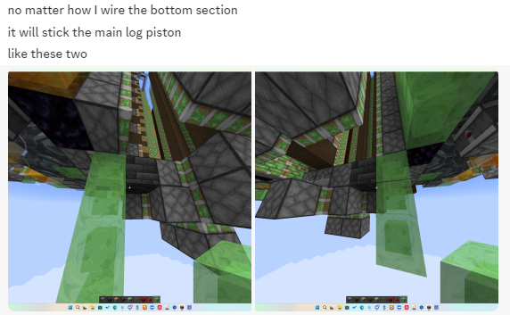
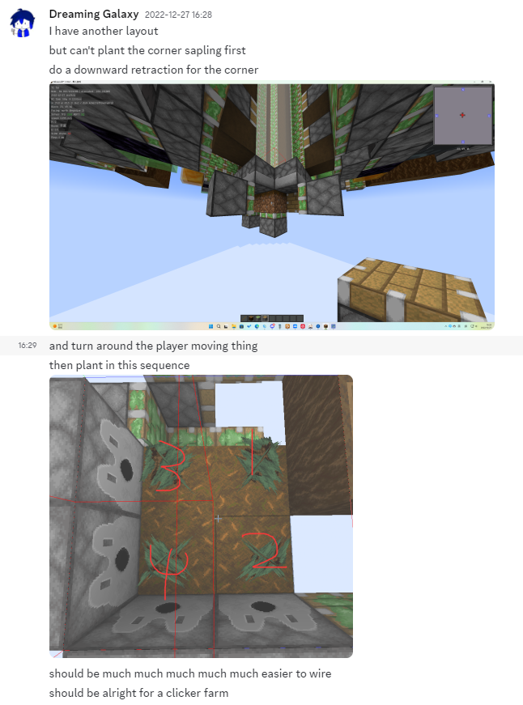

# #08 关于大云杉树场

>欢迎来到中后期工程用木材的最主要来源，这里我们将逐渐带你设计一台mc中原木效率最高的树场

## 8.1 大云杉树场入门 

### 8.1.1 大云杉生长机制与架构设计

大云杉的生长检测范围为：**以西北角树苗为中心，树苗层3x3，以上5x5**

大云杉最大树高为28格（西北角会多一个，所以是29）~~一般而言不会有人做了大云杉树场还不处理全高~~

简单而言，我们需要一个二次递归来处理主干原木，然后简单地用蜜绿墙推掉树叶就好了

### 8.1.2 纵向信号传递

用棒子bud拉上去就好了，对于主干和侧墙激活，可以考虑转向粉或者墙电

### 8.1.3 处理

从核心推出来之后左右分流，然后正常重组即可

到这里，你已经可以独立设计一台能用的大云杉树场了。但是不出意外的话，效率就只有10w左右，不尽人意。接下来我们就要来讲，怎么做一台更快的大云杉树场。对于处理时序，相信你们都在之前的学习中有了足够的理解，这里我们只讲如何尽可能凹预催熟

>当然，这里我也希望你们能够体验一下过去的探索历程，所以我会加入很多有关大云杉树场的历史，当然也有一些旧版本内容，hope u enjoy it

## 8.2 [进阶]高速大云杉part1：角落下吸

### 8.2.1 角落下吸的源头

2016年，老仙发布了他的12gt大云杉树场，采用上推架构，首次突破了30w大关。然而随着时间推移，老仙的时序在1.12不再可用，同时玩家逐渐发现了更优的架构和时序设计。

在2020年2月12日，gpw发布了sprucemacy v1，用侦测器充能树根检测和角落下吸，正式开启了现代高速大云杉树场的时代，成为了之后相当一段时间内大云杉的设计标准，直到2021年4月15日gpw发布sprucemacy v2，带来了角落侧吸，我们稍微晚些讲解。现在，让我们回到2020年

### 8.2.2 角落下吸的思想

如果你在8.1尝试做过一台大云杉树场，想必你可以注意到这东西想要加发射器比较困难。如果不想办法修改底座架构，即便使用推动上限检测，我们也只能拥有两个发射器

*因为我们还在2020年，我们暂时还没有推动上限检测/树电检测，所以暂时忽略它们。*我们需要在可以放置发射器的四个位置中选择一个，放置充能树根检测。显然，如果想增加到三个发射器，我们就必然面临一个问题：无论如何都无法通过侧吸处理角落原木

解决方案是显然的，下吸它就好了。但是由于下吸的泥土归位速度较慢，我们需要另外设计一个种植时序

gpw的方案是，让玩家在8/10gt（1.12中玩家的右键放置是跑在简单的4gt interval下的）种植角落树苗，剩下的正常种植就好了

对于玩家移动，gpw采用了矿车

### 8.2.3 角落下吸的局限

在1.14中，mojang修改了玩家右键放置的行为。如果因为一些问题，玩家先放置了靠近玩家这一侧的树苗，那么远离玩家的树苗就无法放置了。目前在不修改种植时序的情况下，唯一的解决方案是羊驼船~~（但是在1.21由于mojang又改了生物在船上的行为，羊驼船也坏了）~~

角落下吸在1.12即便是3gt泥土归位也无法保证4gt前种植角落树苗（原因是上述的右键放置逻辑），因此无法达到极限的效率

>不过可以提前剧透的是，在使用连点器的大云杉中，角落下吸因为更简单的时序和布线设计，焕发了第二春（笑

## 8.3 [进阶]高速大云杉part2：角落侧吸（Corner Retraction）

### 8.3.1 角落侧吸的源头

2021年4月15日，gpw发布了sprucemacy v2，第一次为我们带来了角落侧吸。2022年2月8日，floppy发布的12gt Spruce v2带来了3gt完成受催熟树苗种植的角落侧吸时序。2024年8月，Qontrol开发了有实用意义的6gt复位的角落侧吸底座。

>其实在12gt 角落侧吸刚出来没多久星河就随便做了一个全粉6gt，~~但是完全不像能用的样子~~

~~由于mojang在1.21改了羊驼船，角落侧吸的意义也被摧毁了~~

### 8.3.2 角落侧吸的思想

如果你想要先种植角落树苗，你就必须侧吸它。角落树干的侧面有两个发射器和两个原木，如果我们能以某种方式移除侧面的一个原木，我们就可以塞入一个侧吸活塞，这就是角落侧吸

现在的实现方式是下吸其中一个原木，另一侧用常规的并排侧吸处理就好

对于角落侧吸，很显然我们要用二次递归。对于16gt非连点大云杉，只需要用正常的二次递归就好了；对于12gt，我们采用二级活塞从侧面推入的二次递归；对于6gt，我们采用类似吸转推“标准流”的设计

一般而言，玩家移动采用羊驼船，种植时序角落优先；或者猪船，先种并排侧吸侧的一个，再种角落，再种并排侧吸侧的第二个，最后种植下吸位

>猪船的具体来源我们会在下一个部分叙述

### 8.3.3 太难做了！！！！

如果你还记得8gt大云杉的话，你就会知道，角落侧吸并没有出现在那台树场里。其实原因很简单：我和lintex都没有想到足够好的布线方式，来处理8gt角落侧吸。于是我们转向了角落下吸并更改种植时序（反正没人会给8gt大云杉用真人不带连点挂的

>本来我们立项的时候hampter说要做一个角落侧吸给8gt大云杉用的，结果中途他电脑坏了，~~然后现在他的单元还没发出来~~

这就是角落侧吸最大的缺点：复杂

~~*当然还有更大的缺点：羊驼船坏了所以你只能用猪船和猪船种植时序，那就完全打不过角落下吸了*~~

## 8.4 [进阶]高速大云杉part3：角落下吸的回归/猪船种植时序

### 8.4.1 《无论怎么做都会粘到主吸活塞》

>

>~~其实事后看不会粘到的但整到了更简单的底座还是不错的~~

2022年底，lintex开了8gt大云杉，很快就把主干弄了个七七八八，~~然后我们就卡死在底座上了~~

以当时的视角看，我们无法做出一个足够好使的角落侧吸底座，于是我提出角落用下吸，然后将种植时序倒转过来，这样就可以直接扔掉角落侧吸和对应的种植时序了

这就是角落下吸的连点种植时序

由此，你应该可以独立设计一个角落下吸的连点底座了。还是不会的话可以参考8gt大云杉或者gushen的大云杉

### 8.4.2 为什么是猪船？

其实我不是很喜欢矿车，原因很简单：随便推一下就跑了，然后就要重新放置

羊驼船坏了（躺

对于单一的船，这玩意是在客户端和服务端分别运算的，容易造成客户端和服务端不同步，然后就毁了

至此，你应该可以独立设计一台足够快的大云杉树场了。不过，在这里我们还想提一下1.12的一个天顶星科技：ITT/IF 6gt大云杉

## 8.5 ITT/IF 6gt大云杉