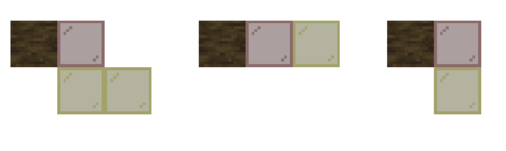

# #12 原木生长机制：树形与催熟

## 12.1 树苗催熟

树苗生长有两个阶段(蘑菇/下届菌),随机刻和骨粉(45%概率)让树苗增加一个阶段

第二阶段的树苗再次尝试生长时就会尝试生成树

>注意树苗最开始就已经在第一阶段,所以最少只需要两个骨粉即可催熟

不同骨粉数量的催熟成功率如下图

| 骨粉数量 | 催熟成功率 |   | 骨粉数量 | 催熟成功率 |
|---------|-----------|---|---------|-----------|
| 1  | 0.000%  |   | 11 | 98.611% |
| 2  | 20.250% |   | 12 | 99.174% |
| 3  | 42.525% |   | 13 | 99.513% |
| 4  | 60.902% |   | 14 | 99.714% |
| 5  | 74.378% |   | 15 | 99.832% |
| 6  | 83.643% |   | 16 | 99.901% |
| 7  | 89.758% |   | 17 | 99.943% |
| 8  | 93.682% |   | 18 | 99.967% |
| 9  | 96.148% |   | 19 | 99.981% |
| 10 | 97.677% |   | 20 | 99.989% |

对于蘑菇/下届菌,使用骨粉有40%概率尝试生成巨型蘑菇/巨型下届菌

## 12.2 树的生成
所有树的生成都可以分为几个阶段,其中准备阶段几乎一样,其余阶段将在各自生成过程中解释
 - 准备阶段:
   - 计算树的高度(或者说树干的长度):基础高度 + (0到随机高度1的随机数) + (0到随机高度2的随机数)
   - 如果有树根生成,那么将树干起点向上移动
   - 检查空间与高度限制
     1. 确保树的最低点和最高点都在世界的有效高度范围内
     2. 从树干起点向上直到树干顶部往上一层，一层层地检查是否有足够的空间容纳树。有障碍物则生成失败
        - 仅限奇异橡树：如果遇到障碍物,返回障碍物的y-2作为最高可生长的高度,尝试剪裁部分高度(最多为4)然后生成,裁剪后仍然不能生成则本次生成失败
 - 树根生成(目前仅红树有):生成树根
 - 树干生成:生成主干和分支以及对应的树叶附着点
 - 树叶生成:在每个树叶附着点按一定的规则生成树叶
 - 装饰:生成藤蔓,蜂巢等等装饰物

|      | 基础高度 | 随机高度1 | 随机高度2 |
| ---- | ---- | ----- | ----- |
| 橡树   | 4    | 2     | 0     |
| 白桦   | 5    | 2     | 0     |
| 云杉   | 5    | 2     | 1     |
| 丛林   | 8    | 4     | 0     |
| 金合欢  | 5    | 2     | 2     |
| 樱花树  | 7    | 1     | 0     |
| 杜鹃   | 4    | 2     | 0     |
| 红树   | 2    | 1     | 4     |
| 高红树  | 4    | 1     | 9     |
| 深色橡树 | 6    | 2     | 1     |
| 巨型丛林 | 10   | 2     | 19    |
| 巨型云杉 | 13   | 2     | 14    |

### 12.2.1橡树,白桦树,丛林树,云杉树,丛林树的生成
- 检查空间与高度限制 除了云杉木检测5×5范围以外,其余的都是每层检测3×3,

-  树干生成:这几种树都使用了`StraightTrunkPlacer`这个树干生成器,会垂直放置相应高度的原木
-  树叶生成:

### 12.2.2樱花树的生成
### 12.2.3金合欢树的生成
### 12.2.4红树的生成
- 准备阶段:将树干生成起点向上移动1-3格(高红树3 - 7格)
- 树根生成
	1. 检查从树苗生长位置到树干底部下方一格能否满足树根放置条件(空气或者有`REPLACEABLE_BY_TREES`或`MANGROVE_ROOTS_CAN_GROW_THROUGH`标签)
	2. 以树干生成起点往外一格为起点开始生成树根(四个方向,顺序为北东南西)
    3. 每个方向重复以下过程15次 
	 图中红色的为生成起点,黄色为一次尝试中可能的情况  `向下然后向外` `向外` `向下`
       

     随着生成起点与树干起点的曼哈顿距离(x距离+y距离)改变,三种情况的概率如下

    | 曼哈顿距离   | 向下然后向外 | 向外 | 向下  |
    |---------|--------|----|-----|
    | \[6,8\] | 20     | 0  | 80  |
    | \>9     | 0      | 0  | 100 |
    | 其余情况    | 0      | 40 | 60  |

    - 若尝试中(黄色玻璃)没有不满足树根放置条件(同第一步)的方块,将本次尝试的最外侧方块作为下一次的起点,并将尝试中的方块位置添加到一个列表用于之后放置树根
    - 若有不满足树根放置条件的方块,该方向生成树根**成功**,将列表中的位置替换为树根(下方有泥的替换为沾泥红树根)
    
	15次后若没有不满足树根放置条件的方块,本次生成终止
   
- 树干生成
	1. 依次向上垂直放置原木直到达到高度 树干顶端为树叶附着点
	2. 每次成功放置非顶端原木(如果目标位置不是空气或者有`REPLACEABLE_BY_TREES`标签则放置失败), 有50%概率生成一个分支(分支长度1-4,高红树1-6)
	3. 对于每个分支,斜着45度放置原木,分支上的每一个原木以及分支末端上下方一个方块为树叶附着点
  
//TODO 这里放个图

-  树叶生成
	对于每个树叶附着点重复70次以下内容
	
	从附着点开始,将x和z坐标 + (两个0-2的随机数相减)

	y坐标+ (两个0-1随机数相减)

	相当于x和z在距离附着点2格内,y距离1格内随机

	在得到的坐标处尝试放置树叶
- 装饰
	- 蜂巢装饰 (红树有1%的概率触发蜂巢装饰)
		1. 如果树有树叶，选择最低树叶下方一格的y值用于生成蜂巢,如果没有树叶,最低树干的y + 1 + (0到2的随机数)用于生成蜂巢
		2. 筛选出本次生成中所有位于目标高度的原木方块
		3. 获取这些原木水平相邻的所有位置（不包括北方,因为蜂巢默认朝南）作为候选位置
		4. 将这些候选位置随机打乱
		5. 找一个满足以下两个条件的位置放置蜂巢(~没有就不放~)
			- 该位置必须是空气
			- 该位置的南方必须是空气
		6.  往蜂巢中放入2-3只蜜蜂
	- 苔藓地毯装饰
	- 红树胎生苗

